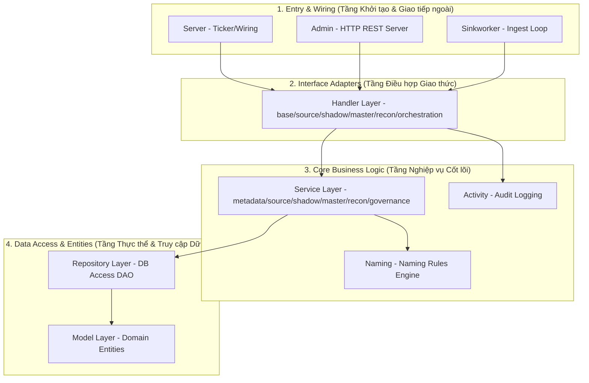
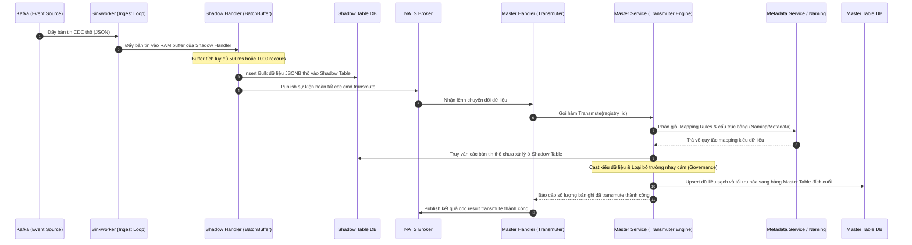

# Tài liệu Kiến trúc & Luồng xử lý qua các Layer (centralized-data-service)

Tài liệu này đặc tả cấu trúc phân tầng (Layered Architecture) và các luồng xử lý nghiệp vụ chính chạy xuyên suốt các layer từ hạ tầng cốt lõi đến các module điều phối cấp cao của hệ thống `centralized-data-service`.

---

## 1. Bản đồ Phân tầng Toàn diện (System Layer Map)

Kiến trúc của `centralized-data-service` được xây dựng dựa trên sự kết hợp giữa **Kiến trúc sạch (Clean Architecture)** và **Phân vùng chức năng nghiệp vụ (Domain Functional Zones)**.

---

## 2. Chi tiết vai trò của các Layer Tầng Cao

### 2.1 Model Layer (`internal/model`)
* **Vai trò**: Tầng thực thể miền (Domain Entities). Định nghĩa cấu trúc dữ liệu thuần túy phản ánh thực tế cơ sở dữ liệu hệ thống (như `SourceConnection`, `RegistryTable`, `MappingRule`, `ActivityLog`).
* **Tính độc lập**: Đây là tầng độc lập nhất trong toàn bộ hệ thống; không phụ thuộc vào bất kỳ thư viện ngoài (ngoại trừ cấu trúc cơ bản) hoặc package nào khác trong thư mục `internal`.

### 2.2 Repository Layer (`internal/repository`)
* **Vai trò**: Tầng truy xuất cơ sở dữ liệu (Data Access Object - DAO). Đóng gói toàn bộ các truy vấn GORM (`Read`, `Create`, `Update`, `Delete`) đối với các bảng hệ thống (Metadata Registry).
* **Quy tắc**: Tách biệt hoàn toàn việc viết truy vấn thô ra khỏi tầng nghiệp vụ (Service Layer). Chỉ tương tác với `gorm.DB` và trả về các cấu trúc định nghĩa ở `internal/model`.

### 2.3 Service Layer (`internal/service/...`)
* **Vai trò**: Trái tim chứa các quy tắc nghiệp vụ cốt lõi (Domain Logic/Business Rules). Bao gồm:
  * `metadata`: Quản lý, kiểm tra, phân giải các cấu hình ánh xạ nguồn-đích.
  * `governance`: Lọc và làm sạch dữ liệu (Sanitization).
  * `recon`: Máy quét và so khớp dữ liệu.
* **Quy tắc**: Nhận yêu cầu từ Handler, thực hiện tính toán/quyết định nghiệp vụ, lưu trữ thông qua Repository và không trực tiếp biết về giao thức HTTP hay NATS.

### 2.4 Handler Layer (`internal/handler/...`)
* **Vai trò**: Tầng điều hợp giao thức (Interface Adapter). Nhận payload thô từ NATS broker, tin nhắn từ Kafka, hoặc REST API.
* **Cấu trúc chức năng**: Được chia nhỏ thành các thư mục nghiệp vụ chuyên biệt:
  * `base`: Tiện ích hạ tầng (SQL safe, publish, HTTP calls).
  * `source`: Quét thông tin và mẫu dữ liệu nguồn.
  * `shadow`: Đẩy dữ liệu thô vào Shadow Tables.
  * `master`: Thực hiện DDL/DML lên Master Tables.
  * `recon`: Quản lý hàng đợi lỗi (DLQ) và đối soát.
  * `orchestration`: Quản lý máy trạng thái (Provisioning Orchestrator State Machine).

### 2.5 Naming Layer (`internal/naming`)
* **Vai trò**: Bộ máy chuẩn hóa định danh cơ sở dữ liệu (Naming Rules Engine).
* **Nhiệm vụ**: Tự động sinh tên bảng đệm (`_shadow`), bảng đích, cột đích, khóa chính, và chỉ mục theo các ADR thống nhất của Data Warehouse để tránh xung đột định danh.

### 2.6 Activity Layer (`internal/activity`)
* **Vai trò**: Hệ thống lưu vết sự kiện hệ thống (Audit Log & Activity Trace).
* **Nhiệm vụ**: Ghi lại lịch sử các bước hoạt động (như `Discover`, `ShadowBind`, `MasterCreate`, `Transmute`) vào DB và log file phục vụ việc theo dõi trạng thái hệ thống.

### 2.7 Admin Layer (`internal/admin`)
* **Vai trò**: Cổng giao tiếp quản trị (REST API Control Port).
* **Nhiệm vụ**: Khởi chạy HTTP Server cung cấp các API REST cho CMS Dashboard (Frontend) để bật/tắt bảng đồng bộ, kiểm tra trạng thái sức khỏe của pipeline, và điều chỉnh Mapping Rules.

### 2.8 Server Layer (`internal/server`)
* **Vai trò**: Bộ điều phối khởi chạy hệ thống (System Bootstrapper).
* **Nhiệm vụ**: Đọc config, kết nối DB chính, kết nối NATS, thực hiện lắp ghép Dependency Injection (DI) thủ công cho các Handler/Service, đăng ký các Subscriber nhận NATS command, và chạy các bộ định thời định kỳ (Tickers/Cron).

### 2.9 Sinkworker Layer (`internal/sinkworker`)
* **Vai trò**: Vòng lặp nhận dữ liệu (Ingestion Pipeline).
* **Nhiệm vụ**: Đăng ký các Consumer Group với Kafka, xử lý song song thông qua `ConsumerPool`, và chuyển tiếp các sự kiện nhận được vào `BatchBuffer` thuộc Shadow Handler.

---

## 3. Bản đồ phối hợp toàn trình (End-to-End Collaboration Flow)

Dưới đây là sơ đồ chi tiết mô tả sự phối hợp từ lúc một sự kiện CDC được Kafka đẩy tới, chạy qua toàn bộ hệ thống phân tầng và lưu trữ ổn định tại PostgreSQL DW.

