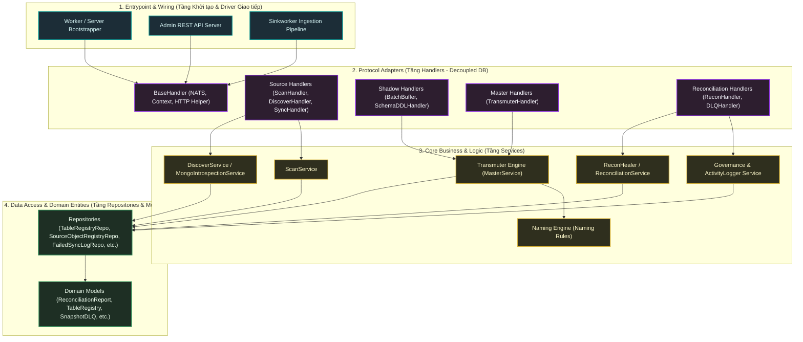
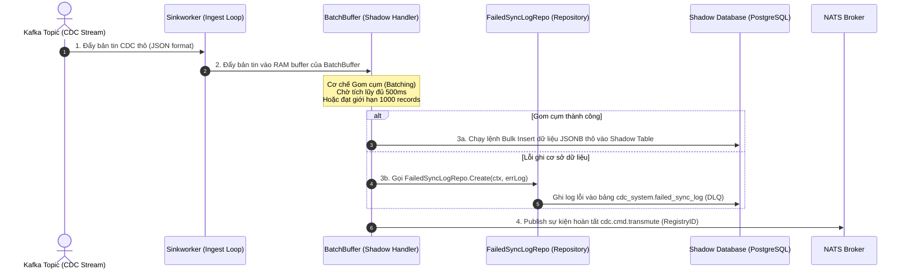
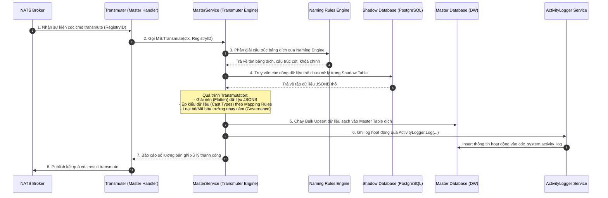
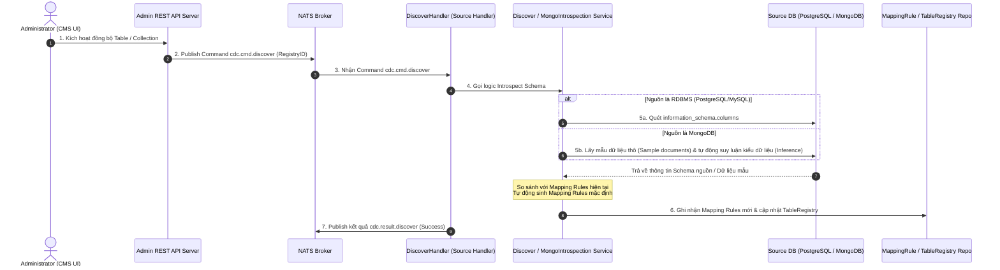
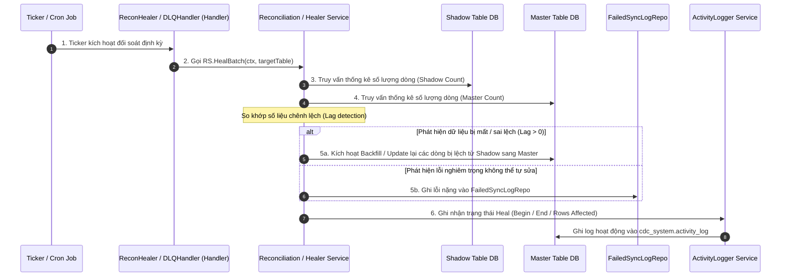
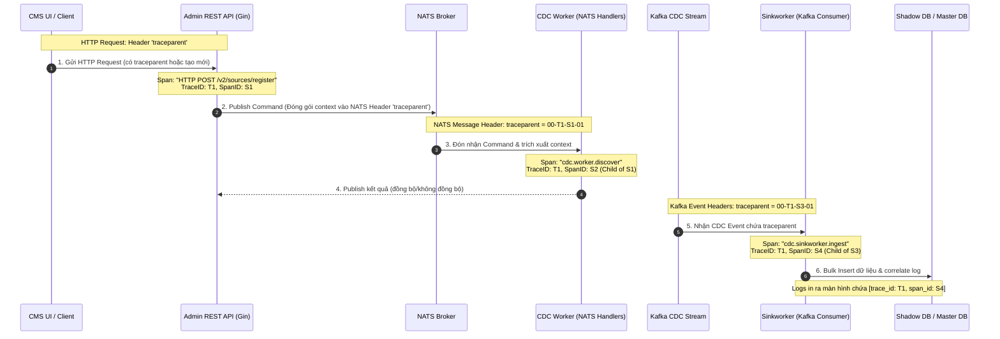

# Kiến trúc Chi tiết & Luồng Xử lý Toàn trình (centralized-data-service v2)

Tài liệu này đặc tả cấu trúc phân tầng (Layered Architecture) hiện đại đã được làm sạch và tái cấu trúc (Decoupled hoàn toàn khỏi DB tại tầng Handler). Tài liệu cung cấp cái nhìn chi tiết nhất về cấu trúc các layer mới, bản đồ phân vùng chức năng miền (Domain Zones) và đi sâu phân tích từng luồng xử lý dữ liệu cốt lõi (End-to-End Core Flows).

---

## 1. Bản đồ Phân tầng Hệ thống Cập nhật (System Layer Map)

Hệ thống được thiết kế chặt chẽ theo nguyên lý **Clean Architecture**, phân định ranh giới nghiêm ngặt giữa tầng điều hợp giao thức (Handlers), tầng xử lý nghiệp vụ cốt lõi (Services) và tầng lưu trữ dữ liệu (Repositories/Models).



---

## 2. Chi tiết vai trò & Ranh giới các Phân tầng (Refactored Layer Roles)

> [!IMPORTANT]
> **Quy tắc Decoupling DB**: Tầng Handler tuyệt đối không được phép import `gorm.io/gorm` cho các thao tác CRUD dữ liệu hoặc chạy Raw SQL. Mọi tương tác cơ sở dữ liệu phải được ủy thác qua tầng Service hoặc qua Interface của Repository được tiêm vào (Dependency Injection) tại lúc khởi động Server.

### 2.1 Model Layer (`internal/model/...`)
* **Vị trí**: Độc lập hoàn toàn, không phụ thuộc vào bất kỳ layer nào khác.
* **Vai trò**: Chứa các thực thể Domain sạch đại diện cho các bảng nghiệp vụ. Sau khi tái cấu trúc:
  - `reconciliation_report.go` và `snapshot_dlq.go` được di chuyển về đúng miền `internal/model/recon/`.
  - Các model registry nằm tại `internal/model/source/` và `internal/model/master/`.

### 2.2 Repository Layer (`internal/repository/...`)
* **Vị trí**: Nằm giữa Services và Models. Chỉ được phép import `gorm.io/gorm` và `internal/model`.
* **Vai trò**: Đóng gói hoàn toàn các câu lệnh CRUD, Transaction và các truy vấn tối ưu.
  - **TableRegistryRepo**: Quản lý registry trạng thái các bảng.
  - **SourceObjectRegistryRepo**: Quản lý registry nguồn dữ liệu.
  - **FailedSyncLogRepo**: Đóng gói logic ghi log lỗi đồng bộ và DLQ, tách biệt ranh giới lưu trữ lỗi khỏi Handler.

### 2.3 Service Layer (`internal/service/...`)
* **Vị trí**: Nơi chứa toàn bộ logic nghiệp vụ (Domain Rules). Phụ thuộc vào Repository và Naming, không biết về NATS hay HTTP.
* **Các Service cốt lõi**:
  - `governance.ActivityLogger`: Ghi log hoạt động nghiệp vụ tập trung.
  - `source.ScanService` & `source.DiscoverService`: Thực hiện introspection và phân tích cấu trúc dữ liệu.
  - `orchestration.ProvisioningOrchestrator`: Quản lý luồng thiết lập (State Machine) của pipeline.

### 2.4 Handler Layer (`internal/handler/...`)
* **Vị trí**: Điểm tiếp nhận sự kiện (NATS, Kafka, HTTP).
* **Đặc điểm**: Đã được dọn sạch DB thô.
  - Sử dụng `FailedSyncLogRepo` thay cho `db.Create` ở `DLQHandler` và `BatchBuffer`.
  - Sử dụng `ActivityLogger` Service cho `ReconHandler` và `ReconHealer`.
  - Sử dụng closure bọc `activityLogger.Quick` cho `SchemaDDLHandler.OnWriteActivity` để cách ly hoàn toàn `gorm.DB` khỏi Handler.

---

## 3. Đi sâu vào Các Luồng Nghiệp vụ Toàn trình (Deep-Dive Core Flows)

### Flow 3.1: Ingestion & Shadow Sink Flow (Luồng Thu nhận và Đồng bộ Shadow)

Luồng này thu nhận các sự kiện CDC thô từ Kafka, lưu trữ đệm vào bộ nhớ RAM, sau đó lưu trữ có cấu trúc vào bảng Shadow Table tại PostgreSQL và phát lệnh chuyển đổi dữ liệu.



**Mô tả chi tiết luồng Ingestion**:
1. **Sinkworker Ingest**: Nhận CDC events từ Kafka Topic. Driver Kafka sử dụng `ConsumerPool` xử lý song song các phân vùng (partitions) để tối đa hóa băng thông.
2. **Buffer Tích lũy (BatchBuffer)**: Thay vì ghi từng record xuống DB gây nghẽn I/O, `BatchBuffer` giữ tin nhắn trên RAM và kích hoạt ghi Bulk khi thỏa mãn điều kiện thời gian (500ms) hoặc số lượng (1000 dòng).
3. **Decoupled Error Logging**: Khi xảy ra lỗi ghi Shadow DB, Handler không tự thao tác DB mà gọi `FailedSyncLogRepo` để đưa tin nhắn lỗi vào hàng đợi DLQ một cách an toàn.
4. **NATS Triggering**: Sự kiện `cdc.cmd.transmute` được đẩy lên NATS Broker chứa metadata Registry ID để báo hiệu tầng xử lý tiếp theo bắt đầu làm việc.

---

### Flow 3.2: Transmutation Flow (Luồng Biến đổi và Đồng bộ Master Table)

Luồng này nhận lệnh chuyển đổi từ NATS, thực hiện đọc dữ liệu thô từ Shadow Table, biến đổi cấu trúc, ép kiểu, làm sạch dữ liệu và đồng bộ vào Master Table đích.



**Mô tả chi tiết luồng Transmutation**:
1. **Phân giải định danh (Naming Engine)**: `MasterService` phối hợp với `Naming Engine` áp dụng các ADR đặt tên cột/bảng của Data Warehouse. Đảm bảo tên bảng Shadow luôn đi kèm hậu tố `_shadow` và Master Table đích chuẩn hóa đúng định dạng PostgreSQL.
2. **Biến đổi dữ liệu (Transmutation Process)**:
   - Đọc dữ liệu JSONB từ Shadow DB.
   - Phân tích cú pháp kiểu dữ liệu (Text, Numeric, Timestamp, Boolean).
   - Áp dụng các Rule lọc bảo mật (Sanitize) do tầng Governance chỉ định để loại bỏ thông tin nhạy cảm trước khi lưu kho.
3. **Bulk Upsert & Clean Logging**: Thực hiện cập nhật/ghi mới (Upsert) tối ưu hóa hiệu năng vào Master Table, đồng thời ghi nhận hoạt động nghiệp vụ thông qua `ActivityLogger` Service để phục vụ việc giám sát hoạt động hệ thống.

---

### Flow 3.3: Provisioning & Automated Discovery Flow (Luồng Cấu hình và Khám phá Schema)

Luồng này cho phép người quản trị kích hoạt đồng bộ một bảng mới từ Admin Dashboard. Hệ thống sẽ tự động quét Schema nguồn (MongoDB hoặc SQL), tạo Mapping Rules và cấu trúc các bảng đệm tự động.



**Mô tả chi tiết luồng Discovery**:
1. **Introspection thông minh**:
   - Đối với cơ sở dữ liệu quan hệ (PostgreSQL, MySQL), hệ thống truy vấn siêu dữ liệu hệ thống (`information_schema`) để xác định chính xác kiểu dữ liệu vật lý của từng trường.
   - Đối với cơ sở dữ liệu phi quan hệ (MongoDB), `MongoIntrospectionService` lấy mẫu 10-100 bản ghi thô từ Collection, tiến hành giải nén (flattening) các trường lồng nhau và tự động suy luận kiểu dữ liệu tối ưu nhất (ví dụ: phát hiện chuỗi JSON hợp lệ, phân biệt số nguyên với số thực dấu phẩy động).
2. **Tự động sinh Mapping**: Hệ thống lưu các quy tắc ánh xạ tự động vào `MappingRuleRepo` giúp giảm thiểu thao tác thủ công của Quản trị viên, hỗ trợ cơ chế phê duyệt schema tự động (Auto-approve).

---

### Flow 3.4: Reconciliation & Self-Healing Flow (Luồng Đối soát và Tự phục hồi dữ liệu)

Luồng đối soát chạy định kỳ (Ticker/Cron) hoặc chạy thủ công để phát hiện chênh lệch số lượng bản ghi giữa database nguồn và Master Database đích, sau đó tiến hành tự sửa lỗi dữ liệu.



**Mô tả chi tiết luồng Đối soát**:
1. **Phát hiện chênh lệch (Lag Detection)**: So sánh trực tiếp số lượng bản ghi (Record Count) và chữ ký dữ liệu (Checksum) giữa bảng đệm Shadow và bảng Master Table đích.
2. **Cơ chế tự sửa lỗi (Self-Healing)**:
   - Với các chênh lệch thông thường do độ trễ mạng hoặc tiến trình Transmute bị gián đoạn, `ReconHealer` tự động kích hoạt backfill đồng bộ bù dữ liệu.
   - Với các lỗi nặng (lỗi ràng buộc khóa ngoại, lỗi định dạng dữ liệu không thể ép kiểu), hệ thống chuyển giao thông tin sang DLQ (`FailedSyncLogRepo`) để người quản trị xử lý thủ công qua CMS Dashboard mà không làm sập pipeline đồng bộ chính.

---

## 4. Tóm tắt các Cải tiến Kiến trúc Gần đây

> [!NOTE]
> **Lịch sử nâng cấp chất lượng mã nguồn**:
> 1. **Dọn sạch rò rỉ DB tại Handlers**: Đã loại bỏ hoàn toàn việc gọi `h.db.Create(...)` và `h.db.Raw(...)` trực tiếp từ tất cả các handler nghiệp vụ.
> 2. **Repository hóa (DAO)**: Tạo mới và chuẩn hóa các Interface Repository (`TableRegistryRepo`, `FailedSyncLogRepo`) để quản lý toàn bộ các tương tác GORM.
> 3. **Tái phân vùng Domain (Package Alignment)**: Chuyển các model/service về đúng thư mục nghiệp vụ chuyên biệt (`internal/model/recon/`, `internal/service/orchestration/`), loại bỏ sự phụ thuộc chéo bất hợp lý.

---

## 5. Đặc tả chi tiết các Luồng Khởi tạo & Thành phần Giao tiếp (Core Component Flows)

### 5.1 Entrypoint & Wiring (Tầng Khởi tạo & Driver Giao tiếp)

Tầng Khởi tạo chịu trách nhiệm thiết lập các kết nối hạ tầng (Database, NATS, Kafka), cấu hình các thông số runtime, đăng ký các Handler điều hướng và quản lý tiến trình vòng đời của ứng dụng.

#### Luồng 5.1.1: Worker / Server Bootstrapper (`cmd/worker/main.go`)
- **Vai trò**: Điểm khởi tạo trung tâm cho CDC Worker chạy ngầm (Background daemon).
- **Luồng xử lý khởi động**:
  1. **Tải cấu hình (Config Loading)**: Đọc file YAML cấu hình runtime qua `config.NewConfig()` và ghi nhận cấu hình debug (như `pprof` để đo hiệu năng bộ nhớ/CPU).
  2. **Kết nối hạ tầng**:
     - Thiết lập kết nối PostgreSQL (Control-plane DB) bằng GORM.
     - Khởi tạo kết nối NATS Broker để nhận các lệnh điều phối (`cdc.cmd.*`).
     - Khởi tạo bộ tạo ID duy nhất Sonyflake (`idgen.Init`) phục vụ việc đánh ID tiến trình.
  3. **Đồng bộ OpenTelemetry**: Khởi chạy `observability.InitOtel()` thiết lập các Trace Providers. Đăng ký Zap Log OTel Bridge (`NewOTelBridgeCore`) để tự động correlate log của Worker về SigNoz.
  4. **Wiring & Đăng ký Handlers**: Khởi tạo `server.NewWorkerServer(cfg, logger)` để wire toàn bộ dependency injection (tiêm repo, service vào handlers) và đăng ký nhận các NATS subject.
  5. **Tách biệt Prometheus Metrics**: Khởi chạy một HTTP Server độc lập trên cổng `9090` để phục vụ riêng cho Prometheus scraping, bảo vệ tiến trình thu thập metrics khỏi nghẽn I/O khi Worker bận rộn.
  6. **Graceful Shutdown**: Đăng ký lắng nghe tín hiệu hệ điều hành (`SIGINT`, `SIGTERM`). Khi nhận tín hiệu, tiến hành dừng nhận tin nhắn mới từ NATS, hoàn tất các tác vụ Transmute đang chạy dở, flush toàn bộ log buffer và tắt tiến trình một cách an toàn.

#### Luồng 5.1.2: Admin REST API Server (`cmd/admin-api/main.go`)
- **Vai trò**: Cung cấp giao diện lập trình HTTP REST cho CMS điều phối cấu hình đồng bộ.
- **Luồng xử lý khởi động**:
  1. **Khởi tạo Gin Engine**: Tạo router Gin (`gin.New()`). Đăng ký chuỗi middleware bảo mật và tracing:
     - `otelMiddleware`: Đăng ký đầu tiên để bọc trace span cho từng HTTP request và trích xuất traceparent header.
     - `gin.Recovery`: Bắt các panic lỗi runtime để ngăn sập tiến trình API.
     - `bodyLimitMiddleware`: Cản các payload quá lớn ngay từ cửa.
     - `rateLimitMiddleware`: Chặn spam request dựa trên thuật toán Token Bucket theo client IP.
     - `authMiddleware`: Enforce Bearer token check bằng hàm so sánh an toàn `subtle.ConstantTimeCompare`.
  2. **Dependency Injection**: Khởi tạo `admin.NewServer` nhận DB, NATS client, Debezium & Schema Registry URLs và logger.
  3. **Routing**: Định nghĩa cổng API `/healthz` công khai và endpoint `/v2/sources/register` bảo mật.
  4. **Graceful Shutdown**: Sử dụng `signal.NotifyContext` để bọc context. Khi API nhận lệnh tắt, server sẽ đóng socket lắng nghe cổng HTTP và đợi các request HTTP hiện tại xử lý xong mới giải phóng tài nguyên.

#### Luồng 5.1.3: Sinkworker Ingestion Pipeline (`cmd/sinkworker/main.go`)
- **Vai trò**: Thu thập tin nhắn CDC trực tiếp từ các topic của Kafka.
- **Luồng xử lý**:
  1. **Thiết lập Consumer Pool**: Tạo một cụm Kafka consumer kết nối vào Kafka cluster (`bootstrap.servers`).
  2. **Giải nén Traceparent Header**: Với mỗi tin nhắn CDC thô nhận được, Sinkworker đọc phần metadata headers để tìm kiếm key `traceparent` (chuẩn W3C). Nếu có, sử dụng để liên kết trace context; nếu không, tự khởi tạo root trace span mới.
  3. **Đẩy đệm (Buffering)**: Chuyển dữ liệu JSONB thô cùng metadata context sang `BatchBuffer` xử lý gom cụm.

---

### 5.2 Protocol Adapters (Tầng Handlers)

Tầng Handlers đóng vai trò thích ứng giao thức giao tiếp (HTTP, NATS, Kafka), phân giải gói tin (deserialization) và chuyển tiếp nghiệp vụ xuống tầng Service.

#### Luồng 5.2.1: BaseHandler (NATS, Context, HTTP Helper)
- **Vị trí**: `internal/handler/base/base_handler.go`
- **Vai trò**: Cung cấp các tiện ích dùng chung cho toàn bộ các Handler xử lý NATS message.
- **Luồng xử lý**:
  1. **Trích xuất Context**: Cung cấp hàm helper `ExtractNATSHeader(msg)` để giải nén W3C trace context từ header của tin nhắn NATS, đảm bảo tính liên tục của luồng trace (trace continuity) từ CMS sang Worker.
  2. **Gửi Response**: Đóng gói các phương thức `PublishResult(msg, success, data, err)` chuẩn hóa định dạng phản hồi kết quả của NATS command (bao gồm ID, trạng thái thành công, payload dữ liệu hoặc mã lỗi tiêu chuẩn).

#### Luồng 5.2.2: Source Handlers (ScanHandler, DiscoverHandler, SyncHandler)
- **Vị trí**: `internal/handler/source/`
- **Vai trò**: Tiếp nhận các lệnh cấu hình và quét schema nguồn.
- **Luồng xử lý**:
  1. **DiscoverHandler**: Lắng nghe command `cdc.cmd.discover`. Khi nhận lệnh:
     - Trích xuất parent context qua `BaseHandler`.
     - Gọi `DiscoverService.IntrospectSchema` để quét cấu trúc database nguồn (SQL hoặc MongoDB).
     - Phản hồi kết quả schema cấu trúc thu được lên NATS thông qua `PublishResult`.
  2. **ScanHandler**: Lắng nghe command `cdc.cmd.scan` để trigger tác vụ quét toàn bộ các table/collection hiện hữu trong database nguồn phục vụ thiết lập ban đầu.
  3. **SyncHandler**: Tiếp nhận lệnh đồng bộ trạng thái cấu hình pipeline sang Debezium connector.

#### Luồng 5.2.3: Shadow Handlers (BatchBuffer, SchemaDDLHandler)
- **Vị trí**: `internal/handler/shadow/`
- **Vai trò**: Ghi nhận dữ liệu thô và thay đổi cấu trúc bảng đệm Shadow.
- **Luồng xử lý**:
  1. **BatchBuffer (RAM-to-DB Engine)**:
     - Tiếp nhận bản ghi CDC thô từ Sinkworker.
     - Đưa vào bộ đệm RAM (Go Channel hoặc Slice) được bảo vệ bằng Lock.
     - Khi kích hoạt cơ chế flush (theo thời gian hoặc kích thước), Handler gọi phương thức Bulk Insert của cơ sở dữ liệu.
     - **Decoupling DB**: Nếu xảy ra lỗi ghi DB, Handler không tự thao tác với DB mà gọi `FailedSyncLogRepo.Create` ghi log lỗi và chuyển sang hàng đợi DLQ.
  2. **SchemaDDLHandler**:
     - Lắng nghe sự kiện thay đổi cấu trúc (DDL) từ schema registry của nguồn.
     - Tạo lệnh `ALTER TABLE` tương ứng trên Shadow Table để giữ cấu trúc khớp với nguồn.

#### Luồng 5.2.4: Master Handlers (TransmuterHandler)
- **Vị trí**: `internal/handler/master/transmuter_handler.go`
- **Vai trò**: Trigger tiến trình ép kiểu và ghi dữ liệu sang Data Warehouse (Master Table).
- **Luồng xử lý**:
  1. Lắng nghe NATS subject `cdc.cmd.transmute`.
  2. Phân giải `RegistryID` từ tin nhắn.
  3. Trích xuất trace context từ NATS header để gắn kết span Transmute vào trace cha.
  4. Gọi `MasterService.Transmute(ctx, registryID)` chạy công cụ ép kiểu và bulk upsert dữ liệu.
  5. Trả kết quả thành công/thất bại và số lượng bản ghi xử lý về NATS.

#### Luồng 5.2.5: Reconciliation Handlers (ReconHandler, DLQHandler)
- **Vị trí**: `internal/handler/recon/`
- **Vai trò**: Quản lý đối soát sai lệch dữ liệu định kỳ và hàng đợi tin nhắn lỗi (DLQ).
- **Luồng xử lý**:
  1. **ReconHandler**: Chạy ngầm định kỳ bằng Ticker. Mỗi chu kỳ sẽ:
     - Tạo một Trace span cha `ReconciliationJob`.
     - Duyệt danh sách các active registry tables.
     - Gọi `ReconciliationService.VerifyTableCount` thực hiện so khớp chênh lệch record count giữa Shadow DB và Master DB.
     - Kích hoạt healer tự động nếu phát hiện chênh lệch.
  2. **DLQHandler**:
     - Lắng nghe sự kiện lỗi `cdc.event.failed_sync`.
     - Phân giải payload tin nhắn lỗi.
     - Ghi nhận thông tin lỗi vào bảng `failed_sync_log` thông qua `FailedSyncLogRepo` để Admin có thể xem xét và xử lý thủ công (Retry/Discard) trên CMS API.

---

## 6. Đặc tả Luồng Tracing & Lan truyền Context (End-to-End Tracing & Propagation Flows)

Để đảm bảo khả năng quan sát toàn diện (End-to-End Observability), mọi yêu cầu và sự kiện trong hệ thống đều được đính kèm một định danh vết duy nhất (**Trace ID**) chạy xuyên suốt qua các ranh giới mạng và dịch vụ.

### 6.1 Sơ đồ Truyền vết Context qua các Ranh giới mạng (Context Propagation Diagram)



---

### 6.2 Các Luồng Tracing & Bản đồ Span Chi tiết (Detailed Trace & Span Maps)

#### Luồng Tracing 1: API Provisioning & Automated Discovery
Luồng này đi từ Client gọi HTTP API, đẩy command qua NATS và thực thi introspection ở Worker.

1. **Root Span**: `HTTP POST /v2/sources/register` (Tạo bởi Gin `otelMiddleware` của `admin-api`).
   - **Attributes**:
     - `http.method`: `POST`
     - `http.route`: `/v2/sources/register`
     - `http.status_code`: `200`
2. **Child Span 1**: `nats.publish cdc.cmd.discover` (Sinh ra khi API Server publish command vào NATS).
   - **Traceparent**: Trích xuất từ HTTP context hiện tại và chèn vào NATS Header.
3. **Child Span 2**: `cdc.worker.discover` (Tạo bởi NATS `DiscoverHandler` trong Worker khi nhận message).
   - **Propagation**: Trích xuất trace context từ NATS Header bằng `BaseHandler.ExtractNATSHeader`.
4. **Child Span 3**: `cdc.service.discover` (Bọc quanh logic introspection DB nguồn).
   - **Attributes**:
     - `db.system`: `mongodb` hoặc `postgresql`
     - `db.operation`: `introspect`

#### Luồng Tracing 2: Ingestion & Shadow Ingest Pipeline
Luồng này chạy bất tuần tự, thu nhận dữ liệu thay đổi từ Kafka và đổ vào Shadow Table.

1. **Parent Context**: Đọc từ Kafka Record Headers. Nếu Kafka engine (như Debezium) không truyền `traceparent`, Sinkworker tự tạo root trace context mới.
2. **Root/Child Span**: `cdc.sinkworker.ingest` (Tạo bởi Sinkworker consumer loop).
   - **Attributes**:
     - `messaging.system`: `kafka`
     - `messaging.destination`: `source_tables_topic`
3. **Child Span**: `cdc.batchbuffer.flush` (Tạo bởi BatchBuffer khi gom cụm đủ dung lượng và bulk insert).
   - **Attributes**:
     - `db.shadow.table`: `source_table_shadow`
     - `db.batch.size`: `500`
4. **Child Span** (Chỉ tạo khi lỗi): `cdc.repo.failed_sync_log` (Ghi nhận lỗi ghi đệm vào bảng DLQ).
   - **Attributes**:
     - `error.message`: `foreign key violation / connection timeout`
5. **Child Span**: `nats.publish cdc.cmd.transmute` (Sinh ra để trigger lệnh biến đổi dữ liệu kế tiếp).

#### Luồng Tracing 3: Transmutation & Master Syncer
Luồng này nhận lệnh transmute, ép kiểu và đẩy sang Data Warehouse.

1. **Parent Span**: Trích xuất từ NATS header của command `cdc.cmd.transmute`.
2. **Child Span 1**: `cdc.worker.transmute` (Tạo bởi `TransmuterHandler`).
   - **Attributes**:
     - `cdc.registry.id`: `12345`
3. **Child Span 2**: `cdc.service.transmute` (Tạo bởi `MasterService` chạy ép kiểu).
   - **Attributes**:
     - `db.master.table`: `target_dw_table`
     - `db.records_processed`: `1000`
4. **Child Span 3**: `cdc.service.activity_log` (Tạo bởi `ActivityLogger` Service ghi nhận lịch sử vào bảng audit).

#### Luồng Tracing 4: Stuck Job Reaper & Reconciliation
Các tác vụ tự động chạy ngầm theo chu kỳ thời gian (Ticker/Cron). Do không có client kích hoạt, các tiến trình này tự sinh Root Span riêng:

1. **Reconciliation Job**:
   - **Root Span**: `cdc.worker.recon` (Tạo bởi ticker của `ReconHandler`).
   - **Child Span**: `cdc.service.recon_verify` (Quét record count chênh lệch).
   - **Child Span**: `cdc.service.recon_heal` (Nếu phát hiện lệch dữ liệu, chạy backfill).
2. **Stuck Job Reaper**:
   - **Root Span**: `cdc.cms.stuck_job_reaper` (Tạo bởi cron worker quét dọn job kẹt).
   - **Attributes**:
     - `db.system`: `postgresql`
     - `db.operation`: `update_stuck_status`

---

### 6.3 Log Correlation (Gắn kết Log với Traces)

Mọi dòng Log in ra từ Zap Logger đều tự động được bổ sung hai trường dữ liệu `trace_id` và `span_id` khi có context trace hoạt động.

*   **Cơ chế hoạt động**:
    *   Zap Core được bọc bởi `NewOTelBridgeCore`.
    *   Khi developer log bằng context: `logger.InfoContext(ctx, "processing message", zap.String("key", "val"))`, bridge sẽ trích xuất Trace ID và Span ID từ `ctx` và nhúng trực tiếp vào payload JSON:
        ```json
        {
          "level": "info",
          "ts": 1782124023.191,
          "logger": "cdc-worker",
          "msg": "processing message",
          "key": "val",
          "trace_id": "80f198ee56343ba864fe8b2945d82d61",
          "span_id": "ab482635a90bc1f2"
        }
        ```
    *   Điều này giúp SigNoz / ClickHouse tự động nhóm log và trace có cùng `trace_id` lại với nhau trên cùng một dòng thời gian của dashboard giám sát.
