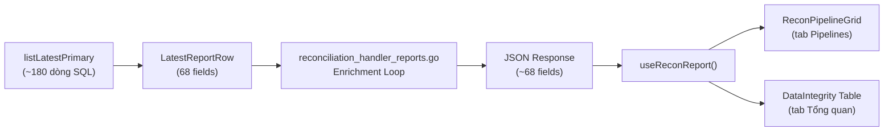

# 🔍 Báo cáo Audit: `listLatestPrimary` / `listLatestLegacy`

## 1. Bối cảnh

Trang `/data-integrity` trên CMS FE có **2 tab chính** sử dụng dữ liệu từ `GET /api/reconciliation/report`:

| Tab | Component | Vai trò |
|-----|-----------|---------|
| **Pipelines** (mặc định) | `ReconPipelineGrid.tsx` | Hiển thị danh sách pipeline Source→Shadow→Master, nhóm theo connector/DB. Click = Drawer drill-down |
| **Tổng quan** | `DataIntegrity.tsx` (Table inline) | Hiển thị bảng chi tiết với các cột enrichment |

Cả 2 tab đều consume **cùng một** `useReconReport()` → `GET /api/reconciliation/report` → `ListLatest()` → SQL `listLatestPrimary`.

---

## 2. Luồng dữ liệu (Data Flow)



---

## 3. Bảng Audit: SQL Column → Go Field → FE Sử dụng

### 3.1 Các cột từ bảng chính `cdc_reconciliation_report` (UNION ALL `cdc_recon_smoke_result`)

| SQL Column | Go Field | FE Pipeline Grid | FE Overview Table | Ghi chú |
|---|---|---|---|---|
| `r.id` | `ID` | ✅ (key, dedup) | ✅ (rowKey) | Cần thiết |
| `r.run_id` | `RunID` | ❌ | ❌ | **KHÔNG DÙNG trên UI** |
| `r.cycle_id` | — | ❌ | ❌ | **KHÔNG DÙNG** — chỉ có trong smoke, không map vào struct |
| `r.segment` | `Segment` | ✅ (phân A/B) | ✅ (tag) | **Cần thiết** |
| `r.source_type` | `SourceType` | ✅ (getSourceDisplayName) | ❌ | Hiển thị trong Drawer |
| `r.source_host` | `SourceHost` | ❌ | ❌ | **KHÔNG DÙNG trên UI** |
| `r.source_db` | `SourceDB` | ✅ (sourceName) | ✅ | Cần |
| `r.source_total` | `SourceTotal` | ✅ (fallback count) | ❌ | Dùng trong buildPipelines |
| `r.source_active` | `SourceActive` | ✅ (pipeline count) | ✅ | **Cần thiết** — hiển thị trực tiếp |
| `r.shadow_total` | `ShadowTotal` | ✅ (fallback count) | ❌ | Dùng trong buildPipelines |
| `r.shadow_active` | `ShadowActive` | ✅ (pipeline count) | ✅ | **Cần thiết** |
| `r.master_total` | `MasterTotal` | ✅ (fallback count) | ❌ | Dùng trong buildPipelines |
| `r.master_active` | `MasterActive` | ✅ (pipeline count) | ✅ | **Cần thiết** |
| `r.master_schema` | `MasterSchema` | ✅ (masterFqn) | ✅ | Cần |
| `r.master_table` | `MasterTable` | ✅ (masterFqn) | ✅ | Cần |
| `r.diff` | `Diff` | ✅ (driftBC fallback) | ❌ | Dùng trong buildPipelines |
| `r.status` | `Status` | ✅ (overallStatus) | ✅ | **Cần thiết** |
| `r.error_message` | `ErrorMessage` | ❌ | ❌ | **KHÔNG DÙNG trên UI** (xem ErrorCode thay thế) |
| `r.duration_ms` | `DurationMs` | ❌ (chỉ trong Drawer history) | ❌ | **KHÔNG CẦN cho ListLatest** — dùng ở TableHistory |
| `r.checked_at` | `CheckedAt` | ✅ (lastReconAt) | ✅ | Cần |
| `r.target_table` | `TargetTable` | ✅ | ✅ | Cần |
| `r.source_count` | `SourceCount` | ❌ (dùng active thay) | ✅ (handler enrichment) | Dùng gián tiếp qua ComputeDriftStatus |
| `r.dest_count` | `DestCount` | ❌ (dùng active thay) | ✅ (handler enrichment) | Dùng gián tiếp qua ComputeDriftStatus |
| `r.source_count AS nullable_source_count` | `NullableSourceCount` | ❌ | ✅ (ComputeDriftStatus) | Dùng trong handler enrichment |
| `NULL AS error_code` | `ErrorCode` | ❌ | ✅ (Trạng thái → lookup error) | Dùng trong handler enrichment |

### 3.2 Các cột từ Enrichment JOINs

| SQL Column | JOIN Source | Go Field | FE Pipeline Grid | FE Overview Table | Ghi chú |
|---|---|---|---|---|---|
| `reg.sync_engine` | `INNER JOIN cdc_table_registry` | `SyncEngine` | ❌ | ✅ (Tag cột) | Overview table only |
| `reg.timestamp_field` | `INNER JOIN cdc_table_registry` | `TimestampField` | ❌ | ✅ (cột riêng) | Overview table only |
| `reg.timestamp_field_source` | `INNER JOIN cdc_table_registry` | `TimestampFieldSource` | ❌ | ✅ (Tooltip) | Overview table only |
| `reg.timestamp_field_confidence` | `INNER JOIN cdc_table_registry` | `TimestampFieldConfidence` | ❌ | ✅ (Tooltip) | Overview table only |
| `reg.full_source_count` | `INNER JOIN cdc_table_registry` | `FullSourceCount` | ❌ | ✅ (cột Daily) | Overview table only |
| `reg.full_dest_count` | `INNER JOIN cdc_table_registry` | `FullDestCount` | ❌ | ✅ (cột Daily master) | Overview table only |
| `reg.full_count_at` | `INNER JOIN cdc_table_registry` | `FullCountAt` | ❌ | ❌ | **KHÔNG DÙNG trên UI** |
| `lag.ingest_lag_ms` | `LEFT JOIN recon_lag` | `IngestLagMs` | ✅ (cột Lag) | ✅ | Cần |
| `lag.transmute_lag_ms` | `LEFT JOIN recon_lag` | `TransmuteLagMs` | ✅ (cột Lag) | ✅ | Cần |
| `lag.worker_backlog` | `LEFT JOIN recon_lag` | `WorkerBacklog` | ❌ | ❌ | **KHÔNG DÙNG trên UI** |
| `sb.source_object_id` | **LATERAL JOIN shadow_binding** | `SourceObjectID` | ❌ | ✅ (ReDetectButton) | Overview actions only |
| `so.source_object_name` | `LEFT JOIN source_object_registry` | `SourceTable` | ✅ (sourceName) | ✅ | Cần |
| `sb.shadow_schema` | **LATERAL JOIN shadow_binding** | `ShadowSchema` | ✅ (shadowName) | ✅ | Cần |
| `sb.shadow_table` | **LATERAL JOIN shadow_binding** | `ShadowTable` | ✅ (shadowName) | ✅ | Cần |
| `cr.connection_code` | `LEFT JOIN connection_registry` | `SourceConnectionCode` | ✅ (connector tag) | ✅ | Cần |
| `scope_counts.binding_count > 1` | **LATERAL JOIN shadow_binding (COUNT)** | `ScopeAmbiguous` | ❌ | ✅ (Tag "Ambiguous") | Overview table only |

### 3.3 Enrichment tại Handler (Go, không phải SQL)

| Go Field | Logic | FE | Ghi chú |
|---|---|---|---|
| `ComputedStatus` | `ComputeDriftStatus()` | ✅ Override `Status` | Computed |
| `DriftPct` | `ComputeDriftStatus()` | ✅ (cột Drift %) | Computed |
| `ErrorMessageVI` | `ErrorMessagesVI[code]` | ❌ | **KHÔNG DÙNG trên UI** — FE tự lookup |
| `SourceQueryMethod` | `DeriveSourceQueryMethod()` | ❌ | **KHÔNG DÙNG trên UI** (khai báo trong ReconReport nhưng không render) |
| `HealNeeded` | `ComputeHealNeeded()` | ❌ | **KHÔNG DÙNG trên UI** (declared nhưng không rendered) |

---

## 4. Phân tích LATERAL JOINs đắt đỏ

### JOIN 1: `sb_norm` — Normalize shadow_schema NULL (dòng 107-114 trong listLatestPrimary)
```sql
LEFT JOIN LATERAL (
    SELECT shadow_schema FROM cdc_system.shadow_binding
    WHERE shadow_table = r.shadow_table AND is_active = TRUE
    ORDER BY updated_at DESC, id DESC LIMIT 1
) sb_norm ON r.shadow_schema IS NULL
```
> **Chi phí:** O(N) × scan shadow_binding cho mỗi row cũ chưa có shadow_schema.
> **Cần thiết?** CÓ — nhưng chỉ cho records cũ. Sau khi tất cả records đều có shadow_schema (post-migration 085), lateral này trở thành dead code.

### JOIN 2: `s` — Lấy smoke counts khi primary row thiếu (dòng 150-160)
```sql
LEFT JOIN LATERAL (
    SELECT source_total, source_active, shadow_total, shadow_active, master_total, master_active
    FROM cdc_system.cdc_recon_smoke_result
    WHERE ... ORDER BY checked_at DESC LIMIT 1
) s ON r.source_active IS NULL
```
> **Chi phí:** O(N) × scan smoke_result cho mỗi row có source_active=NULL.
> **Cần thiết?** CÓ — nhưng chỉ khi record chính (cdc_reconciliation_report) chưa có active counts. Smoke result đã được UNION ALL vào subquery, nên LATERAL này chỉ fallback cho edge cases.

### JOIN 3: `sb` — Lấy source_object_id + shadow metadata (dòng 163-170)
```sql
LEFT JOIN LATERAL (
    SELECT source_object_id, shadow_schema, shadow_table
    FROM cdc_system.shadow_binding
    WHERE shadow_table = r.shadow_table AND is_active = TRUE
    ORDER BY updated_at DESC, id DESC LIMIT 1
) sb ON TRUE
```
> **Chi phí:** O(N) × scan shadow_binding.
> **Cần thiết?** CÓ — cung cấp `source_object_id` (ReDetectButton), `shadow_schema/shadow_table` (COALESCE), `source_connection_code` (qua chain join).

### JOIN 4: `scope_counts` — Đếm binding (dòng 171-176)
```sql
LEFT JOIN LATERAL (
    SELECT COUNT(*)::int AS binding_count
    FROM cdc_system.shadow_binding
    WHERE shadow_table = r.shadow_table AND is_active = TRUE
) scope_counts ON TRUE
```
> **Chi phí:** O(N) × full scan shadow_binding.
> **Cần thiết?** CHỈ cho tag "Ambiguous" trên tab Overview. **Tab Pipelines KHÔNG dùng field này.**

---

## 5. Kết luận & Đề xuất Tối ưu

### 5.1 Các field KHÔNG được dùng ở ĐÂU trên UI (Dead SQL Columns)

| SQL Column | Go Field | Đề xuất |
|---|---|---|
| `r.run_id` | `RunID` | **Loại bỏ** khỏi SELECT |
| `r.cycle_id` | — | **Loại bỏ** (đã NULL) |
| `r.source_host` | `SourceHost` | **Loại bỏ** |
| `r.error_message` | `ErrorMessage` | **Loại bỏ** — FE dùng error_code |
| `r.duration_ms` | `DurationMs` | **Loại bỏ** — chỉ dùng ở TableHistory |
| `reg.full_count_at` | `FullCountAt` | **Loại bỏ** |
| `lag.worker_backlog` | `WorkerBacklog` | **Loại bỏ** |

### 5.2 Handler Enrichment KHÔNG dùng trên FE

| Go Field | Đề xuất |
|---|---|
| `ErrorMessageVI` | **Loại bỏ** — FE tự lookup qua `lookupReconError()` |
| `SourceQueryMethod` | **Loại bỏ** — declared nhưng không render |
| `HealNeeded` | **Loại bỏ** — declared nhưng không render |

### 5.3 Tối ưu LATERAL JOINs

> [!IMPORTANT]
> **Đề xuất chính: Thay thế 2 LATERAL JOINs (`sb` + `scope_counts`) bằng CTE hoặc subquery JOIN thường.**

| Lateral | Đề xuất | Lý do |
|---|---|---|
| `sb_norm` | **Giữ nguyên** (hoặc cleanup nếu tất cả records đã có shadow_schema) | Chỉ fire khi `r.shadow_schema IS NULL` |
| `s` (smoke fallback) | **Giữ nguyên** | Chỉ fire khi `r.source_active IS NULL` |
| `sb` (shadow binding) | **→ CTE + LEFT JOIN** | Fire cho **MỌI** row → O(N) |
| `scope_counts` | **→ CTE + LEFT JOIN** | Fire cho **MỌI** row → O(N) |

**Phương án CTE cụ thể:**
```sql
WITH active_bindings AS (
    SELECT id, source_object_id, shadow_schema, shadow_table,
           ROW_NUMBER() OVER (PARTITION BY shadow_table ORDER BY updated_at DESC, id DESC) as rn
    FROM cdc_system.shadow_binding
    WHERE is_active = TRUE
),
binding_counts AS (
    SELECT shadow_table, COUNT(*) AS binding_count
    FROM cdc_system.shadow_binding
    WHERE is_active = TRUE
    GROUP BY shadow_table
)
-- Thay thế:
--   LEFT JOIN LATERAL (...) sb ON TRUE       → LEFT JOIN active_bindings sb ON sb.shadow_table = r.shadow_table AND sb.rn = 1
--   LEFT JOIN LATERAL (...) scope_counts     → LEFT JOIN binding_counts bc ON bc.shadow_table = r.shadow_table
```

### 5.4 Về `listLatestLegacy`

> [!WARNING]
> **Query này có thể ĐÃ CHẾT (dead code).**
> Nó chỉ chạy khi `listLatestPrimary` lỗi (tức là khi DB chưa có migration 017). Nếu production đã apply migration 017, query này KHÔNG BAO GIỜ thực thi.
> **Đề xuất:** Xác nhận migration 017 đã apply trên tất cả env → loại bỏ legacy query + fallback logic.

### 5.5 Tóm tắt Tác động

| Hạng mục | Trước | Sau |
|---|---|---|
| Số LATERAL JOINs | 4 | 2 (sb_norm + smoke fallback, chỉ conditional) |
| SELECT columns | ~25 | ~18 (loại 7 dead columns) |
| Handler enrichment | 5 computed fields | 2 (chỉ giữ ComputedStatus + DriftPct) |
| Legacy fallback | Có | Loại bỏ (nếu migration 017 confirmed) |
