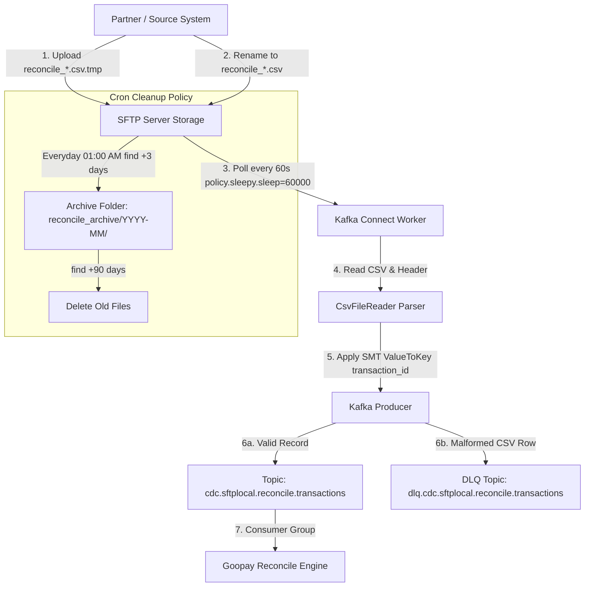

# 03_implementation: Thiết Kế Kỹ Thuật Chi Tiết (Technical Design Spec)

## 1. Sơ Đồ Luồng Dữ Liệu Enterprise (Data Flow Architecture)



## 2. Thông Số Cấu Hình Chi Tiết (JSON Specification)

```json
{
  "name": "sftp-reconcile-source-v1",
  "config": {
    "connector.class": "com.github.mmolimar.kafka.connect.fs.FsSourceConnector",
    "tasks.max": "1",

    "fs.uris": "sftp://${file:/etc/kafka-connect/secrets/sftp-credentials.properties:SFTP_USER}:${file:/etc/kafka-connect/secrets/sftp-credentials.properties:SFTP_PASS}@sftp-prod-internal.goopay.vn:2022/home/gp-reconcile-admin/goopay/reconcile",

    "policy.class": "com.github.mmolimar.kafka.connect.fs.policy.SleepyPolicy",
    "policy.sleepy.sleep": "60000",
    "policy.recursive": "false",
    "policy.regexp": "^reconcile_.*\\.csv$",

    "file_reader.class": "com.github.mmolimar.kafka.connect.fs.file.reader.CsvFileReader",
    "file_reader.delimited.header": "true",

    "topic": "cdc.sftplocal.reconcile.transactions",

    "key.converter": "org.apache.kafka.connect.storage.StringConverter",
    "value.converter": "org.apache.kafka.connect.json.JsonConverter",
    "value.converter.schemas.enable": "false",

    "transforms": "createKey,extractField",
    "transforms.createKey.type": "org.apache.kafka.connect.transforms.ValueToKey",
    "transforms.createKey.fields": "transaction_id",
    "transforms.extractField.type": "org.apache.kafka.connect.transforms.ExtractField$Key",
    "transforms.extractField.field": "transaction_id",

    "errors.tolerance": "all",
    "errors.deadletterqueue.topic.name": "dlq.cdc.sftplocal.reconcile.transactions",
    "errors.deadletterqueue.topic.replication.factor": "3",
    "errors.deadletterqueue.context.headers.enable": "true",
    "errors.log.enable": "true",
    "errors.log.include.messages": "true"
  }
}
```

## 3. Cấu Hình File Secrets & ConfigProvider
File `/etc/kafka-connect/secrets/sftp-credentials.properties`:
```properties
SFTP_USER=gp-reconcile-admin
SFTP_PASS=SuperSecureProdPassword2026!
```
ConfigProvider trong `connect-distributed.properties`:
```properties
config.providers=file
config.providers.file.class=org.apache.kafka.connect.transforms.util.FileConfigProvider
```
