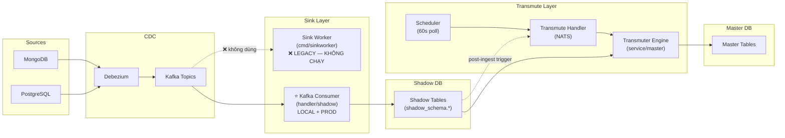
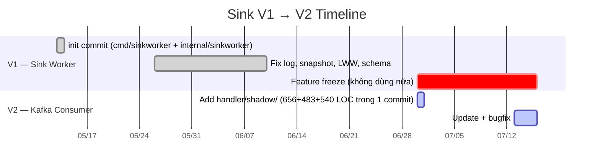
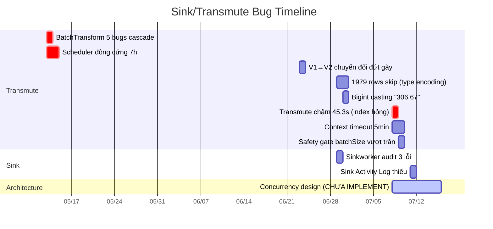

# 🔍 AUDIT TỔNG QUAN: Luồng Sink & Transmute — Phân Tích Rủi Ro Mất Dữ Liệu

> **Ngày audit:** 2026-07-16 (cập nhật lần 2)
> **Phạm vi:** `centralized-data-service` — Toàn bộ pipeline Kafka → Shadow DB → Master DB
> **Động lực:** Data chạy rất hay bị miss dữ liệu, không truy vấn được — đặc biệt luồng sink

> [!CAUTION]
> **PHÁT HIỆN QUAN TRỌNG:** Kafka Consumer (`handler/shadow`) là đường dẫn **PRIMARY đang chạy cả local và production** — xác nhận qua activity log (`kafka-consumer`, `{"written": 1, "batch_size": 2}`). Sink Worker (`cmd/sinkworker`) là binary legacy **KHÔNG chạy** ở bất kỳ môi trường nào hiện tại.
>
> Các rủi ro **SINK-C1** (auto-commit 1s) và **SINK-C2** (flush gap) **ĐANG ẢNH HƯỞNG TRỰC TIẾP PRODUCTION** — đây là nguyên nhân gốc rễ data bị miss.

---

## 1. KIẾN TRÚC TỔNG QUAN



Hệ thống có **2 đường dẫn sink trong code** nhưng chỉ **1 đường đang active**:

| Component | Binary | Trạng thái | Consumer Group | Commit Strategy |
|-----------|--------|-----------|---------------|-----------------|
| **Kafka Consumer** ⭐ | `cmd/worker` (main service) | **✅ ACTIVE — Local + Prod** | `cfg.Kafka.GroupID` | `CommitInterval: 1s` ⚠️ Auto |
| **Sink Worker** | `cmd/sinkworker` (riêng) | **❌ LEGACY — Không chạy** | `cdc-v125-sink-worker` | `CommitInterval: 0` Manual |

**Bằng chứng Kafka Consumer là PRIMARY:**
- Activity log cả local + prod đều ghi: action=`sink-upsert`, source=`kafka-consumer`, detail=`{"written": 1, "batch_size": 2}` → format của [batch_buffer.go:272-275](file:///Users/trainguyen/Documents/work/data-hub/centralized-data-service/internal/handler/shadow/batch_buffer.go#L272)
- [config-local.yml:53-62](file:///Users/trainguyen/Documents/work/data-hub/centralized-data-service/config/config-local.yml#L53): `kafka.enabled: true`, `brokers: [10.200.186.203:9092]`
- Production inject brokers qua env vars (config-production.yml chỉ là template mặc định)
- [server_setup.go:423-435](file:///Users/trainguyen/Documents/work/data-hub/centralized-data-service/internal/server/server_setup.go#L423): Tự động start khi `cfg.Kafka.Enabled && len(cfg.Kafka.Brokers) > 0`

**Bằng chứng Sink Worker KHÔNG chạy:**
- K8s manifests: **KHÔNG có** deployment cho sinkworker
- Docker-compose: **KHÔNG có** service riêng cho sinkworker
- Makefile: **KHÔNG có** build target cho sinkworker
- Runbook ghi: *"Nếu có sinkworker chạy riêng, dừng luôn process đó"* — gợi ý optional/legacy
- Activity log: **KHÔNG có** record nào với detail format `{"topic", "partition", "offset", "snap"}` — format riêng của Sink Worker ([worker.go:264-269](file:///Users/trainguyen/Documents/work/data-hub/centralized-data-service/internal/sinkworker/worker.go#L264))

---

### ⭐ Kafka Consumer — Chi tiết luồng xử lý (PRIMARY, Local + Prod)

**Files:** [kafka_consumer.go](file:///Users/trainguyen/Documents/work/data-hub/centralized-data-service/internal/handler/shadow/kafka_consumer.go) (659 LOC) → [event_handler.go](file:///Users/trainguyen/Documents/work/data-hub/centralized-data-service/internal/handler/shadow/event_handler.go) (544 LOC) → [batch_buffer.go](file:///Users/trainguyen/Documents/work/data-hub/centralized-data-service/internal/handler/shadow/batch_buffer.go) (514 LOC)

**Cách hoạt động:** Xử lý **batch** qua `EventHandler` + `BatchBuffer`, flush theo timer (5s) hoặc khi đầy.

```
Kafka ──FetchMessage──► processMessage ──► EventHandler ──► BatchBuffer.Add() ─── timer 5s ──► Flush (batchUpsert) ──► Shadow DB
     200ms timeout          │                   │                │                                    │
                     kafka_consumer.go    event_handler.go   batch_buffer.go                   batch_buffer.go
                            │                   │
                       ⚠️ auto-commit       routing +
                         mỗi 1s            fan-out
```

**Step-by-step:**

| Step | File:Line | Hành động | Error Handling |
|------|-----------|-----------|----------------|
| 1. Build reader | [kafka_consumer.go:144](file:///Users/trainguyen/Documents/work/data-hub/centralized-data-service/internal/handler/shadow/kafka_consumer.go#L144) | `CommitInterval: 1s` ⚠️ auto-commit | — |
| 2. Fetch message | [kafka_consumer.go:293](file:///Users/trainguyen/Documents/work/data-hub/centralized-data-service/internal/handler/shadow/kafka_consumer.go#L293) | `FetchMessage()` với 200ms timeout | Timeout → continue loop |
| 3. Check empty | [kafka_consumer.go:502](file:///Users/trainguyen/Documents/work/data-hub/centralized-data-service/internal/handler/shadow/kafka_consumer.go#L502) | `len(value)==0 → return 0, nil` | ⚠️ **Silent drop**, no log |
| 4. Decode | [kafka_consumer.go:494](file:///Users/trainguyen/Documents/work/data-hub/centralized-data-service/internal/handler/shadow/kafka_consumer.go#L494) | Avro/JSON decode → build `cdcEvent` | Error → writeDLQ |
| 5. Check afterData | [kafka_consumer.go:569](file:///Users/trainguyen/Documents/work/data-hub/centralized-data-service/internal/handler/shadow/kafka_consumer.go#L569) | `afterData==nil && op!="d" → skip` | ⚠️ **Silent drop** (Debug log only) |
| 6. Route lookup | [event_handler.go:164](file:///Users/trainguyen/Documents/work/data-hub/centralized-data-service/internal/handler/shadow/event_handler.go#L164) | Registry lookup → shadow target(s) | ⚠️ 0 routes → **silent drop** (Warn log) |
| 7. Extract PK | [event_handler.go:232](file:///Users/trainguyen/Documents/work/data-hub/centralized-data-service/internal/handler/shadow/event_handler.go#L232) | PK value từ event data | ⚠️ Empty PK → **silent drop** (Warn log) |
| 8. Buffer add | [batch_buffer.go](file:///Users/trainguyen/Documents/work/data-hub/centralized-data-service/internal/handler/shadow/batch_buffer.go) | `batchBuffer.Add(record)` | — |
| 9. Flush (timer/full) | [batch_buffer.go:192](file:///Users/trainguyen/Documents/work/data-hub/centralized-data-service/internal/handler/shadow/batch_buffer.go#L192) | `batchUpsert()` per group, chunk 500 | TX error → rollback |
| 10. Fallback sequential | [batch_buffer.go:405](file:///Users/trainguyen/Documents/work/data-hub/centralized-data-service/internal/handler/shadow/batch_buffer.go#L405) | Per-record retry khi batch fail | Failed → `writeDLQ` (`failed_sync_logs`) |
| 11. DLQ write | [dlq_helper.go](file:///Users/trainguyen/Documents/work/data-hub/centralized-data-service/internal/handler/shadow/dlq_helper.go) (143 LOC) | Ghi record lỗi vào `failed_sync_logs` | ⚠️ DLQ write fail → error **swallowed** (`_`) |
| 12. Circuit breaker | [dlq_circuit_breaker.go](file:///Users/trainguyen/Documents/work/data-hub/centralized-data-service/internal/handler/shadow/dlq_circuit_breaker.go) (65 LOC) | Rate limiter, NATS pause/resume pipeline | — |

**Config đang chạy (local):**
```yaml
# config-local.yml
kafka:
  enabled: true
  brokers: [10.200.186.203:9092]
  groupId: cdc-worker-group-local
  topicPrefix: [cdc.gpaylocal, cdc.goopaylocal, cdc.mariadblocal]
  schemaRegistryUrl: http://10.200.186.201:8081

worker:
  kafkaBatchFlushSize: 10000
```

**Config hardcoded trong code:**
```
CommitInterval:    1s ⚠️ (auto-commit) — kafka_consumer.go:151
MinBytes:          10 KB
MaxBytes:          10 MB
SessionTimeout:    30s
RebalanceTimeout:  30s
StartOffset:       FirstOffset
FlushInterval:     5s (configurable via registry)
AdaptiveBatch:     enabled (lag threshold 50000, max multiplier 4x)
```

**Đặc điểm:**
- ✅ **Batch processing** — hiệu năng cao
- ✅ **DLQ** (`failed_sync_logs`) — poison pill không block consumer
- ✅ **Circuit breaker** — pause pipeline khi DLQ rate quá cao
- ✅ **Adaptive batching** — tự điều chỉnh batch size theo lag
- ✅ **SchemaAdapter** — auto-create/alter shadow tables
- ❌ **Auto-commit 1s** — crash giữa commit và flush = **DATA LOSS** (PRODUCTION!)
- ❌ **Flush timing gap** — offset committed trước data ghi DB (PRODUCTION!)
- ❌ **4 silent drop points** (empty value, nil afterData, 0 routes, empty PK)
- ❌ **Không có fencing token** — risk duplicate writes khi rebalance

---

### Sink Worker — Chi tiết (LEGACY, Không chạy)

**Files:** [main.go](file:///Users/trainguyen/Documents/work/data-hub/centralized-data-service/cmd/sinkworker/main.go) (294 LOC) → [worker.go](file:///Users/trainguyen/Documents/work/data-hub/centralized-data-service/internal/sinkworker/worker.go) (459 LOC) → [schema_manager.go](file:///Users/trainguyen/Documents/work/data-hub/centralized-data-service/internal/sinkworker/schema_manager.go) (337 LOC)

**Cách hoạt động:** Binary riêng, phải start thủ công (`go run cmd/sinkworker/main.go`). Xử lý **tuần tự 1 message/lần**, commit manual SAU khi ghi DB thành công.

```
Kafka ──FetchMessage──► Decode (Avro/JSON) ──► HandleMessage ──► Upsert Shadow DB ──► CommitOffset
                            │                       │                    │
                        avro_decode.go          worker.go           sql_builder.go
```

**Step-by-step:**

| Step | File:Line | Hành động | Error Handling |
|------|-----------|-----------|----------------|
| 1. Discover topics | [main.go:150](file:///Users/trainguyen/Documents/work/data-hub/centralized-data-service/cmd/sinkworker/main.go#L150) | Regex `^cdc\.goopay\..*` trên Kafka metadata | Fatal nếu lỗi |
| 2. Claim machine ID | [main.go:94](file:///Users/trainguyen/Documents/work/data-hub/centralized-data-service/cmd/sinkworker/main.go#L94) | `cdc_system.claim_machine_id()` + fencing token | Fatal nếu lỗi |
| 3. Fetch message | [main.go:184](file:///Users/trainguyen/Documents/work/data-hub/centralized-data-service/cmd/sinkworker/main.go#L184) | `reader.FetchMessage()` — 1 message/lần, blocking | Sleep 1s + continue |
| 4. Decode envelope | [avro_decode.go](file:///Users/trainguyen/Documents/work/data-hub/centralized-data-service/internal/sinkworker/avro_decode.go) | Avro (Schema Registry) hoặc JSON fallback | ⚠️ nil envelope → **silent drop** (return nil) |
| 5. Parse after/before | [worker.go:211-221](file:///Users/trainguyen/Documents/work/data-hub/centralized-data-service/internal/sinkworker/worker.go#L211) | `decodeAfter()` cho payload | before error **ignored** (`_`) |
| 6. Extract _source_id | [worker.go:230](file:///Users/trainguyen/Documents/work/data-hub/centralized-data-service/internal/sinkworker/worker.go#L230) | Trích PK từ Debezium key | Return error → không commit |
| 7. Resolve shadow target | [worker.go:245](file:///Users/trainguyen/Documents/work/data-hub/centralized-data-service/internal/sinkworker/worker.go#L245) | Topic → `shadow_schema.shadow_table` (cache 5 phút) | Return error → không commit |
| 8. Masking PII | [worker.go:277](file:///Users/trainguyen/Documents/work/data-hub/centralized-data-service/internal/sinkworker/worker.go#L277) | `masking.MaskTableData()` | Skip nếu lỗi |
| 9. Hash & build record | [worker.go:286-307](file:///Users/trainguyen/Documents/work/data-hub/centralized-data-service/internal/sinkworker/worker.go#L286) | `canonicalJSON → sha256` | — |
| 10. Ensure schema | [schema_manager.go](file:///Users/trainguyen/Documents/work/data-hub/centralized-data-service/internal/sinkworker/schema_manager.go) | Auto-CREATE/ALTER | ⚠️ Financial: field mới bị **delete**. Rate limit 100 ALTER/24h |
| 11. Upsert with fencing | [worker.go:316-326](file:///Users/trainguyen/Documents/work/data-hub/centralized-data-service/internal/sinkworker/worker.go#L316) | TX: SET fencing → `INSERT ON CONFLICT` | Return error → không commit, retry |
| 12. Commit offset | [main.go:211](file:///Users/trainguyen/Documents/work/data-hub/centralized-data-service/cmd/sinkworker/main.go#L211) | `reader.CommitMessages()` — **CHỈ sau success** | Retry nếu lỗi |

**Config hardcoded:**
```
ConsumerGroup:     "cdc-v125-sink-worker" (hardcoded)
CommitInterval:    0 (manual) ✅
Topics:            ^cdc\.goopay\..*  (hardcoded regex, chỉ GooPay)
MaxBytes:          10 MiB
MaxWait:           500ms
HeartbeatInterval: 3s
SessionTimeout:    30s
Fencing:           30s ticker → heartbeat_machine_id()
```

**Đặc điểm:**
- ✅ **At-least-once delivery** — commit SAU khi ghi DB
- ✅ **Fencing token** — chống duplicate writes khi rebalance
- ✅ **Activity logging** — per-message
- ❌ **Không có DLQ** — poison pill = consumer block vĩnh viễn
- ❌ **Không có context timeout** — DB hang = block vô thời hạn
- ❌ **Throughput thấp** — 1 msg/lần tuần tự
- ❌ **Silent drop** tombstone/nil envelope

---

### So sánh 2 đường dẫn

| Tiêu chí | Kafka Consumer ⭐ (ĐANG DÙNG) | Sink Worker (LEGACY) |
|----------|-------------------------------|---------------------|
| **Trạng thái** | ✅ Active — Local + Prod | ❌ Không chạy |
| **Delivery guarantee** | ⚠️ At-most-once (auto-commit bug) | ✅ At-least-once |
| **Throughput** | ✅ Cao (batch + adaptive) | ❌ Thấp (1 msg/lần) |
| **DLQ** | ✅ `failed_sync_logs` | ❌ Không có |
| **Circuit breaker** | ✅ Có | ❌ Không |
| **Poison pill handling** | ✅ Ghi DLQ + tiếp tục | ❌ Block vĩnh viễn |
| **Silent drops** | ❌ 4 điểm | ❌ 1 điểm |
| **Fencing** | ❌ Không | ✅ Heartbeat + token |
| **Context timeout** | ✅ 200ms fetch timeout | ❌ Không |

> [!WARNING]
> **Nghịch lý:** Kafka Consumer có kiến trúc tốt hơn (batch, DLQ, circuit breaker) nhưng lại có **bug commit strategy chí mạng** gây data loss ở production. Sink Worker có commit strategy đúng nhưng thiếu resilience features và không được dùng.

---

### Lịch sử tiến hóa: Tại sao code bị tối nghĩa



| Mốc | Commit | Sự kiện |
|-----|--------|---------|
| **2026-05-13** | `94aa71c init` | **V1 Sink Worker** ra đời — `cmd/sinkworker/` + `internal/sinkworker/`, xử lý tuần tự 1 msg/lần |
| 05-26 → 06-10 | nhiều commit | V1 được phát triển thêm (fix log, snapshot, LWW, schema) |
| **2026-06-30** | `ac4d82c` | **V2 Kafka Consumer** ra đời — toàn bộ `internal/handler/shadow/` (14 files, ~3000 LOC) xuất hiện trong **1 commit**, message = `"update recon core"` |
| 07-13 → 07-14 | tiếp tục | V2 được update, V1 cũng bị sửa song song → tối nghĩa |

**Kết quả:** V1 không bị xoá, không được đánh dấu deprecated. Cả 2 path tồn tại song song trong codebase. Naming lẫn lộn (V1 log action `"kafka-consumer-sw"`, V2 log `"kafka-consumer"` — chỉ khác suffix `-sw`).

---

### ⚠️ Vấn đề Design Pattern: Kafka Consumer sai layer

> [!CAUTION]
> Toàn bộ Kafka Consumer logic (transport + batching + DLQ + circuit breaker + metrics) nằm **sai layer** trong `internal/handler/shadow/`. Đây là vi phạm kiến trúc nghiêm trọng cần tách ra trong tương lai.

**Hiện tại — `handler/shadow/` ôm TẤT CẢ:**

```
handler/shadow/
├── kafka_consumer.go     ← Transport layer (Kafka client, reader, topic discovery)
├── event_handler.go      ← Business logic (routing, PK extraction, fan-out)  
├── batch_buffer.go       ← Business logic (batching, flush, upsert)
├── batch_buffer_utils.go ← Business logic (SQL builder, chunking)
├── batch_buffer_logs.go  ← Observability
├── batch_buffer_fanout.go← Business logic (post-ingest trigger)
├── dlq_helper.go         ← Infrastructure (DLQ persistence)
├── dlq_circuit_breaker.go← Infrastructure (rate limiting)
├── adaptive_batcher.go   ← Business logic (dynamic batch sizing)
├── avro_helper.go        ← Infrastructure (Avro deserialization)
├── event_bridge.go       ← Business logic (event transformation)
└── consumer_pool.go      ← Infrastructure (connection pooling)
```

**Vấn đề:**
- `handler/` theo convention nên chỉ là **thin adapter** (nhận request → parse → gọi service → trả response)
- Kafka consumer là **transport/infrastructure** — nên nằm ở `internal/consumer/` hoặc `internal/transport/kafka/`
- Batch buffer, DLQ, circuit breaker là **business/service logic** — nên nằm ở `internal/service/shadow/`
- Vi phạm **Single Responsibility**: 1 package ôm transport + business + infrastructure
- **Hệ quả thực tế**: Khó test (phải mock Kafka để test batch logic), khó maintain (thay đổi batch strategy phải sờ vào handler package), khó reuse (batch logic bị couple với Kafka transport)

**Khuyến nghị tách (P2 — để sau):**
```
internal/
├── consumer/kafka/        ← Transport: Kafka reader, topic discovery, offset management
├── service/shadow/
│   ├── ingester.go        ← Business: batch buffer, flush strategy, fan-out
│   ├── dlq.go             ← Business: dead letter queue
│   └── circuit_breaker.go ← Business: rate limiting
└── handler/shadow/        ← Thin adapter: chỉ wire consumer → service
```

## 2. BẢNG TỔNG HỢP RỦI RO (RISK MATRIX)

> [!CAUTION]
> Phát hiện **40 rủi ro** tổng cộng: **7 Critical**, **13 High**, **14 Medium**, **6 Low**
> **SINK-C1 và SINK-C2 đang ảnh hưởng PRODUCTION** — là nguyên nhân trực tiếp gây miss data

### Tổng quan nhanh

| Severity | Sink (Kafka Consumer) | Sink (Legacy) | Transmute | Tổng |
|----------|----------------------|--------------|-----------|------|
| 🔴 **Critical** | **2 (PROD!)** | 1 (ko ảnh hưởng) | 4 | **7** |
| 🟠 **High** | 6 (PROD!) | 1 (ko ảnh hưởng) | 6 | **13** |
| 🟡 **Medium** | 3 (PROD!) | 4 (ko ảnh hưởng) | 7 | **14** |
| 🟢 **Low** | 0 | 3 (ko ảnh hưởng) | 3 | **6** |

---

## 3. RỦI RO CRITICAL — CẦN XỬ LÝ NGAY

> [!IMPORTANT]
> 7 rủi ro Critical, trong đó **2 đang gây data loss trực tiếp ở production**

### 🔴 SINK-C1: CommitInterval=1s — Auto-commit trước khi xử lý xong ⚡ PRODUCTION

| | |
|---|---|
| **File** | [kafka_consumer.go:151](file:///Users/trainguyen/Documents/work/data-hub/centralized-data-service/internal/handler/shadow/kafka_consumer.go#L151) |
| **Code** | `CommitInterval: time.Second` |
| **Ảnh hưởng** | **⚡ PRODUCTION — DATA LOSS khi crash/restart** |

**Vấn đề:** `segmentio/kafka-go` khi `CommitInterval > 0` sẽ auto-commit offset theo interval, **bất kể message đã xử lý xong hay chưa**. Worker crash/restart giữa chừng → messages đã auto-committed nhưng chưa flush BatchBuffer → **MẤT DATA VĨNH VIỄN, KHÔNG RECOVERABLE**.

**Đây là nguyên nhân #1 gây miss data ở production.**

```diff
// kafka_consumer.go:151
- CommitInterval: time.Second,
+ CommitInterval: 0, // Manual commit only after successful flush
```

---

### 🔴 SINK-C2: BatchBuffer flush timing gap — Offset committed trước khi data ghi DB ⚡ PRODUCTION

| | |
|---|---|
| **File** | [kafka_consumer.go:474](file:///Users/trainguyen/Documents/work/data-hub/centralized-data-service/internal/handler/shadow/kafka_consumer.go#L474) + [batch_buffer.go:155](file:///Users/trainguyen/Documents/work/data-hub/centralized-data-service/internal/handler/shadow/batch_buffer.go#L155) |
| **Ảnh hưởng** | **⚡ PRODUCTION — DATA LOSS window = buffer size × processing time** |

**Vấn đề:** Ngay cả khi fix SINK-C1, vẫn cần đảo thứ tự: flush BatchBuffer xong → rồi mới commit offset. Hiện tại message được auto-commit offset **NGAY** sau `processMessage()` add vào buffer, nhưng data chỉ ghi DB khi flush (timer 5s hoặc khi đầy). Crash giữa commit và flush → data mất.

```
Timeline: auto-commit offset ──── 5s gap ──── flush to DB
                    ▲                             ▲
              offset saved                   data written
              
          Crash ở đây → DATA LOSS ❌
```

**Fix cần ~50 LOC refactor:** commit offset SAU khi flush thành công, track highest offset per partition.

---

### 🔴 SINK-C3: Tombstone/NULL message bị SILENT DROP — không log, không DLQ

| | |
|---|---|
| **File (Kafka Consumer)** | [kafka_consumer.go:502-503](file:///Users/trainguyen/Documents/work/data-hub/centralized-data-service/internal/handler/shadow/kafka_consumer.go#L502) |
| **File (Sink Worker)** | [worker.go:197-198](file:///Users/trainguyen/Documents/work/data-hub/centralized-data-service/internal/sinkworker/worker.go#L197) |
| **Ảnh hưởng** | **⚡ PRODUCTION (Kafka Consumer) — Mất DELETE events, không dấu vết** |

**Vấn đề:** Kafka tombstone (Debezium compaction) → empty/nil value → message bị drop im lặng, **KHÔNG log**, không DLQ, không metrics. Không thể audit bao nhiêu events bị mất.

---

### 🔴 TRANSMUTE-C1: Bulk upsert fail → toàn batch bị skip, KHÔNG retry

| | |
|---|---|
| **File** | [transmuter.go:671-676](file:///Users/trainguyen/Documents/work/data-hub/centralized-data-service/internal/service/master/transmuter.go#L671) |
| **Ảnh hưởng** | **⚡ PRODUCTION — Mất data vĩnh viễn do transient error** |

**Vấn đề:** Khi `bulkUpsertMaster()` fail (deadlock, connection reset, timeout), code chỉ `logger.Error` + `out.skipped += ...` + `continue`. **Không retry, không DLQ, không persist failed records**. Data mất vĩnh viễn.

```go
// transmuter.go:671-676 — HIỆN TẠI
if err != nil {
    logger.Error("bulkUpsertMaster failed", zap.Error(err))
    out.skipped += int64(end - i)  // ← đếm rồi bỏ qua!
    continue                        // ← next batch, data cũ mất
}
```

---

### 🔴 TRANSMUTE-C2: Flatten orphan rows — KHÔNG auto soft-delete

| | |
|---|---|
| **File** | [flatten.go:20-23](file:///Users/trainguyen/Documents/work/data-hub/centralized-data-service/internal/service/master/transmute/flatten.go#L20) |
| **Ảnh hưởng** | **⚡ PRODUCTION — Query master trả về data thừa (stale)** |

**Vấn đề:** Khi document update thu nhỏ array (5 items → 3), các master rows orphan (`#3`, `#4`) **KHÔNG bị soft-delete**. Data cũ tồn tại mãi mãi, gây sai aggregate queries. Code ghi rõ: *"KNOWN LIMITATION (deferred)"*.

---

### 🔴 TRANSMUTE-C3: Silent rule drop — rules bị lọc bỏ không log

| | |
|---|---|
| **File** | [transmuter.go:425-438](file:///Users/trainguyen/Documents/work/data-hub/centralized-data-service/internal/service/master/transmuter.go#L425) |
| **Ảnh hưởng** | **⚡ PRODUCTION — Columns thiếu → record bị skip toàn bộ** |

**Vấn đề:** `loadRules()` filter bỏ rules có `transform_fn` không whitelist hoặc `data_type` invalid — **chỉ log** cho `$` case, **không log** 2 case đầu. Rules bị drop → columns thiếu → nếu `is_nullable=false` → **toàn bộ record bị drop** (TX-C4).

---

### 🔴 TRANSMUTE-C4: Non-nullable field miss → toàn bộ record bị drop

| | |
|---|---|
| **File** | [transmuter.go:791-793](file:///Users/trainguyen/Documents/work/data-hub/centralized-data-service/internal/service/master/transmuter.go#L791) |
| **Ảnh hưởng** | **⚡ PRODUCTION — 1 field thiếu → mất TOÀN BỘ record** |

**Vấn đề:** Khi `gjson.Get(rawStr, path)` không tìm thấy field VÀ rule `is_nullable=false` VÀ `default_value=nil` → return `false`. **Toàn bộ record bị drop**, kể cả các columns khác đã extract thành công.

---

## 4. RỦI RO HIGH — CẦN LÊN KẾ HOẠCH FIX

### Luồng Sink — Kafka Consumer (⚡ PRODUCTION)

| ID | Rủi ro | File | Impact |
|----|--------|------|--------|
| SINK-H1 | Empty Kafka value bị **silent drop** (không log, không DLQ) | [kafka_consumer.go:502-503](file:///Users/trainguyen/Documents/work/data-hub/centralized-data-service/internal/handler/shadow/kafka_consumer.go#L502) | Messages rỗng biến mất |
| SINK-H2 | Null afterData (non-delete) bị **silent drop** (chỉ Debug log) | [kafka_consumer.go:569-574](file:///Users/trainguyen/Documents/work/data-hub/centralized-data-service/internal/handler/shadow/kafka_consumer.go#L569) | Production tắt Debug → không trace |
| SINK-H3 | Source chưa register → **toàn bộ events bị drop**, return nil | [event_handler.go:164-178](file:///Users/trainguyen/Documents/work/data-hub/centralized-data-service/internal/handler/shadow/event_handler.go#L164) | Mất data khi chưa register source |
| SINK-H4 | Missing PK → **record bị skip**, return nil | [event_handler.go:232-237](file:///Users/trainguyen/Documents/work/data-hub/centralized-data-service/internal/handler/shadow/event_handler.go#L232) | Records thiếu PK mất im lặng |
| SINK-H5 | Batch rollback + sequential fallback → **partial success** trên offset đã committed | [batch_buffer.go:405-460](file:///Users/trainguyen/Documents/work/data-hub/centralized-data-service/internal/handler/shadow/batch_buffer.go#L405) | Partial data loss |
| SINK-H6 | DLQ write fail bị **swallow** (`_` ignore) → record mất hoàn toàn | [dlq_helper.go](file:///Users/trainguyen/Documents/work/data-hub/centralized-data-service/internal/handler/shadow/dlq_helper.go) | Record biến mất cả khỏi DLQ |

### Luồng Sink — Sink Worker (❌ Legacy, không ảnh hưởng production)

| ID | Rủi ro | File | Impact |
|----|--------|------|--------|
| SINK-H7 | **KHÔNG CÓ DLQ** → poison pill block consumer vĩnh viễn | [main.go:199-208](file:///Users/trainguyen/Documents/work/data-hub/centralized-data-service/cmd/sinkworker/main.go#L199) | Consumer stuck (chỉ khi start thủ công) |

### Luồng Transmute (⚡ PRODUCTION)

| ID | Rủi ro | File | Impact |
|----|--------|------|--------|
| TX-H1 | NATS Subscribe **không dùng QueueGroup** → duplicate processing multi-instance | [server_setup.go:282-283](file:///Users/trainguyen/Documents/work/data-hub/centralized-data-service/internal/server/server_setup.go#L282) | Duplicate upsert + deadlock risk |
| TX-H2 | Handler goroutine **không có recover()** → panic = schedule stuck vĩnh viễn | [transmute_handler.go:204-270](file:///Users/trainguyen/Documents/work/data-hub/centralized-data-service/internal/handler/master/transmute_handler.go#L204) | Schedule row vĩnh viễn stuck |
| TX-H3 | OCC timestamp comparison có thể **skip update hợp lệ** (clock skew) | [transmuter.go:731](file:///Users/trainguyen/Documents/work/data-hub/centralized-data-service/internal/service/master/transmuter.go#L731) | Data stale trong master |
| TX-H4 | Concurrent realtime + cron full sync → **race condition** trên cursor | [transmuter.go:218-312](file:///Users/trainguyen/Documents/work/data-hub/centralized-data-service/internal/service/master/transmuter.go#L218) | Miss records khi crash giữa chừng |
| TX-H5 | **Type assertion panic** trong dedup (`_gpay_id.(int64)`) → cascade TX-H2 | [transmuter.go:626, 634-635](file:///Users/trainguyen/Documents/work/data-hub/centralized-data-service/internal/service/master/transmuter.go#L626) | Toàn batch mất do panic |
| TX-H6 | FNV hash collision trong flatten → **silent data overwrite** | [transmuter_utils.go:179-187](file:///Users/trainguyen/Documents/work/data-hub/centralized-data-service/internal/service/master/transmuter_utils.go#L179) | Low probability, high impact |

---

## 5. RỦI RO MEDIUM & LOW

<details>
<summary>📋 Click để xem 14 Medium risks + 6 Low risks</summary>

### 🟡 Medium Risks

| ID | Rủi ro | Component | Ảnh hưởng Prod? |
|----|--------|-----------|----------------|
| SINK-M1 | Shadow target cache TTL 5 phút → ghi vào table sai/deactivated | Sink Worker (legacy) | ❌ |
| SINK-M2 | Financial table → field mới bị `delete(record, k)` → thiếu column data | Sink Worker (legacy) | ❌ |
| SINK-M3 | ALTER rate limit (100/24h) → field mới bị drop khỏi record | Sink Worker (legacy) | ❌ |
| SINK-M4 | Context không timeout → DB hang = consumer block vô thời hạn | Sink Worker (legacy) | ❌ |
| SINK-M5 | `resolveDB()` fail → **fallback default DB im lặng** → ghi vào DB sai | Kafka Consumer | ⚡ PROD |
| SINK-M6 | Flush on shutdown best-effort → buffer data mất khi SIGTERM + DB down | Kafka Consumer | ⚡ PROD |
| SINK-M7 | Schema Registry down → decode fallback + **hot-loop** log spam | Kafka Consumer | ⚡ PROD |
| TX-M1 | Cache TTL 60s → stale rules/shadow state | Transmuter | ⚡ PROD |
| TX-M2 | Post-ingest gate fail-open → NATS message storm khi DB down | BatchBuffer Fanout | ⚡ PROD |
| TX-M3 | Scheduler `LIMIT 10` per tick → stale data cho low-priority tables | Scheduler | ⚡ PROD |
| TX-M4 | Scheduler fencing token hardcoded 0 → audit trail confusion | Scheduler | ⚡ PROD |
| TX-M5 | `_deleted` fill NULL → NOT NULL constraint fail trên master | Copy 1:1 Strategy | ⚡ PROD |
| TX-M6 | Parallel chunk processing → non-deterministic dedup | Transmuter | ⚡ PROD |
| TX-M7 | Empty array / sai explode_path → record skip âm thầm | Flatten Strategy | ⚡ PROD |

### 🟢 Low Risks

| ID | Rủi ro | Component | Ảnh hưởng Prod? |
|----|--------|-----------|----------------|
| SINK-L1 | NATS transmute trigger publish fail → chỉ Warn log | Sink Worker (legacy) | ❌ |
| SINK-L2 | Heartbeat fail → self-terminate giữa processing | Sink Worker (legacy) | ❌ |
| SINK-L3 | `_before` decode error bị ignore | Sink Worker (legacy) | ❌ |
| TX-L1 | `transformNumericCast` dùng float64 → reject extreme precision | Transform Registry | ⚡ PROD |
| TX-L2 | Missing `_source_id` index chỉ log warning, không auto-create | Transmuter | ⚡ PROD |
| TX-L3 | `epochToTime` interpret sai microsecond sources | Transmuter Utils | ⚡ PROD |

</details>

---

## 6. LỊCH SỬ BUG ĐÃ XẢY RA (PATTERN ANALYSIS)

> [!WARNING]
> Hệ thống đã trải qua **13 incidents** liên quan sink/transmute trong 2 tháng qua. 1 thiết kế concurrency optimization đã hoàn tất nhưng **CHƯA IMPLEMENT**.

### Timeline Incidents



### Recurring Patterns — Bẫy lặp lại

| Pattern | Tần suất | Mô tả |
|---------|----------|-------|
| **BSON/ExtJSON type mismatch** | 4 lần | Epoch-ms as number, float string cho integer, BSON Date → PG timestamp |
| **V1↔V2 repo/source lệch** | 3 lần | Query V1 table khi data ở V2, active flag sai |
| **Index thiếu/hỏng shadow tables** | 2 lần | INVALID index do CONCURRENTLY bị gián đoạn, thiếu index _source_id |
| **Fire-and-forget telemetry** | 2 lần | Log success dựa trên NATS publish, không dựa execution result |
| **Safety gate cứng không tự chia** | 2 lần | Hard cap batchSize/timeout → reject hoặc timeout thay vì chunk |
| **Schema drift** | 2 lần | Mapping rules vs DB thực tế lệch → crash |

### ⚠️ VẤN ĐỀ TỒN ĐỌNG LỚN NHẤT

**Sink/Transmute Concurrency Optimization — CHƯA IMPLEMENT**

Workspace [FixSinkTransmuteConcurrency20260708](file:///Users/trainguyen/Documents/work/agent/memory/workspaces/FixSinkTransmuteConcurrency20260708) đã có thiết kế 34KB qua 5 vòng Red Teaming nhưng **CHƯA có code nào được viết**:

- `[ ]` Song song hóa Sink Flush (`errgroup.SetLimit(20)`)
- `[ ]` Semaphore transmute concurrency
- `[ ]` Late ACK (NATS Pull JetStream)
- `[ ]` Binary Search Split cô lập Poison Pill
- `[ ]` Debounce Buffer + Backpressure
- `[ ]` Graceful Shutdown drain

**Impact hiện tại:**
- Sequential flush → Head-of-Line Blocking: 1 bảng chậm block 200 bảng khác
- Không giới hạn goroutine → Connection Storm khi burst 5000 msg/s

---

## 7. ROOT CAUSE ANALYSIS — TẠI SAO DATA BỊ MISS

Dựa trên 40 rủi ro và 13 incidents đã phân tích, có **5 nguyên nhân gốc rễ** gây miss data:

```mermaid
graph TD
    A["DATA MISS<br/>Không truy vấn được"] --> B["1. Commit-before-Write<br/>⚡ PROD — 2 điểm Critical"]
    A --> C["2. Silent Drop<br/>⚡ PROD — 4 điểm"]
    A --> D["3. Batch Skip on Error<br/>⚡ PROD — 2 điểm"]
    A --> E["4. Type/Schema Mismatch<br/>⚡ PROD — 4 recurring"]
    A --> F["5. Concurrency Gaps<br/>⚡ PROD — chưa fix"]
    
    B --> B1["CommitInterval=1s<br/>auto-commit ⚡"]
    B --> B2["BatchBuffer flush gap<br/>5s window ⚡"]
    
    C --> C1["Empty value → return nil"]
    C --> C2["afterData nil → Debug only"]
    C --> C3["0 routes → Warn only"]
    C --> C4["Empty PK → Warn only"]
    
    D --> D1["bulkUpsertMaster fail<br/>→ skip + continue"]
    D --> D2["Non-nullable miss<br/>→ entire record drop"]
    
    E --> E1["BSON epoch-ms → TEXT"]
    E --> E2["Float string → BIGINT"]
    E --> E3["V1↔V2 repo mismatch"]
    E --> E4["Schema drift"]
    
    F --> F1["Sequential flush<br/>Head-of-Line Block"]
    F --> F2["Unlimited goroutines<br/>Connection Storm"]
    F --> F3["No QueueGroup<br/>duplicate processing"]
```



> [!CAUTION]
> **Nguyên nhân #1 gây miss data: SINK-C1 + SINK-C2** — Kafka Consumer auto-commit offset trước khi data ghi vào DB. Mỗi lần worker restart/crash/redeploy, toàn bộ buffer chưa flush sẽ **mất vĩnh viễn** mà không có cách recover.

---

## 8. KHUYẾN NGHỊ ƯU TIÊN FIX

> [!TIP]
> Ưu tiên theo nguyên tắc: **Stop the bleeding first** — Fix commit gap trước (đang gây data loss ngay bây giờ), rồi mới xử lý silent drops và kiến trúc

### 🏥 P0 — Fix ngay (tuần này) — Chặn data loss production

| # | Action | Risks addressed | Effort | Impact |
|---|--------|----------------|--------|--------|
| 1 | **Đổi `CommitInterval: 0`** cho Kafka Consumer | SINK-C1 | 1 dòng code | Chặn auto-commit trước xử lý |
| 2 | **Flush BatchBuffer TRƯỚC khi commit offset** | SINK-C2 | ~50 LOC refactor | Đảm bảo data ghi DB trước khi commit |
| 3 | **Log + metrics cho 4 silent drop points** | SINK-H1-H4 | ~30 LOC | Biết data mất ở đâu |
| 4 | **Thêm `recover()` trong transmute goroutine** | TX-H2 | ~15 LOC | Chặn panic crash |
| 5 | **Fix bare type assertion** `_gpay_id.(int64)` | TX-H5 | ~10 LOC | Chặn panic cascade |

### 🔧 P1 — Fix trong sprint tiếp theo

| # | Action | Risks addressed | Effort |
|---|--------|----------------|--------|
| 6 | **Retry logic cho `bulkUpsertMaster`** — exponential backoff, max 3 retries | TX-C1 | ~50 LOC |
| 7 | **Đổi NATS Subscribe → QueueSubscribe** | TX-H1 | 1 dòng code |
| 8 | **Log chi tiết khi rules bị filter** (transform_fn, data_type) | TX-C3 | ~10 LOC |
| 9 | **Default value cho non-nullable rules** khi field miss | TX-C4 | ~20 LOC |
| 10 | **Fix DLQ write error swallow** — log + retry thay vì `_` ignore | SINK-H6 | ~10 LOC |

### 🏗️ P2 — Cải thiện kiến trúc (sprint +2)

| # | Action | Risks addressed | Effort |
|---|--------|----------------|--------|
| 11 | **Implement Concurrency Optimization** (thiết kế 34KB đã có) | Sequential flush, Connection Storm | ~500 LOC |
| 12 | **Flatten orphan cleanup** — soft-delete master rows khi array shrink | TX-C2 | ~100 LOC |
| 13 | **Reconciliation tự động** Kafka offset vs Shadow DB row count | Detection gap | ~200 LOC |
| 14 | **Scheduler stuck cleanup** — timeout `last_status='running'` sau 2x interval | TX-H2 complement | ~30 LOC |

---

## 9. IMPACT ASSESSMENT — ĐÁNH GIÁ TÁC ĐỘNG

### Ước tính data loss hiện tại (PRODUCTION)

| Scenario | Probability | Data at risk | Detection |
|----------|-------------|-------------|-----------| 
| **Worker restart khi buffer chưa flush** | **Cao** (mỗi deploy) | **Toàn bộ buffer** (lên đến vài nghìn messages) | ❌ Không phát hiện được |
| **Silent drop** (empty, unregistered, missing PK) | **Cao** | Không xác định | ❌ Không metrics |
| Transmute batch fail (deadlock/timeout) | Trung bình | 1 batch = tối đa 2000 records | ⚠️ Chỉ có error log |
| Non-nullable field miss | Trung bình | Từng record bị drop | ❌ Chỉ internal counter |
| Flatten orphan (stale rows) | Cao | Tất cả array documents | ⚠️ Query trả thừa data |

### Điểm mù (Blind Spots)

1. **Không có metrics cho silent drops** → không biết mất bao nhiêu data
2. **Không có reconciliation tự động** giữa Kafka offset và Shadow DB row count
3. **Không có alert** khi transmute skip rate > threshold
4. **Mỗi lần deploy = potential data loss** do buffer chưa flush bị discard

---

## 10. FILES ĐÃ AUDIT

<details>
<summary>📁 Danh sách 30+ files đã phân tích</summary>

**Kafka Consumer — PRIMARY (10 files):**
- [internal/handler/shadow/kafka_consumer.go](file:///Users/trainguyen/Documents/work/data-hub/centralized-data-service/internal/handler/shadow/kafka_consumer.go)
- [internal/handler/shadow/event_handler.go](file:///Users/trainguyen/Documents/work/data-hub/centralized-data-service/internal/handler/shadow/event_handler.go)
- [internal/handler/shadow/batch_buffer.go](file:///Users/trainguyen/Documents/work/data-hub/centralized-data-service/internal/handler/shadow/batch_buffer.go)
- [internal/handler/shadow/batch_buffer_utils.go](file:///Users/trainguyen/Documents/work/data-hub/centralized-data-service/internal/handler/shadow/batch_buffer_utils.go)
- [internal/handler/shadow/batch_buffer_logs.go](file:///Users/trainguyen/Documents/work/data-hub/centralized-data-service/internal/handler/shadow/batch_buffer_logs.go)
- [internal/handler/shadow/batch_buffer_fanout.go](file:///Users/trainguyen/Documents/work/data-hub/centralized-data-service/internal/handler/shadow/batch_buffer_fanout.go)
- [internal/handler/shadow/dlq_helper.go](file:///Users/trainguyen/Documents/work/data-hub/centralized-data-service/internal/handler/shadow/dlq_helper.go)
- [internal/handler/shadow/dlq_circuit_breaker.go](file:///Users/trainguyen/Documents/work/data-hub/centralized-data-service/internal/handler/shadow/dlq_circuit_breaker.go)
- [internal/handler/shadow/adaptive_batcher.go](file:///Users/trainguyen/Documents/work/data-hub/centralized-data-service/internal/handler/shadow/adaptive_batcher.go)
- [internal/service/shadow/schema_adapter.go](file:///Users/trainguyen/Documents/work/data-hub/centralized-data-service/internal/service/shadow/schema_adapter.go)

**Sink Worker — LEGACY (7 files):**
- [cmd/sinkworker/main.go](file:///Users/trainguyen/Documents/work/data-hub/centralized-data-service/cmd/sinkworker/main.go)
- [internal/sinkworker/worker.go](file:///Users/trainguyen/Documents/work/data-hub/centralized-data-service/internal/sinkworker/worker.go)
- [internal/sinkworker/avro_decode.go](file:///Users/trainguyen/Documents/work/data-hub/centralized-data-service/internal/sinkworker/avro_decode.go)
- [internal/sinkworker/sql_builder.go](file:///Users/trainguyen/Documents/work/data-hub/centralized-data-service/internal/sinkworker/sql_builder.go)
- [internal/sinkworker/utils.go](file:///Users/trainguyen/Documents/work/data-hub/centralized-data-service/internal/sinkworker/utils.go)
- [internal/sinkworker/schema_manager.go](file:///Users/trainguyen/Documents/work/data-hub/centralized-data-service/internal/sinkworker/schema_manager.go)
- [internal/sinkworker/test_exports.go](file:///Users/trainguyen/Documents/work/data-hub/centralized-data-service/internal/sinkworker/test_exports.go)

**Transmute (15+ files):**
- [internal/service/master/transmuter.go](file:///Users/trainguyen/Documents/work/data-hub/centralized-data-service/internal/service/master/transmuter.go)
- [internal/service/master/transmuter_state.go](file:///Users/trainguyen/Documents/work/data-hub/centralized-data-service/internal/service/master/transmuter_state.go)
- [internal/service/master/transmuter_utils.go](file:///Users/trainguyen/Documents/work/data-hub/centralized-data-service/internal/service/master/transmuter_utils.go)
- [internal/service/master/transform_registry.go](file:///Users/trainguyen/Documents/work/data-hub/centralized-data-service/internal/service/master/transform_registry.go)
- [internal/service/master/transmute/strategy.go](file:///Users/trainguyen/Documents/work/data-hub/centralized-data-service/internal/service/master/transmute/strategy.go)
- [internal/service/master/transmute/copy_1_to_1.go](file:///Users/trainguyen/Documents/work/data-hub/centralized-data-service/internal/service/master/transmute/copy_1_to_1.go)
- [internal/service/master/transmute/flatten.go](file:///Users/trainguyen/Documents/work/data-hub/centralized-data-service/internal/service/master/transmute/flatten.go)
- [internal/handler/master/transmute_handler.go](file:///Users/trainguyen/Documents/work/data-hub/centralized-data-service/internal/handler/master/transmute_handler.go)
- [internal/service/master/transmute_scheduler.go](file:///Users/trainguyen/Documents/work/data-hub/centralized-data-service/internal/service/master/transmute_scheduler.go)
- [internal/service/master/job_monitor.go](file:///Users/trainguyen/Documents/work/data-hub/centralized-data-service/internal/service/master/job_monitor.go)
- [internal/service/master/master_ddl_generator.go](file:///Users/trainguyen/Documents/work/data-hub/centralized-data-service/internal/service/master/master_ddl_generator.go)
- [internal/server/server_setup.go](file:///Users/trainguyen/Documents/work/data-hub/centralized-data-service/internal/server/server_setup.go)

**Config:**
- [config/config-local.yml](file:///Users/trainguyen/Documents/work/data-hub/centralized-data-service/config/config-local.yml)
- [config/config-production.yml](file:///Users/trainguyen/Documents/work/data-hub/centralized-data-service/config/config-production.yml)
- [deployments/runbooks/wipe_bootstrap_v2.md](file:///Users/trainguyen/Documents/work/data-hub/centralized-data-service/deployments/runbooks/wipe_bootstrap_v2.md)

</details>

---

> **Kết luận:** Hệ thống có **7 Critical risks**, trong đó **SINK-C1** (`CommitInterval: 1s`) và **SINK-C2** (flush gap) là 2 nguyên nhân **trực tiếp nhất** gây miss data ở production — **đang xảy ra mỗi lần deploy/restart**. Fix P0 (1 dòng code + 50 LOC refactor) sẽ chặn phần lớn data loss ngay lập tức.
