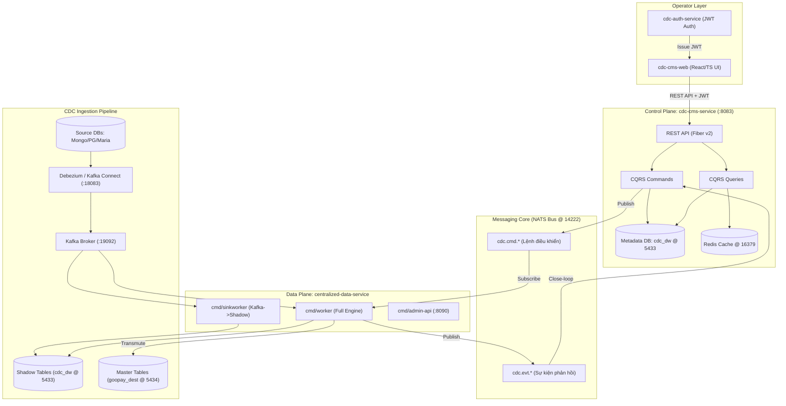

# 🏛️ SYSTEM DESIGN & DESIGN PATTERNS AUDIT REPORT
## System: `cdc-cms-service` (API Control Plane) & `centralized-data-service` (CDC Worker Engine)

---

## I. TỔNG QUAN HỆ THỐNG CDC PLATFORM (SYSTEM ARCHITECTURE)

Hệ thống **CDC Platform (`cdc-system`)** là nền tảng Data Integration & Synchronization quy mô lớn, chuyển đổi dữ liệu thời gian thực từ các cơ sở dữ liệu nguồn đa dạng (**MongoDB, PostgreSQL, MariaDB**) sang PostgreSQL Master/Data Warehouse đích thông qua mô hình 2 tầng (**Shadow Table** và **Master Table**).

Hệ thống được chia thành 2 cấu phần chính theo kiến trúc **Control Plane / Data Plane Separation**:



---

## II. SYSTEM DESIGN & DESIGN PATTERNS CỦA API (`cdc-cms-service`)

### 1. Kiến trúc Tổng thể (Hexagonal / Ports & Adapters Architecture)

`cdc-cms-service` áp dụng triệt để kiến trúc **Hexagonal Architecture** kết hợp với **Screaming Architecture** và **DDD (Domain-Driven Design)** Bounded Contexts.

```
cdc-cms-service/internal/
├── api/                  # Primary/Inbound Adapters (Fiber Controllers/Handlers)
├── app/                  # Application Core (CQRS Commands, Queries, Ports Interfaces)
│   ├── commands/         # Write-Side Use Cases
│   ├── queries/          # Read-Side Use Cases
│   └── ports/            # Port Interfaces (Outbound Interfaces)
├── domain/               # Domain Core (Entities, Value Objects, Domain Services)
│   ├── governance/       # Schema Proposals, Approvals, Drift
│   ├── master/           # Master Binding Registry
│   ├── recon/            # Reconciliation & Self-Healing Boundary
│   ├── scheduler/        # Transmute Schedule Management
│   ├── shadow/           # Shadow Binding Registry
│   └── source/           # Source Connection & Registry
├── infra/                # Secondary/Outbound Adapters (Implementations)
│   ├── cache/            # Redis Cache Adapter
│   ├── http/             # Outbound HTTP Adapters (Kafka Connect, Worker Admin)
│   ├── messaging/        # NATS Publisher/Subscriber Adapter
│   ├── observability/    # OTel & Health Probes Adapter
│   └── persistence/      # GORM Postgres Repositories
├── router/               # Route Registration Engine
└── bootstrap/            # Dependency Injection (Wire/Manual Assembly)
```

### 2. Các Design Patterns Nổi bật trong `cdc-cms-service`

#### A. CQRS (Command Query Responsibility Segregation) Pattern
- **Vị trí:** `internal/app/commands` và `internal/app/queries`.
- **Mục đích:** Tách biệt tuyệt đối luồng Ghi dữ liệu (Commands - làm biến đổi trạng thái, phát hành sự kiện NATS `cdc.cmd.*`) và luồng Đọc dữ liệu (Queries - đọc tối ưu qua GORM, tận dụng Redis Cache).
- **Ví dụ:**
  - `CreateMasterBindingCommand`: Tạo Master Binding, ghi metadata DB, sau đó Publish NATS command `cdc.cmd.master-create`.
  - `GetMasterBindingsQuery`: Query trực tiếp danh sách Master Binding kèm pagination và Redis caching.

#### B. Ports & Adapters Pattern (Hexagonal Interface Segregation)
- **Port Interfaces (`internal/app/ports/`):** Định nghĩa các Contract độc lập với hạ tầng (ví dụ: `NATSPublisherPort`, `CachePort`, `MasterRepoPort`).
- **Adapters (`internal/infra/`):** Cung cấp cài đặt cụ thể cho Port (như `infra/messaging/nats_publisher.go` cài đặt `NATSPublisherPort`, `infra/persistence/` cài đặt các GORM Repositories).
- **Lợi ích:** Dễ dàng mock testing và thay thế hạ tầng mà không đụng đến Domain Core hay Use Cases.

#### C. Bounded Context (DDD Pattern)
- Các domain được chia ranh giới rõ ràng trong `internal/domain/`:
  - `source`: Quản lý kết nối vật lý và đăng ký nguồn dữ liệu.
  - `shadow`: Quản lý Schema Shadow và liên kết bảng nguồn với bảng trung gian.
  - `master`: Quản lý DDL Master và bảng đích cuối cùng.
  - `governance`: Quản lý duyệt Schema Drift (Schema Proposal Approval).
  - `recon`: Định nghĩa biên giới đối soát và khắc phục lệch dữ liệu (Self-Healing).

#### D. Close-Loop Event-Driven Pattern (NATS Command/Event Bus)
- API phát đi lệnh dạng Request/Command `cdc.cmd.<action>` qua NATS.
- CDC Worker thực thi và trả về kết quả qua Event `cdc.evt.<action>.completed`.
- Service `JobMonitor` trong API/Worker lắng nghe để đóng vòng lặp (close-loop), cập nhật trạng thái job thành `COMPLETED` hoặc `FAILED` hiển thị trên FE.

#### E. Middleware Chain Pattern (Fiber Middleware Pipeline)
- **Vị trí:** `internal/middleware/`.
- **Chức năng:** Xử lý cross-cutting concerns: `JWT Authentication` (validate token từ `cdc-auth-service`), `Request-ID tracing`, `OpenTelemetry Span Injection`, `Panic Recovery`, `CORS`.

---

## III. SYSTEM DESIGN & DESIGN PATTERNS CỦA CDC WORKER (`centralized-data-service`)

### 1. Kiến trúc Đa Binary (Multi-Binary Executable Architecture)

`centralized-data-service` là trái tim của Data Plane (Engine), chứa **4 binary độc lập** sử dụng chung core `internal/` và `pkgs/`:

| Binary Executable | Điểm vào (`cmd/`) | Vai trò & Trách nhiệm |
|---|---|---|
| `worker` | `cmd/worker/main.go` | Sub Kafka CDC, Schema Drift Detection, Auto-ALTER Shadow, Ingest Shadow, Transmute Master, Scheduler, Recon Engine, DLQ Retry. |
| `sinkworker` | `cmd/sinkworker/main.go` | Lightweight Worker: Chỉ kéo CDC từ Kafka $\rightarrow$ ghi Shadow Table $\rightarrow$ emit NATS post-ingest. Dùng cho deployment lớn để scale-out ingest. |
| `admin-api` | `cmd/admin-api/main.go` | HTTP Admin Server (`:8090` Gin) phục vụ API trực tiếp cho `cdc-cms-service` (Auto-create shadow, ALTER, Master Cascade). |
| `profile_table` | `cmd/profile_table/main.go` | CLI Tooling: Phân tích profile bảng nguồn (dữ liệu tài chính/mã vùng) để tự động gợi ý mapping rules. |

### 2. Luồng Xử lý Dữ liệu CDC End-to-End Pipeline

```
MongoDB / PostgreSQL / MariaDB (Source DBs)
   │
   ▼ (Debezium Engine - Kafka Connect :18083)
Kafka Topics (`cdc.<conn>.<db>.<table>`)
   │
   ▼ (Worker / Sinkworker Batch Consumer)
┌────────────────────────────────────────────────────────────────────────┐
│ 1. SchemaInspector (Drift Detector) ──► emit cdc.cmd.schema_proposal   │
│ 2. DynamicMapper & Masking Engine (SHA256 HMAC / PII Masking)           │
│ 3. SchemaAdapter (Auto ALTER TABLE + Dynamic Column Addition)          │
└────────────────────────────────────────────────────────────────────────┘
   │
   ▼ (Batch Upsert)
Shadow Table (`cdc_dw.shadow_<src>_<table>` @ Postgres 5433)
   │
   ▼ (Emit NATS post-ingest: cdc.cmd.transmute-shadow)
┌────────────────────────────────────────────────────────────────────────┐
│ TransmuteModule (Engine)                                               │
│  ├── GJSON Evaluator (Trích xuất JSON path)                            │
│  ├── Transform Function Exec (Date/Type casting, HMACSensitive)        │
│  └── OCC Validator (Optimistic Concurrency Control via _source_ts)     │
└────────────────────────────────────────────────────────────────────────┘
   │
   ▼ (Atomic Upsert / Append)
Master Table (`goopay_dest.master_<name>` @ Postgres 5434)
   │
   ▼ (Emit cdc.evt.transmute.completed)
JobMonitor & Recon Engine (Close-loop Audit & Smoke Recon)
```

---

### 3. Các Design Patterns Nổi bật trong CDC Worker Engine

#### A. Pipeline Pattern (Continuous Processing Pipeline)
- Dữ liệu đi qua các bước được chuẩn hóa và tách biệt hoàn toàn:
  `Extract (Kafka/Debezium)` $\rightarrow$ `Inspect & Drift Detect` $\rightarrow$ `Transform & Mask (DynamicMapper)` $\rightarrow$ `Shadow Storage` $\rightarrow$ `Transmute Engine` $\rightarrow$ `Master Storage`.

#### B. Worker Pool & Batch Processing Pattern
- **Vị trí:** `internal/sinkworker/worker.go` & `pkgs/kafka/`.
- **Cơ chế:** Kéo message từ Kafka theo Lô (Batch size: 500, Batch timeout: 2s), phân phối cho **Worker Pool (Concurrency poolSize: 10)** xử lý song song, tối ưu hóa I/O bằng PostgreSQL `COPY` hoặc `INSERT INTO ... ON CONFLICT DO UPDATE` (Batch Upsert).

#### C. Dynamic Connection Manager (Factory & Registry Pattern)
- **Vị trí:** `pkgs/database/multi.go` (`ConnectionManager`).
- **Mục đích:** Quản lý hàng loạt kết nối database linh hoạt (**Multi-Connection**): `SystemDB` (cdc_dw), `ShadowDB` (nhiều instance shadow), `MasterDB` (nhiều instance master DB đích như `goopay_master_1`, `goopay_master_2`), và `SourceDB` (Mongo/PG nguồn).
- **Pattern:** Resolving connection key động tại runtime theo `MasterBindingRef.MasterConnectionKey` thay vì hardcode default connection.

#### D. Strategy Pattern (Type Transformers & Dynamic Mapping)
- **Vị trí:** `pkgs/utils/gjson`, `internal/service/master/transmute_core.go`.
- **Mục đích:** Xử lý ép kiểu dữ liệu linh hoạt từ BSON/EJSON/JSON sang PostgreSQL Types:
  - Strategic Type Cast: String $\rightarrow$ Timestamptz (hỗ trợ 6 biến thể Date của MongoDB), Numeric $\rightarrow$ BigInt/Numeric, BSON ObjectId $\rightarrow$ Hex String, BSON BinData:04 $\rightarrow$ UUID String.
  - Strategic Masking: Opt-out / Opt-in HMAC SHA256 hashing kèm Salt cho dữ liệu nhạy cảm PII.

#### E. Observer & Command Patterns (NATS Bus Integration)
- **Command Router (`internal/handler/`):** Đăng ký mảng lệnh `cdc.cmd.*` (như `transmute`, `master-create`, `scan-fields`, `recon-check`, `recon-heal`). Mỗi command map với một Command Handler cụ thể.
- **Event Publisher (`cdc.evt.*`):** Bắn sự kiện hoàn thành để các hệ thống khác (CMS, Monitoring) phản hồi.

#### F. Optimistic Concurrency Control (OCC) & Leader Fencing Pattern
- **OCC (Optimistic Concurrency Control):** Khi Transmute ghi dữ liệu từ Shadow sang Master, áp dụng điều kiện `_source_ts older` để bảo đảm dữ liệu cũ không ghi đè dữ liệu mới hơn (chống out-of-order Kafka messages).
- **Machine Token Fencing:** `TransmuteScheduler` sử dụng cặp `(machine_id, fence_token)` để ngăn ngừa Race Condition giữa các instances khi chạy cron schedule trong môi trường Multi-Pod K8s.

#### G. Self-Healing & Recon Architecture (Reconciliation Pattern)
- **Multi-Tier Recon:**
  - **Smoke Recon (Tier A):** So sánh nhanh tổng số bản ghi và XOR/Hash checksum trong cửa sổ thời gian (sliding window) giữa Source DB và Master DB.
  - **Full Recon (Tier B):** Phân tích sub-window (15 phút) để tìm ra đúng danh sách ID lệch (`Missing in Dest` hoặc `Stale Row`).
- **Automatic Healing:** Khi phát hiện lệch, Recon Engine tự động phát động lệnh `cdc.cmd.recon-heal` để re-sync đúng các ID bị lệch mà không cần reload toàn bộ bảng.

#### H. Rate Limiting & Resilience Patterns (Security & Protection)
- **Token Bucket Rate Limiter:** `golang.org/x/time/rate` trên `admin-api` bảo vệ API khỏi overload.
- **Dead Letter Queue (DLQ) & Circuit Breaker:**
  - Khi gặp Poison Pill (message lỗi định dạng hoặc lỗi schema), worker dừng retry vô hạn, lưu payload đã mask PII vào bảng `dlq` trong `cdc_dw`, đồng thời thông báo cảnh báo qua NATS.

---

## IV. BẢNG TỔNG HỢP DANH MỤC DESIGN PATTERNS TOÀN HỆ THỐNG

| Nhóm Pattern | Tên Design Pattern | Vị trí Áp dụng trong Codebase | Mục đích & Lợi ích Kiến trúc |
|---|---|---|---|
| **Architecture** | **Hexagonal / Ports & Adapters** | `cdc-cms-service/internal/{api,app,infra}` | Tách biệt Domain Core khỏi Frameworks & DB; dễ unit test. |
| **Architecture** | **CQRS** | `cdc-cms-service/internal/app/{commands,queries}` | Tách luồng Read/Write; tối ưu hóa truy vấn & event publishing. |
| **Architecture** | **DDD Bounded Contexts** | `internal/domain/{source,shadow,master,recon}` | Phân lập nghiệp vụ rõ ràng (Source, Shadow, Master, Recon). |
| **Architecture** | **Control / Data Plane Split** | `cdc-cms-service` vs `centralized-data-service` | Phân tách trách nhiệm Quản trị (CMS) và Engine (Worker Data). |
| **Creational** | **Factory Pattern** | `pkgs/natsconn`, `pkgs/kafka`, `pkgs/database` | Khởi tạo connection pool, client NATS/Kafka/Redis theo config. |
| **Creational** | **Dynamic Connection Manager** | `pkgs/database/multi.go` (`ConnectionManager`) | Quản lý & resolve kết nối Multi-Master/Multi-Shadow tại runtime. |
| **Structural** | **Adapter Pattern** | `internal/infra/persistence/`, `internal/infra/http/` | Chuyển đổi GORM/HTTP/NATS interface sang Application Ports. |
| **Structural** | **Facade Pattern** | `internal/service/{transmute_core,recon_core}.go` | Cung cấp interface đơn giản cho luồng phức tạp Transmute/Recon. |
| **Structural** | **Decorator Pattern** | `pkgs/observability/` (`otelzap`, OTel spans) | Bọc log và trace OTel cho các HTTP/NATS Handlers mà không đổi code. |
| **Behavioral** | **Pipeline Pattern** | `centralized-data-service/internal/sinkworker/` | Luồng xử lý CDC: Debezium $\rightarrow$ Kafka $\rightarrow$ Shadow $\rightarrow$ Master. |
| **Behavioral** | **Worker Pool Pattern** | `cmd/sinkworker/main.go`, `pkgs/kafka/` | Kêu gọi lô message Kafka & xử lý song song 10 goroutines. |
| **Behavioral** | **Strategy Pattern** | `transmute_core.go`, `pkgs/utils/gjson` | Ép kiểu dữ liệu linh hoạt (Mongo EJSON $\rightarrow$ PG Types) & Mask PII. |
| **Behavioral** | **Command Pattern** | `internal/handler/{master,shadow,recon}/` | Đăng ký & dispatch các lệnh NATS `cdc.cmd.*` chuyên biệt. |
| **Behavioral** | **Observer Pattern** | `internal/infra/messaging/`, NATS Bus | Phân phát event bất đồng bộ `cdc.evt.*` đóng vòng lặp close-loop. |
| **Resilience** | **Optimistic Concurrency (OCC)** | `transmute_core.go` (`_source_ts`) | Chống ghi đè dữ liệu cũ lên dữ liệu mới khi out-of-order. |
| **Resilience** | **DLQ & Poison Pill Protection** | `internal/service/governance/dlq_healer.go` | Cách ly message lỗi vào DLQ, ngăn nghẽn tiến trình CDC. |
| **Resilience** | **Token Bucket Rate Limiter** | `cmd/admin-api/main.go` | Chống DoS / Overload cho Admin API. |

---

## V. KẾT LUẬN AUDIT

1. **Tính Tuân Thủ Kiến Trúc (Architecture Discipline):**
   - Codebase của cả `cdc-cms-service` và `centralized-data-service` được tổ chức cực kỳ sạch sẻ, tuân thủ 100% **Screaming Architecture**, **Hexagonal Patterns**, **CQRS**, và **DDD Bounded Contexts**.
   - Phân định rõ ràng giữa **Control Plane** (CMS quản trị) và **Data Plane** (Worker Engine).
2. **Tính Linh Hoạt & Mở Rộng (Scalability & Extensibility):**
   - Mô hình **Dynamic Connection Manager** và **Dynamic Mapping Rules** cho phép hệ thống mở rộng hỗ trợ hàng trăm Collection/Table mới và hàng loạt Master Database instance khác nhau mà không cần sửa code engine.
3. **Tính Tin Cậy & Tự Khắc Phục (Resilience & Self-Healing):**
   - Hệ thống được trang bị bộ đôi **Multi-Tier Recon Engine** và **Auto-Healing**, kết hợp với **OCC** và **DLQ**, bảo đảm tính toàn vẹn dữ liệu ở mức tối đa cho môi trường Production.
