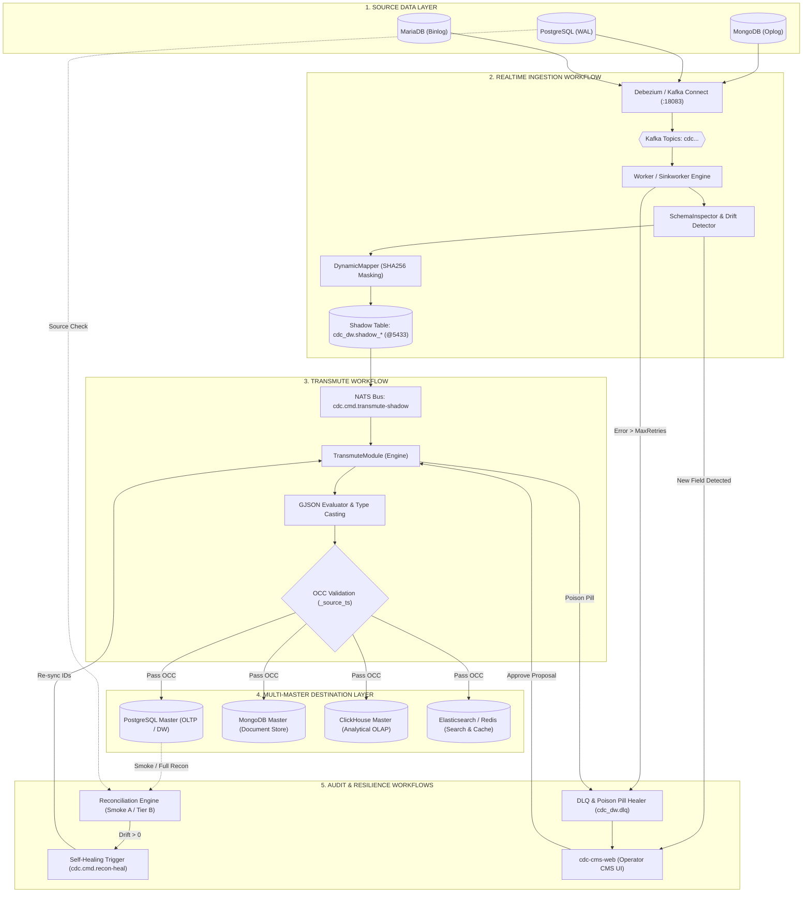

# 📊 BÁO CÁO PHÂN TÍCH WORKFLOWS CHÍNH & BÀI TOÁN MULTI-MASTER DESTINATION (POSTGRES, MONGO, CLICKHOUSE)

---

## I. TỔNG HỢP 5 WORKFLOW CHÍNH TRONG HỆ THỐNG CDC PLATFORM

### 1. Workflow 1: CDC Realtime Ingestion (Source DB ➔ Kafka ➔ Shadow Table)
- **Mục đích:** Kéo toàn bộ sự kiện biến động (INSERT, UPDATE, DELETE) từ các DB nguồn (MongoDB, PostgreSQL, MariaDB) lưu trữ nguyên bản vào tầng trung gian **Shadow Table**.
- **Các bước thực thi:**
  1. DB Nguồn sinh ra Oplog / WAL log.
  2. **Debezium Engine** (trên Kafka Connect `:18083`) bắt sự kiện và push vào Kafka Topic (`cdc.<conn>.<db>.<table>`).
  3. `sinkworker` / `worker` kéo lô sự kiện (Batch size: 500, Concurrency: 10 goroutines).
  4. Qua `SchemaInspector`: Tự động phát hiện Schema Drift (cột mới).
  5. Qua `DynamicMapper`: Băm dữ liệu nhạy cảm PII (SHA256 HMAC + Salt).
  6. Qua `SchemaAdapter`: Tự động chạy SQL `ALTER TABLE ADD COLUMN` nếu có trường mới trên Shadow.
  7. Ghi Batch Upsert vào **Shadow Table** (`cdc_dw.shadow_<src>_<table>` @ Postgres 5433).
  8. Phát hành sự kiện NATS post-ingest: `cdc.cmd.transmute-shadow`.

---

### 2. Workflow 2: Shadow to Master Transmute (Shadow Table ➔ Transmute Engine ➔ Master DB)
- **Mục đích:** Chuyển đổi dữ liệu thô từ Shadow Table thành cấu trúc chuẩn hoá nghiệp vụ trên **Master DB** (PostgreSQL, MongoDB, ClickHouse...).
- **Các bước thực thi:**
  1. Kích hoạt bởi Post-ingest Event NATS, Cron Schedule (`TransmuteScheduler`), hoặc CMS Manual Trigger.
  2. `TransmuterModule` đọc lô bản ghi thô từ Shadow Table (`_raw_data`, `_source_ts`, `_deleted`).
  3. **GJSON Evaluator**: Trích xuất các trường từ JSON path (`source_path`) theo `mapping_rule`.
  4. **Strategic Type Coercion**: Ép kiểu dữ liệu (Date Mongo $\rightarrow$ Timestamptz, BSON Binary $\rightarrow$ UUID string, String $\rightarrow$ BigInt).
  5. **OCC Validation (Optimistic Concurrency Control)**: Kiểm tra `_source_ts older` để bảo đảm message cũ out-of-order từ Kafka không bao giờ ghi đè bản ghi mới trên Master DB.
  6. Thực thi Atomic Batch Upsert / Soft-Delete vào **Master DB** (`master_<name>`).
  7. Emit NATS Event `cdc.evt.transmute.completed` cho `JobMonitor` đóng vòng lặp close-loop.

---

### 3. Workflow 3: Schema Drift & Governance (Phát hiện & Phê duyệt đổi Schema)
- **Mục đích:** Quản trị an toàn sự thay đổi cấu trúc bảng nguồn mà không làm crash pipeline.
- **Các bước thực thi:**
  1. Worker phát hiện field mới chưa khai báo trong `mapping_rule`.
  2. Tạo bản ghi `schema_proposal` ở trạng thái `pending_review` trong database metadata `cdc_dw`.
  3. Phát đi cảnh báo qua NATS `cdc.cmd.schema_proposal` và hiển thị trên CMS Web UI.
  4. Operator review trên UI: Phê duyệt (Approve) hoặc Từ chối (Reject).
  5. Khi Approve: API gửi lệnh `cdc.cmd.master-create` / `alter-column` cho Worker tự động cập nhật DDL trên Master DB đích.

---

### 4. Workflow 4: Reconciliation & Self-Healing (Đối soát & Tự phục hồi dữ liệu)
- **Mục đích:** Phát hiện và tự động khắc phục sai lệch dữ liệu (Drift) giữa Source DB, Shadow Table và Master DB.
- **Các bước thực thi:**
  1. **Smoke Recon (Tier A)**: Chạy cron định kỳ (1-10 phút), tính toán tổng số record và XOR/Checksum hash trong sliding window giữa Source và Master.
  2. **Full Recon (Tier B)**: Nếu Smoke Recon phát hiện `drift > 0`, hệ thống tự động kích hoạt Tier B phân tích chi tiết theo sub-window 15 phút.
  3. Lập danh sách phân loại ID bị lệch: `Missing in Dest` (thiếu dữ liệu) hoặc `Stale Row` (lệch timestamp).
  4. **Auto-Healing**: Phát lệnh `cdc.cmd.recon-heal` re-sync đích danh đúng các ID bị sai lệch từ Source $\rightarrow$ Shadow $\rightarrow$ Master mà không cần scan toàn bộ bảng.

---

### 5. Workflow 5: Dead Letter Queue (DLQ) & Circuit Breaker (Xử lý Poison Pill)
- **Mục đích:** Cách ly các bản ghi bị lỗi dữ liệu nghiêm trọng (Poison Pill) để ngăn dừng pipeline.
- **Các bước thực thi:**
  1. Khi một bản ghi bị lỗi parse/lỗi DB liên tục quá `MaxRetries` (3 lần).
  2. Worker gọi `DLQHealer`, thực hiện PII Masking trên payload lỗi.
  3. Lưu bản ghi lỗi vào bảng `cdc_dw.dlq` và phát cảnh báo Slack/Email.
  4. Operator có thể inspect payload trên CMS UI, chỉnh sửa mapping rule và nhấn Replay/Retry.

---

## II. SƠ ĐỒ LUỒNG QUY TRÌNH TỔNG HỢP (WORKFLOW MERMAID CHART)

---

## III. LIÊN KẾT TỚI BÀI TOÁN MULTI-MASTER DESTINATION ENGINES

Kiến trúc Master Layer trong CDC Platform được thiết kế theo nguyên lý **Polyglot Persistence**, cho phép `centralized-data-service` đẩy dữ liệu từ Shadow Table sang nhiều loại hình Master Storage Engine khác nhau tùy theo bài toán nghiệp vụ:

| Master Database Target | Mô Hình Dữ Liệu | Cơ Chế Synchronize / Ingestion | Bài Toán & Use Case Nghiệp Vụ |
|---|---|---|---|
| **PostgreSQL Master** | Relational RDBMS | `INSERT INTO ... ON CONFLICT DO UPDATE` (Atomic Upsert) | Hỗ trợ OLTP core services, dữ liệu tài chính có ràng buộc ACID cao, quan hệ 1-1, 1-N. |
| **MongoDB Master** | Document Store (BSON/JSON) | `BulkWrite(Ordered: true)` với `UpdateOne` / `Upsert: true` | Hỗ trợ Document API, linh hoạt Schema (Flexible Schema), lưu trữ mảng lồng nhau (Nested Arrays). |
| **ClickHouse Master** | Columnar OLAP | Batch Insert vào `ReplacingMergeTree` / `VersionedCollapsingMergeTree` Engine | Hỗ trợ Big Data Analytics, Realtime Dashboard, Aggregation query trên hàng trăm triệu bản ghi với độ trễ ms. |
| **Elasticsearch / OpenSearch** | Full-Text Inverted Index | Bulk Index API (`_bulk`) | Hỗ trợ Tìm kiếm chuỗi văn bản (Full-text Search), Autocomplete, Fuzzy Matching cho giao diện App/Web. |
| **Redis Cache** | Key-Value / Hash / Set | Pipeline Batch `HMSET` / `SETEX` với TTL expiry | Hỗ trợ Fast Cache Reader, Session Storage, Leaderboard, giảm tải 95% query vào Database chính. |

---

### 💡 Chi tiết Giải pháp Kỹ thuật cho từng Master Engine

#### 1. Bài toán PostgreSQL Master (OLTP / Data Warehouse)
- **Cơ chế:**
  - `TransmuterModule` map các trường JSON path từ Shadow `_raw_data` thành các cột định kiểu cứng (`TIMESTAMPTZ`, `BIGINT`, `NUMERIC`, `VARCHAR`, `UUID`).
  - Sử dụng cờ `_source_ts` để kiểm soát OCC: `WHERE master.updated_at IS NULL OR master._source_ts <= EXCLUDED._source_ts`.
- **Tối ưu:** Tạo sẵn B-Tree Index cho Primary Key và Foreign Key; Partial Indexes cho bản ghi Active.

#### 2. Bài toán MongoDB Master (Document Store)
- **Cơ chế:**
  - Bảo tồn nguyên vẹn cấu trúc Extended JSON (EJSON) từ BSON nguồn.
  - Sử dụng `toHexString()` cho BSON `ObjectId` và convert `BinData:04` sang UUID String chuẩn 8-4-4-4-12.
- **Tối ưu:** Dùng `delete.handling.mode: rewrite` để bảo toàn key khi `DELETE` và gán version `_v` ở từng cấp mảng con (Array Element Versioning) để tránh race condition khi update.

#### 3. Bài toán ClickHouse Master (Realtime Analytics / OLAP)
- **Cơ chế:**
  - ClickHouse là Columnar DB, cực kỳ mạnh cho `COUNT`, `SUM`, `AVG` nhưng không tối ưu cho `UPDATE` từng dòng.
  - Sử dụng Engine **`ReplacingMergeTree(_source_ts)`** hoặc **`VersionedCollapsingMergeTree(sign, _source_ts)`**.
  - Sự kiện CDC `INSERT`/`UPDATE` được nạp vào ClickHouse dưới dạng Append-Only Batch (10,000 rows/batch). ClickHouse sẽ tự động merge background và giữ bản ghi có `_source_ts` mới nhất.
- **Tối ưu:** Giảm tối đa IOPS write, phục vụ báo cáo realtime cho CMS Dashboard và BI Tools với tốc độ scan hàng triệu dòng/giây.

#### 4. Bài toán Elasticsearch / Redis (Search & High-Speed Cache)
- **Cơ chế:**
  - **Redis:** `worker` lắng nghe NATS post-ingest event, cập nhật cache Redis key `cache:<entity>:<id>` theo định dạng JSON nén.
  - **Elasticsearch:** Push batch document vào ES Index với `_id = _source_id`. Hỗ trợ đánh index đa ngôn ngữ và phân tích PII.

---

## IV. KẾT LUẬN

Hệ thống CDC Platform đã được chuẩn hóa thành 5 Workflow cốt lõi vận hành khép kín (Close-Loop Event-Driven), kết hợp với kiến trúc **Multi-Destination Master** linh hoạt, giúp giải quyết triệt để bài toán đồng bộ dữ liệu thời gian thực từ bất kỳ DB Nguồn nào sang bất kỳ DB Đích nào (**PostgreSQL, MongoDB, ClickHouse, Redis, Elasticsearch**) với hiệu năng cao, khả năng tự phục hồi (Self-Healing) và độ an toàn tuyệt đối.
