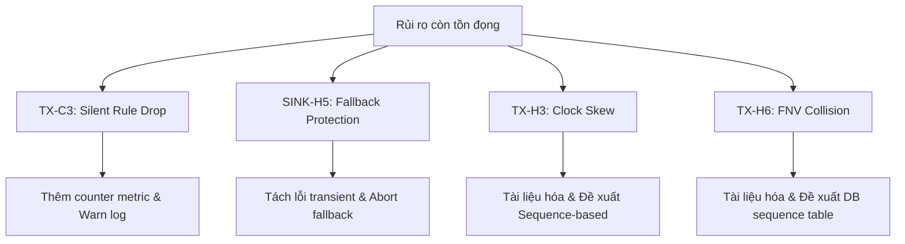

# 02_plan_phase_3.md - Roadmap cao tầng Phase 3

Roadmap giải quyết 4 rủi ro còn tồn đọng:

## 1. Bản đồ giải pháp

## 2. Kế hoạch chi tiết từng phần

### Phase 3 - Khắc phục lỗ hổng an toàn
- **Task 1:** Sửa đổi `loadRules` trong `transmuter.go` để in Warn log và increment metrics `cdc_transmute_rule_dropped_total` khi rule bị drop.
- **Task 2:** Định nghĩa metric dropped rule trong `prometheus.go`.
- **Task 3:** Sửa đổi sequential fallback trong `batch_buffer.go` để check `isRetryableDBError` và abort ném error ra ngoài khi có lỗi kết nối/transient.
- **Task 4:** Phân tích và tài liệu hóa giải pháp tối ưu cho `TX-H3` (Optimistic Concurrency Control) và `TX-H6` (FNV Hash Collision).
- **Task 5:** Chạy unit test suite để verify code.
