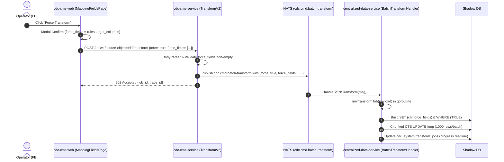

# 03 Technical Design — Force Transform & Key Collision Fix

## 1. Kiến trúc luồng dữ liệu Force Transform

## 2. Chi tiết kỹ thuật

### A. Fix `BuildCastExpr` cho `timestamptz`
- File: `centralized-data-service/internal/service/metadata/mapping_utils.go`
- Tách case `"timestamp with time zone"`, `"timestamptz"` khỏi `"timestamp"`, `"timestamp without time zone"`.
- Nhánh ELSE của `timestamptz` dùng: `(NULLIF(_raw_data->>'<field>', ''))::TIMESTAMPTZ`.
- Nhánh `timestamp` không timezone giữ nguyên: `::TIMESTAMP`.

### B. Mở rộng Payload và Logic Worker
- File: `centralized-data-service/internal/handler/shadow/batch_transform_handler.go`
- Struct `BatchTransformPayload` thêm `Force bool` và `ForceFields []string`.
- Trong `runTransformJob`:
  - Validate: `payload.Force && len(payload.ForceFields) == 0` -> kết thúc với lỗi.
  - Lọc rules: khi `Force=true`, chỉ áp dụng các rule có `TargetColumn` nằm trong `ForceFields`.
  - WHERE clause: khi `Force=true`, `whereExpr = "TRUE"` (bỏ qua `IS NULL`).
  - Phân trang chunked CTE UPDATE giữ nguyên (an toàn bộ nhớ và lock cho 100M+ bản ghi).

### C. CMS API forward tham số
- File: `cdc-cms-service/internal/api/source/source_object_actions_handler.go`
- Hàm `TransformV2`: Parse JSON body `{force, force_fields}`.
- Đóng gói vào struct `natsPayload` và publish qua NATS.

### D. UI Fix Key & Force Transform Button
- File: `cdc-cms-web/src/pages/TableRegistry.tsx`
  - Đổi `activeTransformJobs[r.source_object_id]` thành `activeTransformJobs[r.id]` tại child binding table.
- File: `cdc-cms-web/src/pages/MappingFieldsPage.tsx`
  - Thêm nút "Force Transform" vào Action Bar.
  - Khi kích hoạt, hiển thị Modal xác nhận với số lượng fields được trích xuất lại từ `_raw_data`.
