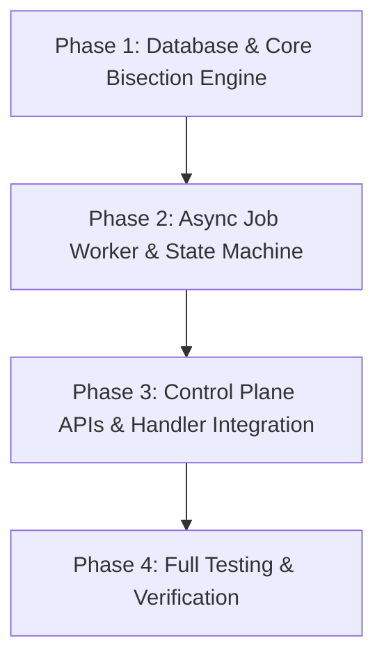

# 02 — Roadmap Kế Hoạch Cao Tầng: Adaptive Binary & Async Job Refactor

> **Workspace:** `ReconAdaptiveBinaryAsync20260721`  
> **Trạng thái:** APPROVED ROADMAP  

---

## 1. Các Giai Đoạn Triển Khai (Phases)

---

## 2. Chi Tiết Các Phase

### Phase 1: Core Bisection Engine & DB Schema (Brain Plan -> Muscle Execute)
- **Tác vụ 1.1:** Viết DDL Migration tạo bảng `cdc_system.recon_jobs`.
- **Tác vụ 1.2:** Triển khai `ReconJobRepository` CRUD thao tác với `recon_jobs`.
- **Tác vụ 1.3:** Triển khai `BinaryDrillDownEngine` (`recon_bisection_engine.go`) với thuật toán Merkle Tree Hash Bisection đệ quy và `errgroup` parallelization.
- **Tác vụ 1.4:** Viết Unit test suite cho `BinaryDrillDownEngine` (`recon_bisection_engine_test.go`).

### Phase 2: Async Job Worker & State Machine
- **Tác vụ 2.1:** Thiết lập NATS Subject `cdc.event.recon.job_created` và Payload DTO.
- **Tác vụ 2.2:** Triển khai `ReconJobWorker` tiêu thụ tin nhắn và quản lý vòng đời Job (`PENDING` -> `RUNNING` -> `COMPLETED` / `FAILED`).
- **Tác vụ 2.3:** Triển khai cơ chế Checkpointing và tính toán % `progress_percent` động theo số lượng node đệ quy đã quét.

### Phase 3: Control Plane APIs & Handler Integration
- **Tác vụ 3.1:** Thêm Route & Handler `POST /api/reconciliation/check-async`.
- **Tác vụ 3.2:** Thêm Route & Handler `GET /api/reconciliation/jobs/:job_id`.
- **Tác vụ 3.3:** Giữ tương thích ngược với API `POST /api/reconciliation/check` cũ (Ủy quyền cho Async Engine bên dưới nếu range > 1 ngày).

### Phase 4: Full Verification & Quality Gates
- **Tác vụ 4.1:** Chạy Unit test `go test -v ./...`.
- **Tác vụ 4.2:** Integration test giả lập 30 ngày dữ liệu khớp và 30 ngày dữ liệu bị lệch 1 record.
- **Tác vụ 4.3:** Đo đạc Benchmark hiệu năng (Latency & Query Count).
