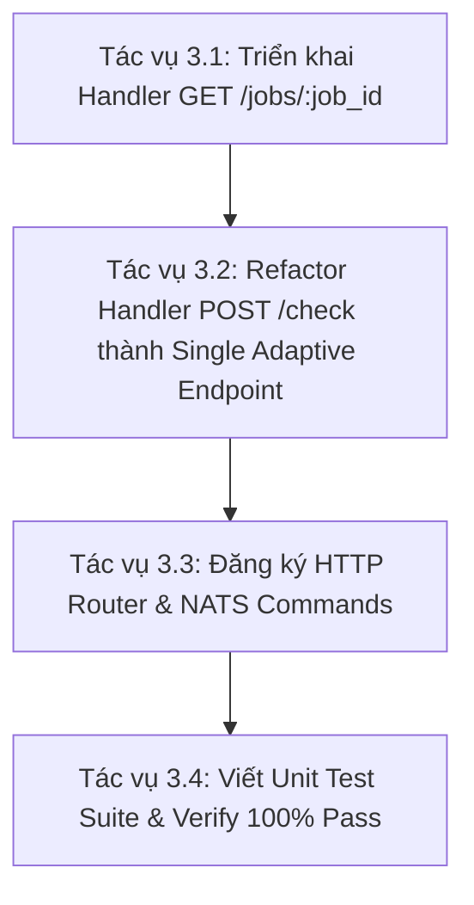

# 02 — Kế Hoạch Lộ Trình Triển Khai Phase 3 (Roadmap)

> **Workspace:** `ReconAdaptiveBinaryAsync20260721`  
> **Phase:** 3 — Control Plane API Integration  

---

## 1. Các Tác Vụ Chi Tiết Trong Phase 3

---

## 2. Chi Tiết Từng Tác Vụ

### Tác Vụ 3.1: Triển Khai Handler Polling `recon_job_handler.go`
- Viết Handler `HandleGetJobStatus` lấy thông tin `ReconJob` từ `ReconJobRepository`.
- Định nghĩa DTO phản hồi JSON cho Frontend.

### Tác Vụ 3.2: Refactor `recon_check_handler.go` (Single Adaptive Endpoint)
- Đọc `StartTime` và `EndTime` từ `reconCheckPayload`.
- Phân nhánh:
  - `range <= 2h`: Gọi trực tiếp `BinaryDrillDownEngine` (Sync Fast-path).
  - `range > 2h`: Insert `recon_jobs` (PENDING), pub NATS Event, return HTTP 202 Accepted.

### Tác Vụ 3.3: Router Registration
- Đăng ký Route `/api/reconciliation/jobs/:job_id` trong HTTP Server / Router.

### Tác Vụ 3.4: Unit Tests & Verification
- Viết `recon_job_handler_test.go` cover các cases Sync, Async, và Polling.
- Verification: `go build ./...` và `go test -v ./internal/service/recon/...`.
