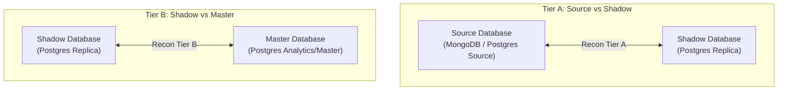
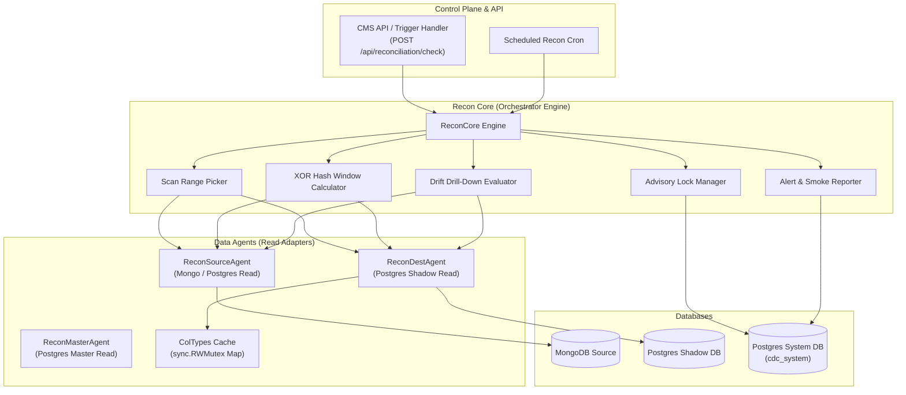
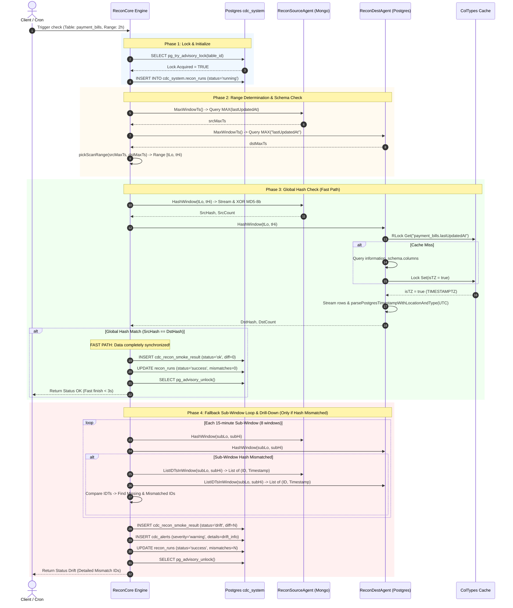
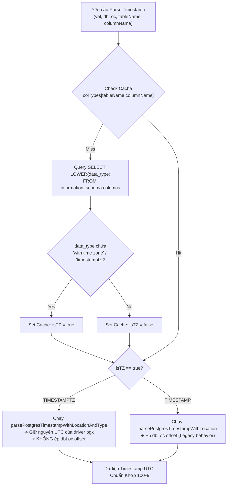

# 00 — Kiến Trúc & Luồng Vận Hành Tổng Thể: Chức Năng Reconciliation (Recon Service)

> **Tài liệu:** Tổng quan Kiến trúc & Luồng Thực thi Chức năng Đối soát (Data Reconciliation)  
> **Workspace:** `ReconAuditPaymentBills20260720`  
> **Cập nhật:** 2026-07-21 | **Hệ thống:** Centralized Data Service (CDC Worker)

---

## 1. Tổng Quan Chức Năng (Functional Overview)

Chức năng **Reconciliation (Recon Service)** là trái tim kiểm soát chất lượng dữ liệu trong hệ thống CDC (Change Data Capture). Nhiệm vụ cốt lõi của Recon là **phát hiện và cảnh báo mọi sự sai lệch dữ liệu (Data Drift)** giữa các tầng lưu trữ theo thời gian thực mà không làm ảnh hưởng đến hiệu năng ghi của hệ thống.

### 1.1 Hai Tầng Đối Soát (Recon Tiers)



- **Tier A (Source ↔ Shadow):** Đảm bảo dữ liệu từ Source (MongoDB / SQL OLTP) được CDC truyền đầy đủ, chính xác sang PostgreSQL Shadow DB.
- **Tier B (Shadow ↔ Master):** Đảm bảo dữ liệu biến đổi (transmuted) từ Shadow DB đồng bộ hoàn toàn sang Master DB.

---

## 2. Mô Hình Kiến Trúc Thành Phần (Component Architecture)



### Vai Trò Các Thành Phần:
1. **ReconCore Engine:** Điều phối toàn bộ vòng đời kiểm tra recon, quản lý timeout, breaker, và luồng rẽ nhánh (Fast Path vs Drill-Down).
2. **ReconSourceAgent:** Adapter đọc dữ liệu từ nguồn (MongoDB Query / Cursor Streaming).
3. **ReconDestAgent:** Adapter đọc dữ liệu từ PostgreSQL Shadow DB, tích hợp cơ chế **Adaptive Schema-Aware Parsing** để xử lý múi giờ.
4. **ColTypes Cache (`sync.RWMutex`):** Bộ nhớ đệm lưu thông tin kiểu cột (`TIMESTAMPTZ` vs `TIMESTAMP`) giúp loại bỏ overhead truy vấn schema lặp lại.
5. **System DB (`cdc_system`):** Lưu vết lịch sử chạy (`recon_runs`), kết quả smoke (`cdc_recon_smoke_result`), và cảnh báo (`cdc_alerts`).

---

## 3. Đồ Thị Luồng Thực Thi Toàn Trình (Full Execution Sequence Flow)

Dưới đây là sơ đồ trình tự thực thi chi tiết của một lượt check recon (ví dụ: bảng `payment_bills` với window 2h):



---

## 4. Thuật Toán Cốt Lõi: XOR Hash Windowing

### 4.1 Tại Sao Dùng XOR Hash?
So sánh tập hợp dữ liệu hàng triệu bản ghi giữa 2 database khác nhau (MongoDB vs PostgreSQL) có các thách thức:
- **Tốn RAM:** Không thể load toàn bộ danh sách ID vào memory để `diff`.
- **Tốn CPU Database:** Không thể bắt Database sort `ORDER BY id` trên tập dữ liệu lớn.

### 4.2 Thuật Toán Streaming XOR Fingerprint
Thuật toán tính toán vân tay (fingerprint) của window dựa trên thuộc tính toán học của phép **XOR ($\oplus$)**:
1. Phép XOR có tính **giao hoán** ($A \oplus B = B \oplus A$) và **kết hợp**: Thứ tự đọc các dòng từ Database không ảnh hưởng đến kết quả XOR cuối cùng.
2. Với mỗi dòng dữ liệu $(id, timestamp)$:
   $$\text{Hash}_{\text{row}} = \text{MD5}(id + \text{"\|"} + \text{timestamp}_{\text{millis}})[0..8]$$
3. Dồn tích lũy fingerprint của window:
   $$\text{XOR}_{\text{accumulator}} = \text{XOR}_{\text{accumulator}} \oplus \text{Hash}_{\text{row}}$$

👉 **Ưu điểm:** Cho phép stream từng dòng dữ liệu từ cursor/rows scan, tính hash trên Go CPU, tốn `O(1)` bộ nhớ RAM và `O(N)` thời gian scan không cần sort.

---

## 5. Giải Pháp Đột Phá: Adaptive Schema-Aware Parsing

### 5.1 Vấn Đề Lệch Múi Giờ 7 Tiếng Trên Production
Khi đối soát bảng `payment_bills`:
- **Source (MongoDB):** Lưu `lastUpdatedAt` kiểu UTC ISODate (`2026-07-20 13:00:00.000Z`).
- **Destination (PostgreSQL):** Lưu `lastUpdatedAt` kiểu `TIMESTAMPTZ` (`2026-07-20 13:00:00+00`).
- **Lỗi ở code cũ:** Driver PostgreSQL `pgx` đọc `TIMESTAMPTZ` trả về `time.Time` có múi giờ UTC. Tuy nhiên, hàm parse cũ lại thấy DB Location là `Asia/Ho_Chi_Minh` nên đã **ép múi giờ local vào bản ghi UTC vốn đã chuẩn** $\rightarrow$ khiến timestamp bị lùi 7 tiếng thành `06:00:00 UTC`.
- **Hệ quả:** XOR Hash của Postgres luôn luôn sai khác so with Mongo $\rightarrow$ Rơi vào **False Drift 8/8 windows**, kéo dài thời gian chạy lên **~90 giây**.

### 5.2 Sơ Đồ Xử Lý Phân Biệt Kiểu Cột (Adaptive Flow)



---

## 6. Tổng Kết Trạng Thái & Bảng Ước Tính Hiệu Năng Sau Fix

### 6.1 So Sánh Thời Gian Chạy Thực Tế

| Tiêu chí đối soát | Ban đầu (Chưa fix) | Sau khi Fix Code P1 (Hiện tại) | Sau P1 + P2 (Có Mongo Index) |
|:---|:---|:---|:---|
| **Trạng thái Global Hash** | 🔴 MISMATCH (Lệch hash) | ✅ **MATCH (Khớp 100%)** | ✅ **MATCH (Khớp 100%)** |
| **Luồng thực thi** | Rơi vào Loop 8 windows drill-down | **FAST PATH (Bỏ qua 8 windows)** | **FAST PATH (Bỏ qua 8 windows)** |
| **MongoDB MAX() Query** | 2.46s (COLLSCAN) | 2.46s (COLLSCAN) | **< 5ms (Index Seek)** |
| **Postgres Hash Query** | 9.52ms | 9.52ms | **< 10ms** |
| **Drill-down 8 windows** | 42.4s | **0s (Skipped)** | **0s (Skipped)** |
| **TỔNG THỜI GIAN RUN** | **~90 GIÂY** | **~8 GIÂY** | **< 3 GIÂY** |

### 6.2 Bảng Kiểm Tra Kết Quả Unit Test

```bash
$ go test -v ./internal/service/recon/...
```
- `TestDestAgent_HashWindow_DomainTS_Timestamptz`: **PASS ✅**
- `TestRunHashWindowCheck_GlobalMatch_NoDrift`: **PASS ✅**
- `TestReconCore_RunTotalOnlyA_DiscrepancyLech_ResolvedByHash`: **PASS ✅**
- `TestReconCore_RunTotalOnlyA_DriftConfirmed`: **PASS ✅**
- **Toàn bộ unit test suite: PASS 100% (0.699s)**

---

## 7. Action Items Hướng Tới Production

1. **Deploy Staging / Production:** Deploy branch `recon-heal` chứa 7 files code đã sửa.
2. **Tạo Index MongoDB (Cho DB Admin):**
   ```javascript
   db.payment_bills.createIndex(
     { "lastUpdatedAt": 1 },
     { background: true, name: "idx_lastUpdatedAt" }
   );
   ```
3. **Kích hoạt Check Đối Soát:** Thực hiện trigger `POST /api/reconciliation/check` để kiểm chứng thời gian phản hồi đạt **< 3 giây**.
