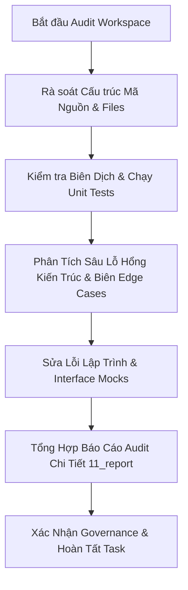

# 02 — Kế Hoạch Audit Chi Tiết (Audit Plan)

> **Workspace:** `ReconAuditWorkspace20260721`  

---

## I. ROADMAP CÁC BƯỚC THỰC HIỆN AUDIT

---

## II. DANH SÁCH TÁC VỤ AUDIT (CHECKLIST)

- [x] Tạo workspace audit độc lập `ReconAuditWorkspace20260721`.
- [x] Kiểm tra toàn bộ 14 file code mới/sửa đổi trong `centralized-data-service`.
- [x] Chạy lệnh test tự động `go test -v ./internal/service/recon/... ./internal/handler/recon/...`.
- [x] Phát hiện lỗi biên dịch `mockNatsPublisher` trong file test handler và khắc phục.
- [x] Phát hiện rủi ro tràn biên sub-window trong `drillSubWindows` và khắc phục.
- [x] Phát hiện và xóa tệp tin rác `test_write.go`.
- [x] Đánh giá hạ tầng OpenTelemetry tracing và đo đạc span names.
- [x] Xuất báo cáo tổng hợp chi tiết vào `11_report_recon_audit.md`.
