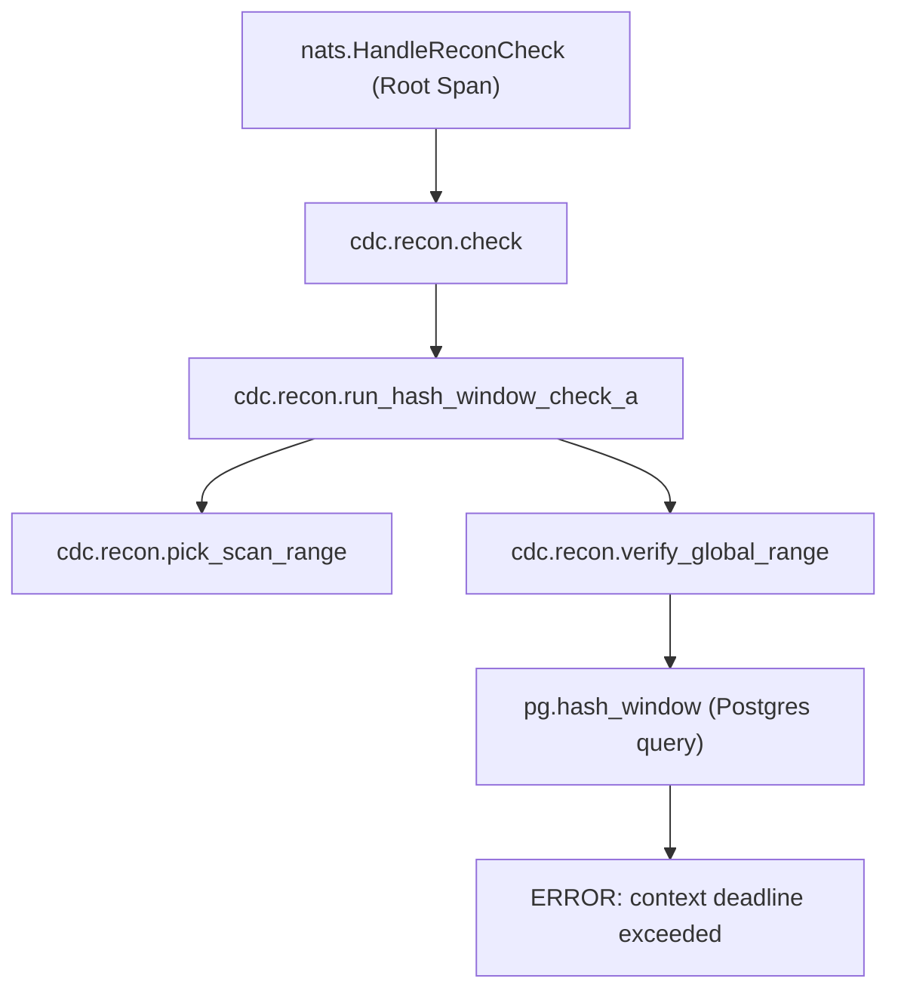

# Báo cáo Audit - Luồng đối soát hash_window và lỗi timeout ID 92

Báo cáo phân tích chi tiết luồng thực thi, các hàm liên quan, nguyên nhân gây ra lỗi timeout của báo cáo ID 92 (`dst hash window ...: timeout: context deadline exceeded`), và mô hình trace trên Signoz.

---

## 1. Bản đồ luồng gọi (Call Trace & Functions)

### Phase 1: API Gateway & Command Dispatching (`cdc-cms-service`)
1. **HTTP POST `/api/reconciliation/check?type_recon=hash_window`**
   - Fiber router định tuyến request đến handler [TriggerCheckAll](file:///Users/trainguyen/Documents/work/data-hub/cdc-cms-service/internal/api/recon/reconciliation_handler_commands.go#L78).
2. **`TriggerCheckAll`**
   - Đọc payload JSON chứa `start_time` (`1783311660000` ~ `2026-07-06 11:21:00`) và `end_time` (`1783916460000` ~ `2026-07-13 11:21:00`).
   - Gọi `resolveTargetTable` phân giải tên bảng nghiệp vụ `schedule_histories`.
   - Khởi tạo struct `ReconCheckCommand` với tham số tương ứng và Dispatch lên command bus: `h.bus.Dispatch(ctx, cmd)`.
3. **Command Bus (NATS Publisher)**
   - Chèn một dòng job ghi nhận trạng thái vào bảng `cdc_jobs` (lưu ID 92).
   - Marshal command sang JSON và publish lên NATS subject `cdc.cmd.recon-check`.
   - Trả về HTTP `202 Accepted` kèm theo thông tin Job ID ngay lập tức cho client.

---

### Phase 2: NATS Subscription & Check Handler (`centralized-data-service`)
4. **NATS Subscriber Listener**
   - Subscriber đã đăng ký tại [server_setup.go](file:///Users/trainguyen/Documents/work/data-hub/centralized-data-service/internal/server/server_setup.go#L405) nhận tin nhắn trên subject `cdc.cmd.recon-check` và gọi callback `checkHandler.HandleReconCheck`.
5. **[HandleReconCheck](file:///Users/trainguyen/Documents/work/data-hub/centralized-data-service/internal/handler/recon/recon_check_handler.go#L35)**
   - Giải nén NATS Header lấy trace context (Trace ID, Span ID) của OTel.
   - Thiết lập context timeout 15 phút cho goroutine: `context.WithTimeout(parentCtx, 15*time.Minute)`.
   - Khởi tạo span cha `"nats.HandleReconCheck"`.
   - Gọi `validateAndEnrichContext`: parse `start_time`/`end_time` và gán vào context dưới dạng biến range qua `WithReconTimeRange`.
   - Vì `segment` = `"source_shadow"`, định tuyến gọi `executeCheckSegmentA`.
   - `executeCheckSegmentA` gọi `executeGenericCheck`. Vì `type_recon` = `"hash_window"`, định tuyến gọi đến function `h.reconCore.RunHashWindowCheck(ctx, *entry)`.

---

### Phase 3: Core Reconciliation Engine (`RunHashWindowCheck`)
6. **[RunHashWindowCheck](file:///Users/trainguyen/Documents/work/data-hub/centralized-data-service/internal/service/recon/recon_tier_a.go#L627)**
   - Khởi tạo child span `"cdc.recon.run_hash_window_check_a"`.
   - Gọi `withTableLock` để chiếm lock trên bảng `schedule_histories` (tránh chạy song song gây lock-storm).
   - Gọi `beginRun` để ghi nhận run history vào database.
   - Gọi `pickScanRangeWithLag`, sau đó ghi đè `lo` và `hi` bằng custom time range lấy từ context (dải 7 ngày).
   - Tính toán `diffDays = 7`. Vì `diffDays <= 7` (ngưỡng maxGlobalDays), hệ thống chọn chạy **Global Hash Check** thay vì chia nhỏ block.
   - Khởi tạo child span `"cdc.recon.verify_global_range"`.
   - Gọi song song 2 Agent để lấy XOR hash:
     - `srcGlobal, errS := rc.sourceAgent.HashWindow(...)` (quét MongoDB).
     - `dstGlobal, errD := rc.destAgent.HashWindow(...)` (quét Postgres shadow DB).
7. **[HashWindow (Dest Agent)](file:///Users/trainguyen/Documents/work/data-hub/centralized-data-service/internal/service/recon/recon_dest_hash.go#L18)**
   - Khởi tạo child span `"pg.hash_window"`.
   - Thiết lập query timeout mặc định của Postgres: `context.WithTimeout(ctx, da.cfg.QueryTimeout)` (mặc định là **30 giây**).
   - Thực thi SQL select streaming:
     ```sql
     SELECT _id::text AS id, "lastUpdatedAt" AS source_ts
       FROM shadow_test_ss.schedule_histories
      WHERE "lastUpdatedAt" >= ? AND "lastUpdatedAt" < ?
     ```
   - Trong vòng lặp scan dữ liệu `rows.Next()`, gọi `da.limiter.Wait(ctx)` cho mỗi dòng dữ liệu để rate limit tránh quá tải DB.

---

## 2. Nguyên nhân sâu xa gây lỗi Timeout (Context Deadline Exceeded)

1. **Khối lượng dữ liệu quét lớn:** Khoảng thời gian đối soát là 7 ngày ("Cold Lookback"). Nếu bảng `schedule_histories` có lượng bản ghi khổng lồ phát sinh trong dải thời gian này, query streaming sẽ phải trả về lượng dữ liệu rất lớn.
2. **Kẹt ở Rate Limiter:** Backend gọi `da.limiter.Wait(ctx)` cho **từng dòng** scan được. Với rate limit mặc định (ví dụ `5000` dòng/giây), nếu bảng có 500.000 dòng, thời gian chờ tối thiểu do rate limit đã mất $500000 / 5000 = 100$ giây!
3. **Chạm ngưỡng Query Timeout:** Do thời gian xử lý thực tế kéo dài quá lâu (đặc biệt khi bị giới hạn rate limit ở vòng lặp scan), context query Postgres chạm mốc 30 giây (`da.cfg.QueryTimeout`) nên Postgres/Go văng lỗi `context deadline exceeded` (Timeout).
4. **Hậu quả:** Do `dstGlobal` lỗi timeout, `RunHashWindowCheck` đánh dấu status phiên đối soát là `failed`/`error` và lưu error message vào report DB. Vì vậy, báo cáo đối soát thực tế không chuyển sang trạng thái thành công để hiển thị trên UI.

---

## 3. Cấu trúc Trace OTEL trên Signoz

Mối quan hệ cha-con của gói package trace trên Signoz biểu diễn dưới dạng cây:



### Chi tiết các Spans chính trên Signoz:
1. **`nats.HandleReconCheck`**:
   - Trace bắt đầu khi centralized-data-service nhận message từ NATS. Chứa metadata từ NATS headers (`Cdc-Job-Id`, `Cdc-Correlation-Id`).
2. **`cdc.recon.check`**:
   - Span nghiệp vụ kiểm tra trạng thái chặng.
3. **`cdc.recon.run_hash_window_check_a`**:
   - Span thực hiện chạy đối soát cửa sổ hash chặng A.
4. **`cdc.recon.verify_global_range`**:
   - Thực thi đối soát nhanh Global Hash.
5. **`pg.hash_window`**:
   - Thực hiện truy vấn SELECT và quét hash trên Postgres. Span này bị set status = `Error` kèm event `context deadline exceeded`.
