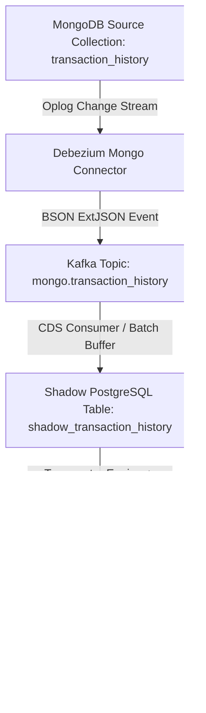

# 03_implementation_gp2_3667.md - Thiết kế Kỹ thuật Chi tiết (Technical Design)

## 1. Kiến trúc Luồng Dữ liệu CDC MongoDB -> PostgreSQL



## 2. Chi tiết Mapping Schema & Types

| MongoDB Field (BSON) | ExtJSON / Shadow Format | Master PostgreSQL Field | Postgres SQL Type | Indexes / Constraints |
| :--- | :--- | :--- | :--- | :--- |
| `_id` | `{"$oid": "..."}` | `id` | `VARCHAR(64)` | PRIMARY KEY |
| `trans_code` | `"TRX123456"` | `trans_code` | `VARCHAR(64)` | UNIQUE INDEX |
| `user_id` | `"USR9876"` | `user_id` | `VARCHAR(64)` | INDEX |
| `merchant_id` | `"MCH001"` | `merchant_id` | `VARCHAR(64)` | INDEX |
| `amount` | `100000` / `{"$numberLong": "100000"}` | `amount` | `BIGINT` | |
| `fee` | `0` | `fee` | `BIGINT` | |
| `status` | `"SUCCESS"` | `status` | `VARCHAR(32)` | INDEX |
| `trans_type` | `"PAYMENT"` | `trans_type` | `VARCHAR(32)` | INDEX |
| `created_at` | `{"$date": "2026-08-24T08:00:00Z"}` | `created_at` | `TIMESTAMPTZ` | BRIN / B-TREE INDEX |
| `updated_at` | `{"$date": "2026-08-24T08:00:00Z"}` | `updated_at` | `TIMESTAMPTZ` | |
| `extra_data` | `{"bank": "NCB", ...}` | `extra_data` | `JSONB` | GIN INDEX (Optional) |

## 3. Cấu hình Debezium Mongo Connector Format
```json
{
  "name": "mongo-trans-history-connector",
  "config": {
    "connector.class": "io.debezium.connector.mongodb.MongoDbConnector",
    "tasks.max": "1",
    "mongodb.connection.string": "mongodb://mongo:27017/?replicaSet=rs0",
    "topic.prefix": "cdc.trans",
    "collection.include.list": "gpaylocal.transaction_history",
    "snapshot.mode": "initial"
  }
}
```
