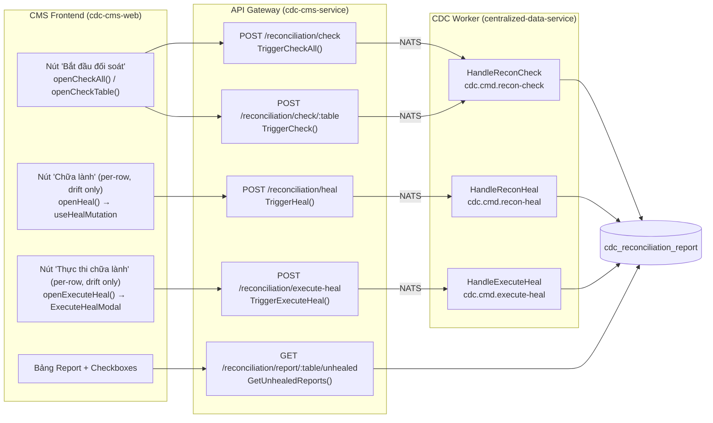
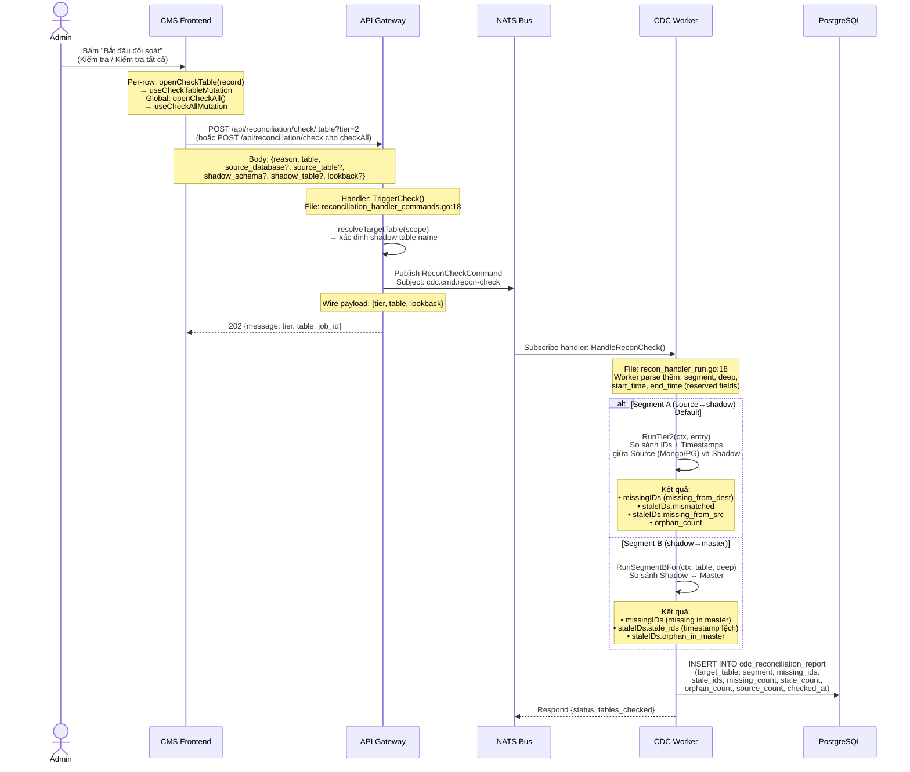
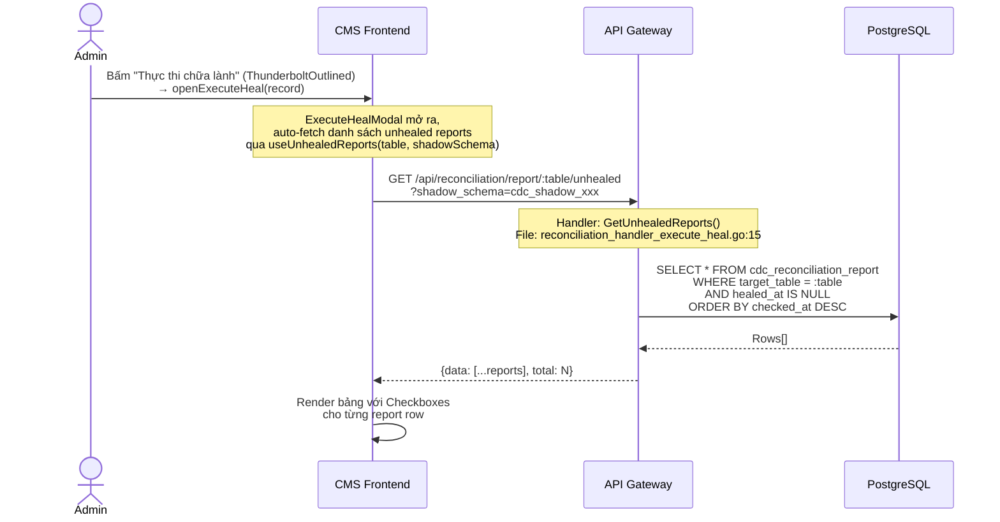
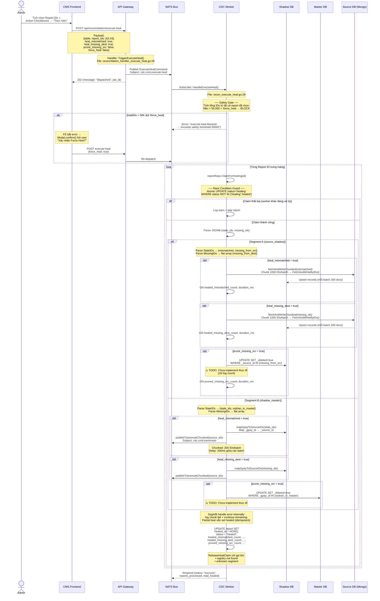
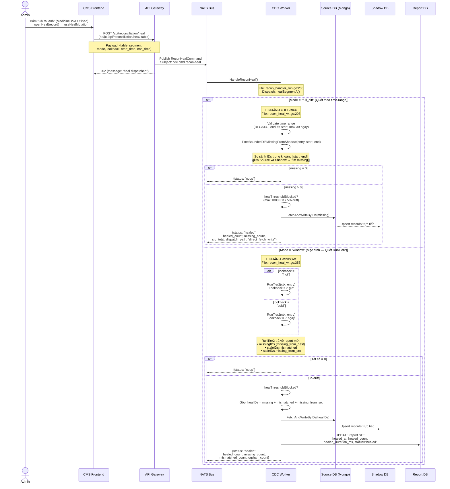
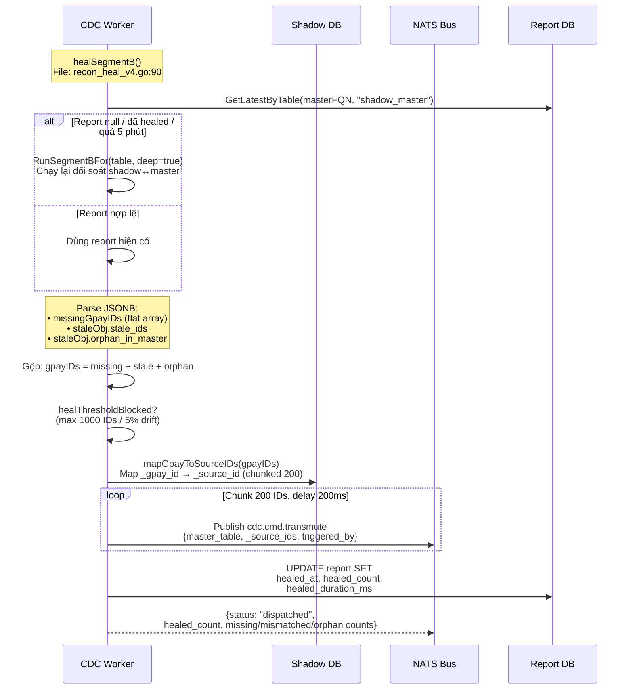
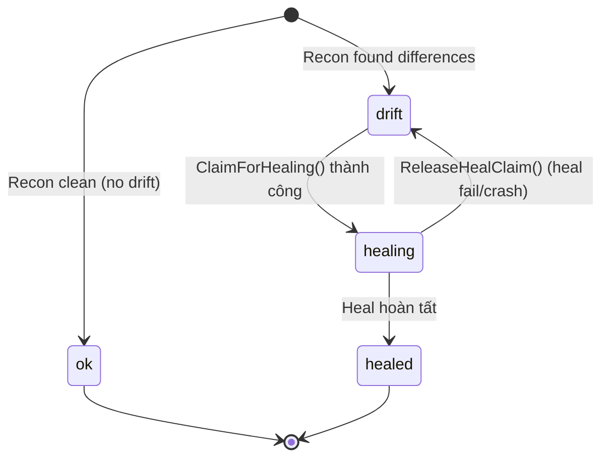

# Phân Tích Kiến Trúc Luồng Đối Soát & Chữa Lành (Recon & Heal Pipeline)

## Tổng Quan Kiến Trúc Hiện Tại

Hệ thống đối soát và chữa lành dữ liệu CDC gồm **3 thành phần chính** hoạt động qua **NATS messaging**:



---

## GIAI ĐOẠN 0: KÍCH HOẠT ĐỐI SOÁT (Recon Check)

### Sequence Flow



### Chi Tiết Kỹ Thuật

| Thành phần | File | Function | NATS Subject |
|---|---|---|---|
| FE Hook | [useReconStatus.ts](file:///Users/trainguyen/Documents/work/data-hub/cdc-cms-web/src/hooks/useReconStatus.ts#L171) | `useCheckTableMutation()` | — |
| FE Hook (All) | [useReconStatus.ts](file:///Users/trainguyen/Documents/work/data-hub/cdc-cms-web/src/hooks/useReconStatus.ts#L162) | `useCheckAllMutation()` | — |
| API Route (1 table) | [router.go](file:///Users/trainguyen/Documents/work/data-hub/cdc-cms-service/internal/router/router.go#L174) | `POST /reconciliation/check/:table` → `TriggerCheck()` | — |
| API Route (all) | [router.go](file:///Users/trainguyen/Documents/work/data-hub/cdc-cms-service/internal/router/router.go#L173) | `POST /reconciliation/check` → `TriggerCheckAll()` | — |
| API Handler | [reconciliation_handler_commands.go](file:///Users/trainguyen/Documents/work/data-hub/cdc-cms-service/internal/api/recon/reconciliation_handler_commands.go#L18) | `TriggerCheck()` | — |
| Command | [recon_check.go](file:///Users/trainguyen/Documents/work/data-hub/cdc-cms-service/internal/app/commands/recon/recon_check.go#L27) | `ReconCheckCommand` | `cdc.cmd.recon-check` |
| Worker Handler | [recon_handler_run.go](file:///Users/trainguyen/Documents/work/data-hub/centralized-data-service/internal/handler/recon/recon_handler_run.go#L18) | `HandleReconCheck()` | Subscribe `cdc.cmd.recon-check` |
| Recon Engine | recon_tier_a.go / recon_tier_b.go | `RunTier2()` / `RunSegmentBFor()` | — |

### Payload — Từ FE đến Worker (Data Flow)

**① FE gửi tới API Gateway:**
```
POST /api/reconciliation/check?tier=2
```
```json
{
  "reason": "Manual check by admin",
  "table": "payment_bills",
  "source_database": "mongo_fintech",    // optional — dùng resolve scope
  "source_table": "payment_bills",       // optional
  "shadow_schema": "cdc_shadow_gpay",    // optional
  "shadow_table": "payment_bills",       // optional
  "lookback": "hot"                      // optional: "hot" (2h) / "cold" (7d)
}
```

**② API Gateway build Command (wire payload qua NATS):**
```json
{
  "tier": "2",
  "table": "cdc_shadow_gpay.payment_bills",
  "lookback": "hot"
}
```
> `tier` lấy từ query string (default `"1"`). `table` là kết quả `resolveTargetTable()` — FQN shadow table. Các field scope (`source_database`, `shadow_schema`...) chỉ dùng để resolve, KHÔNG đi vào wire payload.

**③ Worker parse (có thể nhận thêm reserved fields):**
```go
var payload struct {
    Tier      string `json:"tier"`
    Table     string `json:"table"`
    Segment   string `json:"segment"`    // reserved — FE chưa gửi
    Deep      bool   `json:"deep"`       // reserved — FE chưa gửi
    StartTime *int64 `json:"start_time"` // reserved — epoch ms
    EndTime   *int64 `json:"end_time"`   // reserved — epoch ms
    Lookback  string `json:"lookback"`
}
```
> **Lưu ý:** `segment`, `deep`, `start_time`, `end_time` là reserved fields. Worker parse được nhưng FE + API Gateway hiện **KHÔNG gửi** các field này. Segment B check được trigger bởi logic nội bộ worker (tier1 tự scan tất cả segment).

**Validation tại Worker:**
- `start_time` và `end_time` phải đi cặp, `end >= start`, khoảng cách ≤ 24h
- Nếu `segment == "shadow_master"` → chuyển sang `handleReconCheckSegmentB()`
- Nếu `tier == "prune"` → chạy orphan prune (soft-delete ghost shadow rows)

---

## GIAI ĐOẠN 1: TRUY VẤN DANH SÁCH LỖI (Unhealed Reports)

### Sequence Flow



### Chi Tiết Kỹ Thuật

| Thành phần | File | Function |
|---|---|---|
| API Gateway | [reconciliation_handler_execute_heal.go](file:///Users/trainguyen/Documents/work/data-hub/cdc-cms-service/internal/api/recon/reconciliation_handler_execute_heal.go#L15) | `GetUnhealedReports()` |
| Query Handler | queries/recon/ | `ListUnhealedReportsQuery` |

**Cấu trúc Report trả về:**
```json
{
  "id": 42,
  "target_table": "payment_bills",
  "segment": "source_shadow",
  "missing_count": 15,
  "stale_count": 3,
  "orphan_count": 2,
  "missing_ids": ["id1", "id2", ...],
  "stale_ids": {"mismatched": [...], "missing_from_src": [...]},
  "checked_at": "2026-07-03T10:00:00Z",
  "healed_at": null,
  "status": "drift"
}
```

---

## GIAI ĐOẠN 2: THỰC THI CHỮA LÀNH (Execute Heal — Luồng Tương Tác)

> [!IMPORTANT]
> Đây là luồng **hoàn toàn mới**, tách biệt khỏi luồng heal cũ (background). Không chạy lại đối soát (`RunTier2`/`RunSegmentBFor`), chỉ thực thi chữa lành từ report IDs đã có.

### Sequence Flow



### Chi Tiết Kỹ Thuật

| Thành phần | File | Function | NATS Subject |
|---|---|---|---|
| FE Modal | [ExecuteHealModal.tsx](file:///Users/trainguyen/Documents/work/data-hub/cdc-cms-web/src/components/ExecuteHealModal.tsx) | — | — |
| FE Page | [DataIntegrity.tsx](file:///Users/trainguyen/Documents/work/data-hub/cdc-cms-web/src/pages/DataIntegrity.tsx) | `openExecuteHeal()` | — |
| API Gateway | [reconciliation_handler_execute_heal.go](file:///Users/trainguyen/Documents/work/data-hub/cdc-cms-service/internal/api/recon/reconciliation_handler_execute_heal.go#L29) | `TriggerExecuteHeal()` | — |
| Command | [recon_async.go](file:///Users/trainguyen/Documents/work/data-hub/cdc-cms-service/internal/app/commands/recon/recon_async.go#L35) | `ExecuteHealCommand` | `cdc.cmd.execute-heal` |
| Worker Handler | [recon_execute_heal.go](file:///Users/trainguyen/Documents/work/data-hub/centralized-data-service/internal/handler/recon/recon_execute_heal.go#L43) | `HandleExecuteHeal()` | Subscribe `cdc.cmd.execute-heal` |
| Worker SegA | [recon_execute_heal.go](file:///Users/trainguyen/Documents/work/data-hub/centralized-data-service/internal/handler/recon/recon_execute_heal.go#L155) | `executeHealSegA()` | — |
| Worker SegB | [recon_execute_heal.go](file:///Users/trainguyen/Documents/work/data-hub/centralized-data-service/internal/handler/recon/recon_execute_heal.go#L230) | `executeHealSegB()` | Publish `cdc.cmd.transmute` |
| NATS Sub | [server_setup.go](file:///Users/trainguyen/Documents/work/data-hub/centralized-data-service/internal/server/server_setup.go#L346) | — | `cdc.cmd.execute-heal` |
| Route | [router.go](file:///Users/trainguyen/Documents/work/data-hub/cdc-cms-service/internal/router/router.go#L177) | — | `/reconciliation/execute-heal` |

**Payload API:**
```json
{
  "table": "payment_bills",
  "report_ids": [42, 43, 44],
  "heal_mismatched": true,
  "heal_missing_dest": true,
  "prune_missing_src": false,
  "force_heal": false
}
```

> `force_heal` (default false): Khi tổng IDs vượt ngưỡng 50,000, Worker block request. FE hiển thị `Modal.confirm()` hỏi user → nếu đồng ý, gửi lại với `force_heal: true`.

### Batching & Constants

| Constant | Value | Mô tả | File |
|---|---|---|---|
| `healChunkSize` | 200 | Số IDs mỗi batch transmute (Segment B) | recon_heal_v4.go |
| `healDelayMs` | 200ms | Delay giữa các batch (giảm tải I/O & Kafka) | recon_heal_v4.go |
| `healAutoMaxIDs` | 1,000 | Ngưỡng max IDs cho auto-heal (Background) | recon_heal_v4.go |
| `healAutoMaxDriftPct` | 5.0% | Ngưỡng max drift % cho auto-heal | recon_heal_v4.go |
| `healReportMaxAge` | 5 min | Report quá cũ → chạy lại check | recon_heal_v4.go |
| **`segAChunkSize`** | **1,000** | **Số IDs/batch cho FetchAndWriteByIDs (Segment A)** | **recon_execute_heal.go** |
| **`interactiveHealMaxIDs`** | **50,000** | **Ngưỡng Safety Gate cho Interactive Heal** | **recon_execute_heal.go** |

### Cơ Chế An Toàn (Safety Mechanisms)

| Cơ chế | Áp dụng cho | Mô tả |
|---|---|---|
| **Safety Gate (Threshold)** | Interactive Heal | Tổng IDs > 50K → block, cần `force_heal=true` |
| **Race Condition Guard** | Interactive Heal | `ClaimForHealing()` — atomic UPDATE status='healing', skip nếu bị worker khác claim |
| **Chunking SegA** | Interactive Heal SegA | `fetchAndWriteChunked()` — chunk 1000 IDs/batch trước khi gọi MongoDB `$in` |
| **healThresholdBlocked()** | Background Heal | Max 1000 IDs / 5% drift — tự động block nếu vượt |
| **Chunking SegB** | Cả 2 luồng | `publishTransmuteChunked()` — 200 IDs/batch + 200ms delay |

---

## Luồng Background Heal (HandleReconHeal — Chi Tiết Đầy Đủ)

> [!NOTE]
> Luồng này (`HandleReconHeal` / `cdc.cmd.recon-heal`) VẪN HOẠT ĐỘNG song song với luồng Interactive. Khác biệt chính: luồng này **TỰ CHẠY đối soát** trước khi heal, và hỗ trợ 2 mode: **Window** (mặc định) và **Full-diff** (quét theo time-range).

### Payload — Từ FE đến Worker (Data Flow)

**① FE gửi tới API Gateway (`useHealMutation`):**
```
POST /api/reconciliation/heal
```
```json
{
  "reason": "Manual heal by admin",
  "table": "payment_bills",
  "segment": "source_shadow",            // optional: "" / "source_shadow" / "shadow_master"
  "source_database": "mongo_fintech",    // optional — chỉ dùng resolve scope
  "source_table": "payment_bills",       // optional
  "shadow_schema": "cdc_shadow_gpay",    // optional
  "shadow_table": "payment_bills"        // optional
}
```

**② API Gateway build Command (`TriggerHeal`):**
```json
{
  "table": "cdc_shadow_gpay.payment_bills",
  "segment": "source_shadow"
}
```
> API chỉ extract `table` (qua `resolveTargetTable()`) + `segment`. Các field scope chỉ dùng resolve, **KHÔNG** đi vào wire payload. `ReconHealCommand` struct **CHỈ CÓ 2 FIELD**: `Table` + `Segment`.

**③ Worker parse (có reserved fields — FE/API KHÔNG gửi):**
```go
var payload struct {
    Table     string `json:"table"`
    Segment   string `json:"segment"`    // FE gửi
    Legacy    bool   `json:"legacy"`     // reserved — FE không gửi → false
    Mode      string `json:"mode"`       // reserved — FE không gửi → "" (= window)
    StartTime string `json:"start_time"` // reserved — RFC3339, FE không gửi
    EndTime   string `json:"end_time"`   // reserved — RFC3339, FE không gửi
    Lookback  string `json:"lookback"`   // reserved — FE không gửi → ""
}
```

> [!IMPORTANT]
> **GAP hiện tại:** Worker hỗ trợ đầy đủ `mode=full_diff` + `start_time/end_time` (time-range heal) và `lookback=hot/cold`, nhưng API Gateway (`ReconHealCommand`) **KHÔNG CÓ** các field này → FE **KHÔNG THỂ** trigger `full_diff` mode qua UI. Muốn bật full_diff phải gửi NATS message trực tiếp hoặc bổ sung fields vào `ReconHealCommand`.


### Sequence Flow — Segment A (Source↔Shadow)



### Sequence Flow — Segment B (Shadow↔Master)



### Chi Tiết Kỹ Thuật — Background Heal

| Thành phần | File | Function | NATS Subject |
|---|---|---|---|
| API Gateway | [reconciliation_handler_heal.go](file:///Users/trainguyen/Documents/work/data-hub/cdc-cms-service/internal/api/recon/reconciliation_handler_heal.go#L17) | `TriggerHeal()` | — |
| Command | [recon_async.go](file:///Users/trainguyen/Documents/work/data-hub/cdc-cms-service/internal/app/commands/recon/recon_async.go) | `ReconHealCommand` | `cdc.cmd.recon-heal` |
| Worker Entry | [recon_handler_run.go](file:///Users/trainguyen/Documents/work/data-hub/centralized-data-service/internal/handler/recon/recon_handler_run.go#L206) | `HandleReconHeal()` | Subscribe `cdc.cmd.recon-heal` |
| Segment A | [recon_heal_v4.go](file:///Users/trainguyen/Documents/work/data-hub/centralized-data-service/internal/handler/recon/recon_heal_v4.go#L257) | `healSegmentA()` | — |
| Full-diff scan | recon_heal_v4.go:293 | `TimeBoundedDiffMissingFromShadow()` → `FetchAndWriteByIDs()` | — |
| Window scan | recon_heal_v4.go:353 | `RunTier2()` → `FetchAndWriteByIDs()` | — |
| Segment B | [recon_heal_v4.go](file:///Users/trainguyen/Documents/work/data-hub/centralized-data-service/internal/handler/recon/recon_heal_v4.go#L90) | `healSegmentB()` | Publish `cdc.cmd.transmute` |
| Safety Gate | recon_heal_v4.go:48 | `healThresholdBlocked()` | — |

### So Sánh 2 Mode trong healSegmentA

| Tiêu chí | Window (mặc định) | Full-diff |
|---|---|---|
| **Trigger** | `mode` = "" / "window" | `mode` = "full_diff" |
| **Input time** | `lookback`: "hot" (2h) / "cold" (7d) | `start_time` + `end_time` (RFC3339) |
| **Max range** | Cố định theo lookback | Tối đa 30 ngày |
| **Engine** | `RunTier2()` → full report | `TimeBoundedDiffMissingFromShadow()` |
| **Output** | missing + mismatched + missing_from_src | Chỉ missing (thiếu ở shadow) |
| **Heal path** | `FetchAndWriteByIDs()` trực tiếp | `FetchAndWriteByIDs()` trực tiếp |
| **Report update** | ✅ Cập nhật healed_at, count, duration | ❌ Không cập nhật report |

---

### So Sánh Tổng Quan: Background Heal vs Interactive Heal

| Tiêu chí | Background Heal | Interactive Execute Heal |
|---|---|---|
| **NATS Subject** | `cdc.cmd.recon-heal` | `cdc.cmd.execute-heal` |
| **API Route** | `POST /reconciliation/heal/:table` | `POST /reconciliation/execute-heal` |
| **Trigger** | Nút "Chữa lành" trên FE | Nút "Thực thi chữa lành" trên FE |
| **Chạy đối soát?** | ✅ Có (RunTier2/RunSegmentBFor/TimeBoundedDiff) | ❌ Không — chỉ dùng report đã có |
| **Input** | `{table, segment, mode, lookback, start/end_time}` | `{table, report_ids[], checkboxes}` |
| **Modes** | Window (hot/cold) + Full-diff (time-range) | Không có mode — lấy từ report |
| **Granularity** | Toàn bộ drift phát hiện | Chọn cụ thể report + loại action |
| **Safety Gate** | `healThresholdBlocked()` — max 1000 IDs / 5% drift | Không (user đã chọn thủ công) |
| **Handler** | `HandleReconHeal()` | `HandleExecuteHeal()` |
| **File Worker** | [recon_heal_v4.go](file:///Users/trainguyen/Documents/work/data-hub/centralized-data-service/internal/handler/recon/recon_heal_v4.go) | [recon_execute_heal.go](file:///Users/trainguyen/Documents/work/data-hub/centralized-data-service/internal/handler/recon/recon_execute_heal.go) |

---

## ⚠️ Known Issues (TODO)

> [!WARNING]
> Hai điểm TODO chưa implement trong code hiện tại:

1. **Segment A — Prune Missing Src**: `executeHealSegA()` line 148-158 — chỉ log count, chưa thực thi SQL `UPDATE _deleted = true` trên Shadow DB.
2. **Segment B — Prune Orphan in Master**: `executeHealSegB()` line 216-225 — chỉ log count, chưa thực thi SQL `UPDATE _deleted = true` trên Master DB.

---

## Schema: `cdc_reconciliation_report`

| Column | Type | Mô tả |
|---|---|---|
| `id` | BIGSERIAL | PK |
| `target_table` | TEXT | Tên bảng đối soát |
| `segment` | TEXT | `source_shadow` / `shadow_master` |
| `source_db` | TEXT | Qualified name của source |
| `missing_count` | INT | Số bản ghi thiếu ở đích |
| `stale_count` | INT | Số bản ghi lệch timestamp |
| `orphan_count` | INT | Số bản ghi thừa ở đích |
| `missing_ids` | JSONB | `["id1","id2",...]` |
| `stale_ids` | JSONB | SegA: `{mismatched:[],missing_from_src:[]}` / SegB: `{stale_ids:[],orphan_in_master:[]}` |
| `source_count` | BIGINT | Tổng bản ghi nguồn |
| `checked_at` | TIMESTAMPTZ | Thời điểm check |
| `healed_at` | TIMESTAMPTZ | Thời điểm heal (NULL = chưa heal) |
| `status` | TEXT | State machine (xem bên dưới) |
| `healed_mismatched_count` | INT | Số bản ghi mismatched đã heal |
| `healed_mismatched_duration_ms` | INT | Thời gian heal mismatched (ms) |
| `healed_missing_dest_count` | INT | Số bản ghi missing dest đã heal |
| `healed_missing_dest_duration_ms` | INT | Thời gian heal missing dest (ms) |
| `pruned_missing_src_count` | INT | Số bản ghi pruned |
| `pruned_missing_src_duration_ms` | INT | Thời gian prune (ms) |

### State Machine — `status` Column



| Status | Mô tả | Transition từ |
|---|---|---|
| `ok` | Report sạch, không có drift | Recon check |
| `drift` | Phát hiện missing/stale/orphan, chờ heal | Recon check |
| `healing` | Đang được 1 worker xử lý (race lock) | `ClaimForHealing()` |
| `healed` | Heal hoàn tất | `executeHeal()` / `healSegmentA/B()` |

> **Lưu ý:** `healing` status ngăn luồng thứ 2 (Background / Interactive) can thiệp cùng report. Nếu worker crash giữa chừng, status vẫn là `healing` → cần mechanism cleanup (manual hoặc TTL-based revert) trong tương lai.

