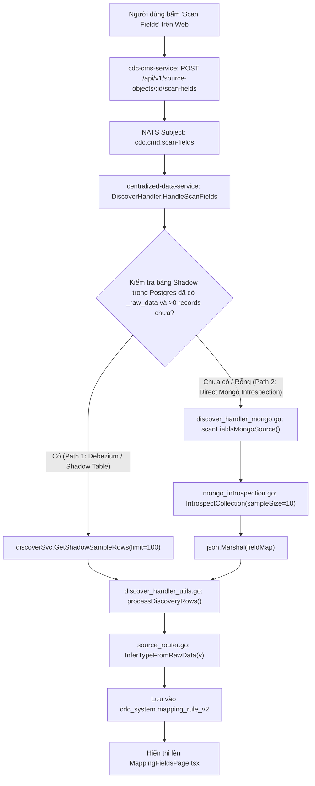

# 13_analysis_mongo_scan_field.md - Báo Cáo Phân Tích Chuyên Sâu: Cơ Chế Scan Field MongoDB

## 1. Tổng quan Kiến trúc Luồng Scan Field

Hệ thống Data Hub CDC hiện tại hỗ trợ 2 đường dẫn thực thi khi người dùng bấm nút **Scan Fields**:



---

## 2. Giải mã Chi Tiết 2 Hiện Tượng Lệch Dữ Liệu

### Hiện tượng A: Tại sao các trường thời gian (`createdAt`, `updatedAt`) và `_id` lại ra kiểu `JSONB`?

#### 1. Định dạng dữ liệu BSON Extended JSON v2:
Trong MongoDB:
- `_id` là BSON `ObjectID("69fc0e8d9697ea33e58afa7b")`
- `createdAt` và `updatedAt` là BSON `DateTime("2026-05-07T04:01:17.830Z")`

Khi Debezium MongoDB CDC connector đọc dữ liệu hoặc khi Go MongoDB Driver decode `bson.M` rồi serialize thành JSON:
```json
{
  "_id": { "$oid": "69fc0e8d9697ea33e58afa7b" },
  "createdAt": { "$date": "2026-05-07T04:01:17.830Z" },
  "updatedAt": { "$date": "2026-05-07T04:01:17.830Z" }
}
```

#### 2. Lỗ hổng trong bộ suy luận kiểu (`InferTypeFromRawData`):
Xem file `centralized-data-service/internal/service/source/source_router.go:37-62`:
```go
func InferTypeFromRawData(jsonValue interface{}) string {
	if jsonValue == nil {
		return "TEXT"
	}
	switch v := jsonValue.(type) {
	case bool:
		return "BOOLEAN"
	case float64:
		if v == float64(int64(v)) {
			return "BIGINT"
		}
		return "NUMERIC"
	case string:
		if isRFC3339Like(v) {
			return "TIMESTAMPTZ"
		}
		return "TEXT"
	case map[string]interface{}, []interface{}:
		return "JSONB"
	default:
		return "TEXT"
	}
}
```
- Khi `json.Unmarshal` đọc JSON chuỗi vào `map[string]interface{}`, giá trị `v` của `createdAt` là một Map `map[string]interface{}{"$date": "2026-05-07T04:01:17.830Z"}`.
- Vì `v` là `map[string]interface{}`, `InferTypeFromRawData` rơi thẳng vào `case map[string]interface{}` và trả về **`JSONB`**.
- Tương tự với `_id` (`{"$oid": "..."}`) và `updatedAt` (`{"$date": "..."}`).

---

### Hiện tượng B: Tại sao lại ra `requestData`, `responseData` mà không có `bankTransactionId`, `logs`?

#### 1. Đặc tính Schema Đa hình (Polymorphic Schema) của MongoDB:
Trong cùng một collection MongoDB của hệ thống thanh toán / giao dịch:
- Các document được sinh ra bởi các API / loại giao dịch khác nhau (`requestType`), hoặc giữa các phiên bản code cũ và mới, có cấu trúc trường hoàn toàn khác nhau:
  - **Schema Nhóm 1 (Generic Request/Response)**:
    `{ _id, id, requestId, requestType, requestData, responseData, status, extraData, createdAt, updatedAt }`
  - **Schema Nhóm 2 (Bank Transfer Direct Log)**:
    `{ _id, id, bankTransactionId, requestId, requestType, logs, status, extraData, createdAt, updatedAt }`

#### 2. Cơ chế Lấy Mẫu Hạn Chế (Sampling Window Bottleneck):
- **Trường hợp quét trực tiếp MongoDB (`scanFieldsMongoSource`)**:
  Tại `centralized-data-service/internal/service/source/mongo_introspection.go:117`:
  ```go
  cursor, err := collection.Find(ctx, bson.M{}, options.Find().SetLimit(int64(sampleSize))) // sampleSize = 10
  ```
  Lệnh `Find(ctx, bson.M{})` với `Limit(10)` và **không có Sort** sẽ lấy ra 10 document đầu tiên theo thứ tự vật lý lưu trữ trên đĩa (Natural Order / Insertion Order).
  10 document đầu tiên này đều thuộc **Schema Nhóm 1** (chứa `requestData`, `responseData`). Do đó, thuật toán scan không quét trúng bất kỳ document nào thuộc **Schema Nhóm 2** (chứa `bankTransactionId`, `logs`).

- **Trường hợp quét từ bảng Shadow (`_raw_data`)**:
  Tại `centralized-data-service/internal/service/source/discover_service.go:65`:
  ```sql
  SELECT _raw_data FROM shadow_table WHERE _raw_data IS NOT NULL AND _raw_data != '{}'::jsonb ORDER BY _synced_at DESC LIMIT 100
  ```
  Nếu bảng Shadow chỉ mới sync các record thuộc Schema Nhóm 1, hoặc 100 record gần nhất toàn bộ là các request thuộc loại `requestData`/`responseData`, hệ thống cũng chỉ gom được tập trường của 100 dòng này.

---

## 3. Bản chất của trường `logs` (Array of Objects)
- Trường `logs` trong document mẫu là một Array chứa các JSON Object:
  ```json
  "logs": [
    {
      "step": "BANK_TRANSFER",
      "time": { "$date": "2026-05-07T04:01:17.822Z" },
      "success": true,
      "error": null,
      "request": { "payload": { ... } },
      "response": { "payload": { ... } }
    }
  ]
  ```
- Trong kiến trúc CDC Data Hub:
  - Ở tầng **Shadow Table (Cấp 1)**: `logs` được ánh xạ thành cột JSONB lưu nguyên vẹn mảng log.
  - Ở tầng **Master Table / Explode View (Cấp 2)**: Sử dụng tính năng **Array Explode** (`Explode Path: logs[*]`) do `ScanArrayFields` trong `scan_service.go` đảm nhiệm để bóc tách các trường con (`step`, `time`, `success`, `request_payload`) thành các dòng độc lập.
