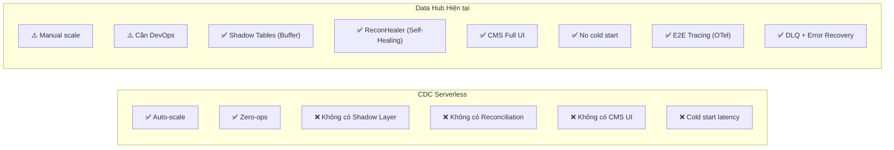
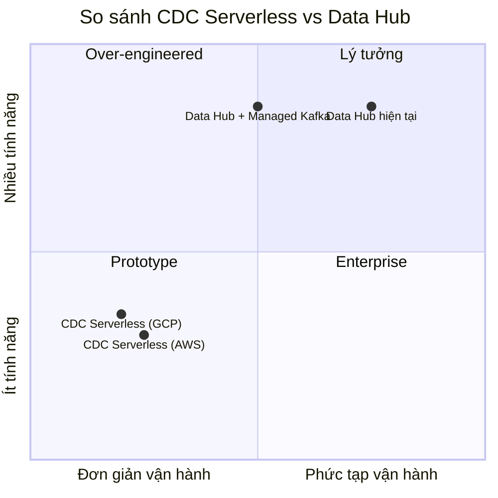

# So sánh CDC Serverless vs Kiến trúc CDC Data Hub hiện tại

## 1. Tổng quan hai Kiến trúc

### CDC Serverless (Mô hình anh gửi)
> Kiến trúc hướng sự kiện (Event-Driven) hoàn toàn tự động, **không duy trì server chạy liên tục**. Các hàm Serverless (Lambda, Cloud Functions) chỉ "thức dậy" khi có sự kiện CDC phát sinh.

### Kiến trúc Data Hub hiện tại
> Kiến trúc **Server-Based Event-Driven**, dùng **Debezium + Kafka + NATS** kết hợp các Worker/Service Go chạy liên tục (long-running daemons) trên Docker containers.

---

## 2. Bản đồ So sánh Chi tiết Từng Tầng

| Tầng kiến trúc | CDC Serverless (Cloud-Native) | Data Hub hiện tại (Self-Hosted) |
|---|---|---|
| **Source Database** | DynamoDB Streams, Aurora DSQL, Cloud SQL, Neon Postgres | **MongoDB (17017), MariaDB (13307), PostgreSQL (5435)** — Multi-engine |
| **CDC Capture** | DynamoDB Streams, Google Datastream, Azure SQL CDC — **Fully Managed** | **Debezium qua Kafka Connect (18083) + Schema Registry (18081)** — Self-hosted trên Docker |
| **Event Stream** | Kinesis, Pub/Sub, Event Hubs — **Serverless** | **Apache Kafka (19092/19093)** — Self-hosted cluster |
| **Command Bus nội bộ** | *(Không cần — Lambda chaining/Step Functions)* | **NATS (14222)** — Command/Event bus nội bộ giữa CMS ↔ Worker |
| **Processing / Compute** | AWS Lambda, Cloud Functions, Azure Functions — **Pay-per-invocation** | **3 Go services chạy 24/7**: `cdc-cms-service`, `centralized-data-service` (worker + sinkworker + admin-api), `cdc-auth-service` |
| **Shadow Layer** | *(Thường không có — data đi thẳng vào DW)* | **Shadow Tables trên PostgreSQL (5433)** — Buffer trung gian lưu JSONB thô |
| **Transformation** | Lambda/Cloud Function xử lý inline | **Transmuter Engine** — Flatten JSONB → ép kiểu → Naming Rules → Bulk Upsert |
| **Destination (DW)** | BigQuery, Redshift, Snowflake — **Serverless** | **PostgreSQL DW (5434)** — Master Tables |
| **Đối soát (Reconciliation)** | *(Phải tự build hoặc dùng dbt/Great Expectations)* | **ReconHealer + DLQ** — Tự động phát hiện chênh lệch & Self-Healing |
| **Schema Discovery** | *(Phải tự build)* | **DiscoverService + MongoIntrospectionService** — Auto-detect schema, tự sinh Mapping Rules |
| **Governance & Audit** | CloudWatch / Cloud Logging | **ActivityLogger + cdc_activity_log** — Ghi log nghiệp vụ chi tiết |
| **Observability** | X-Ray, Cloud Trace — Managed | **OpenTelemetry → SigNoz** — Full-stack tracing E2E (Frontend → API → Worker → Transmuter) |
| **CMS / Control Plane** | *(Phải tự build hoặc dùng 3rd party)* | **cdc-cms-web (React)** + **cdc-cms-service (Fiber)** — Full UI quản trị |
| **Cache** | ElastiCache / Memorystore — Managed | **Redis (16379)** — Mapping cache, leader election |
| **Infra** | Fully managed cloud | **Docker Compose — 13 containers** |

---

## 3. Phân tích Ưu/Nhược theo từng Chiều

### 3.1 Chi phí vận hành (Cost)

| Tiêu chí | CDC Serverless | Data Hub hiện tại |
|---|---|---|
| **Khi KHÔNG có thay đổi** | ✅ **$0** — Không trả tiền compute | ❌ **Vẫn trả tiền** — 13 containers chạy 24/7 |
| **Khi có traffic thấp** | ✅ Rẻ hơn đáng kể | ❌ Chi phí cố định cao (Kafka + Workers idle) |
| **Khi có traffic cao liên tục** | ⚠️ **Đắt hơn** — Lambda pricing scale tuyến tính | ✅ **Rẻ hơn** — Chi phí cố định, throughput cao |
| **Kafka/Streaming** | ✅ Managed (Kinesis/Pub-Sub) — Không cần vận hành | ❌ Self-hosted — Cần maintain Kafka cluster |

> [!IMPORTANT]
> **Nhận định**: Với workload hiện tại của Data Hub (CDC realtime liên tục từ MongoDB/PG/MariaDB), mô hình server-based **tiết kiệm hơn** serverless vì traffic CDC gần như 24/7. Serverless chỉ rẻ hơn khi workload **thưa thớt, không dự đoán được**.

### 3.2 Khả năng xử lý (Processing Power)

| Tiêu chí | CDC Serverless | Data Hub hiện tại |
|---|---|---|
| **Batch processing** | ❌ Lambda timeout 15 phút max | ✅ **BatchBuffer** gom 1000 records/500ms — Không giới hạn thời gian |
| **Bulk Upsert** | ⚠️ Phải tối ưu trong Lambda | ✅ **Transmuter** chạy bulk upsert tối ưu, không bị timeout |
| **Schema phức tạp** | ⚠️ Phải tự code flatten logic | ✅ **Flatten JSONB + Naming Engine + Mapping Rules** — Đã có sẵn |
| **Multi-source CDC** | ⚠️ Mỗi source = config riêng | ✅ **Debezium multi-engine** — MongoDB + PG + MariaDB + SFTP cùng pipeline |

### 3.3 Kiến trúc & Tính năng Nâng cao

| Tính năng | CDC Serverless | Data Hub hiện tại |
|---|---|---|
| **Shadow Layer (Buffer trung gian)** | ❌ Không có — Data đi thẳng DW | ✅ **Có** — Shadow Tables bảo vệ DW khỏi data thô/lỗi |
| **Self-Healing (Tự phục hồi)** | ❌ Phải tự build | ✅ **ReconHealer** — Auto-detect & backfill gaps |
| **DLQ (Dead Letter Queue)** | ⚠️ Có sẵn (SQS DLQ) nhưng cần config | ✅ **FailedSyncLogRepo** — DLQ custom với CMS UI quản lý |
| **Schema Auto-Discovery** | ❌ Phải tự build | ✅ **DiscoverService** — Auto-detect schema MongoDB/SQL |
| **Mapping Rules UI** | ❌ Phải tự build | ✅ **11-step Wizard** trên CMS Web |
| **Bridge Oplog (Gap Recovery)** | ❌ Không có | ✅ **Dual-Mode Bridge** — Change Stream + Find fallback |
| **Auto-scale** | ✅ Tự động | ⚠️ Cần scale thủ công (thêm containers) |
| **Cold Start** | ❌ 100-500ms mỗi invocation | ✅ Không có — Services luôn sẵn sàng |

### 3.4 Vận hành & Bảo trì (Operations)

| Tiêu chí | CDC Serverless | Data Hub hiện tại |
|---|---|---|
| **DevOps overhead** | ✅ **Gần 0** — Cloud quản lý hết | ❌ **Cao** — Maintain Kafka, Debezium, NATS, 13 containers |
| **Debugging** | ⚠️ CloudWatch Logs — Phân tán | ✅ **SigNoz E2E Tracing** — Trace xuyên suốt Frontend→Worker |
| **Deployment** | ✅ `serverless deploy` | ⚠️ Docker Compose / K8s cần quản lý |
| **Vendor lock-in** | ❌ **Cao** — Lambda/Kinesis/BigQuery | ✅ **Thấp** — Open-source stack (Debezium, Kafka, PG) |

---

## 4. Điểm MẠNH NHẤT mà Data Hub đã làm TỐT HƠN so với CDC Serverless tiêu chuẩn

> [!TIP]
> Hệ thống Data Hub hiện tại **KHÔNG phải là CDC đơn giản**. Nó là một **CDC Pipeline Platform** hoàn chỉnh với nhiều tính năng mà CDC Serverless tiêu chuẩn **KHÔNG có sẵn**.

### 4.1 Shadow Table Layer (Tầng đệm Shadow)
CDC Serverless đẩy data thẳng vào DW → Nếu data thô bị lỗi schema, DW bị ảnh hưởng trực tiếp.

Data Hub có **Shadow Tables** chứa JSONB thô → Transmuter ép kiểu/validate trước khi ghi Master → DW được bảo vệ.

### 4.2 Transmuter Engine (Biến đổi dữ liệu thông minh)
- Flatten JSONB lồng nhiều tầng (MongoDB documents)
- Naming Rules Engine chuẩn hóa tên bảng/cột
- Mapping Rules V2 do Admin cấu hình qua UI
- Governance: Mask/Strip trường nhạy cảm trước khi lưu DW

### 4.3 Self-Healing Reconciliation
- **ReconHealer**: Tự động phát hiện gap giữa Shadow và Master, backfill không cần can thiệp.
- **Bridge Oplog Dual-Mode**: Change Stream + Direct Query fallback khi Oplog hết hạn.
- **DLQ với CMS UI**: Admin xem, retry, discard failed records trên giao diện.

### 4.4 Full E2E Observability
- **OpenTelemetry** xuyên suốt: Frontend (Axios interceptor) → CMS API → NATS → Worker → Transmuter → DW
- **SigNoz** dashboard: Trace waterfall, log correlation, span mapping
- **W3C traceparent** propagation qua HTTP + NATS + Kafka headers

### 4.5 Control Plane CMS
- CMS Web UI đầy đủ (React + Vite, ~7600 LOC)
- 11-step Source-to-Master Wizard
- Connector management (Create/Recover/Bridge Oplog)
- Activity Log, Schema Drift Detection

---

## 5. Điểm YẾU của Data Hub so với CDC Serverless

| Điểm yếu | Tác động | Giải pháp tiềm năng |
|---|---|---|
| **Không auto-scale** | Khi burst traffic, worker có thể bị overwhelm | Chuyển sang K8s HPA (Horizontal Pod Autoscaler) |
| **Chi phí cố định cao** | 13 containers chạy 24/7 kể cả khi idle | Tối ưu resource limits, gom services |
| **DevOps overhead** | Cần maintain Kafka, Debezium, NATS | Cân nhắc Managed Kafka (Confluent Cloud, MSK) cho tầng Kafka |
| **Vendor-free nhưng ops-heavy** | Open-source tốt nhưng tốn công vận hành | Hybrid: giữ core self-hosted, outsource Kafka/monitoring |

---

## 6. Kết luận & Khuyến nghị

### Nhận định tổng hợp

> [!IMPORTANT]
> **Data Hub hiện tại đã vượt xa mô hình CDC Serverless tiêu chuẩn** về mặt tính năng và kiểm soát. Nó là một **CDC Platform** hoàn chỉnh, không chỉ là một pipeline đơn giản.

| Kịch bản | Nên dùng gì? |
|---|---|
| **Startup nhỏ, workload thưa thớt, cần lên nhanh** | ✅ CDC Serverless |
| **Enterprise, multi-source, cần kiểm soát data quality** | ✅ **Data Hub hiện tại** |
| **Tối ưu chi phí vận hành nhưng giữ tính năng** | ✅ **Data Hub + Managed Kafka** (Hybrid) |
| **Scale lớn, burst traffic không dự đoán** | ⚠️ Data Hub trên K8s + HPA |

### Hướng phát triển tiềm năng (nếu muốn lấy ưu điểm của Serverless)

1. **Managed Kafka** (Confluent Cloud / AWS MSK Serverless): Giảm ops overhead cho Kafka cluster mà vẫn giữ nguyên kiến trúc Debezium.
2. **K8s + HPA**: Deploy Data Hub lên Kubernetes, dùng Horizontal Pod Autoscaler để auto-scale worker khi traffic burst.
3. **Serverless cho side-effects**: Dùng Lambda/Cloud Functions cho các tác vụ phụ (gửi email, notification) — tách khỏi pipeline chính.

---

## 7. Mapping thuật ngữ

| Thuật ngữ CDC Serverless | Tương đương trong Data Hub |
|---|---|
| Database Change Log (Binlog/WAL) | Debezium đọc Oplog (Mongo) / WAL (PG) / Binlog (MariaDB) |
| CDC Capture Tool | Debezium + Kafka Connect |
| Event Stream | Kafka Topics (`cdc.<conn>.<db>.<table>`) |
| Serverless Function | Worker Handlers (Go) — `TransmuterHandler`, `DiscoverHandler` |
| Trigger | NATS Command (`cdc.cmd.transmute`, `cdc.cmd.discover`) |
| Data Warehouse | Master Tables trên PostgreSQL DW (5434) |
| Cache Invalidation | Redis mapping cache update |
| Real-time Notification | NATS Events (`cdc.evt.transmute.completed`) → JobMonitor |
