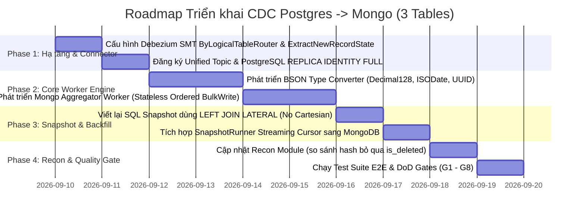

# 02 Plan: Kế hoạch Triển khai CDC PostgreSQL → MongoDB & Denormalization 3 Bảng

> **Workspace**: `feat-cdc-postgres-to-mongo-3tables`  
> **Kỹ năng sử dụng**: `database-design`, `golang-patterns`, `postgres-patterns`, `clean-code`

---

## Roadmap Triển khai (Phân kỳ 4 Giai đoạn)

---

## Chi tiết Từng Phase

### Phase 1: Cấu hình Hạ tầng & Debezium Connector
1. Cấu hình PostgreSQL source database: Bật `wal_level = logical`, thiết lập `REPLICA IDENTITY FULL` trên các bảng con `order_items`, `order_payments`.
2. Tạo cấu hình Debezium PostgreSQL Connector `cdc-pg-orders-to-mongo.json`:
   - Router SMT: `io.debezium.transforms.ByLogicalTableRouter` gom về topic `cdc.pg.unified.orders`.
   - Unwrap SMT: `io.debezium.transforms.ExtractNewRecordState` với `delete.handling.mode: rewrite` để bảo toàn key khi DELETE.

### Phase 2: Xây dựng Stateless Worker Engine (`centralized-data-service`)
1. Tạo module `mongo_type_converter.go`: Chuyển đổi an toàn dữ liệu từ format Debezium sang BSON primitives (`Decimal128`, `ISODate`, `UUID`, `bson.M`).
2. Tạo module `mongo_aggregator_worker.go`:
   - Consumer micro-batching từ Kafka.
   - Idempotent Pull-then-Push cho `order_items` với version timestamp `_v` per-element.
   - Atomic `$set` cho `order_payments` (subdocument).
   - Soft-delete cho `orders` và cấm `Upsert=true` ở bảng con.
   - Atomic `mongoCollection.BulkWrite(ctx, models, SetOrdered(true))` và commit offset.

### Phase 3: Snapshot Backfill Pipeline
1. Tối ưu câu SQL snapshot trong `snapshot_runner_handler.go`: Dùng `LEFT JOIN LATERAL` độc lập tránh Cartesian Product.
2. Streaming cursor batch 1,000 orders và gọi `BulkWrite` sang MongoDB collection `orders`.

### Phase 4: Reconciliation & Kiểm thử Nghiệm thu
1. Cập nhật module Recon so sánh hash giữa PostgreSQL (3 tables) và MongoDB (Collection `orders`), filter `is_deleted != true`.
2. Chạy test suite: Kiểm thử unit test, out-of-order event simulation, zombie document prevention, và DoD Gates.
