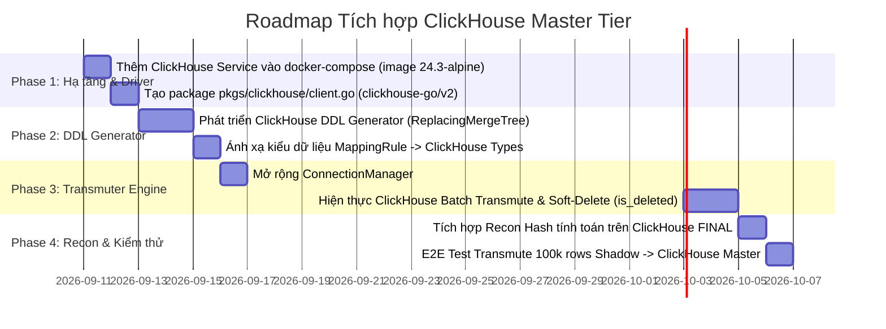

# 02 Plan: Kế hoạch Nâng cấp Master Tier Hỗ trợ ClickHouse

> **Workspace**: `feat-clickhouse-master-destination`

---

## Roadmap Triển khai 4 Giai đoạn

---

## Chi tiết Từng Giai đoạn

### Phase 1: Hạ tầng & Driver
1. Thêm service `clickhouse` vào `docker/docker-compose.yml` (Port 9000 native, 8123 http).
2. Tạo package `pkgs/clickhouse/client.go` trong `centralized-data-service` để khởi tạo connection pool an toàn.

### Phase 2: DDL Generator cho ClickHouse
1. Mở rộng `MasterDDLGenerator` để nhận biết `engine_type` của master binding.
2. Sinh DDL bảng ClickHouse chuẩn `ENGINE = ReplacingMergeTree(_version, _deleted) ORDER BY (_gpay_id)`.

### Phase 3: Transmuter Engine Phân nhánh Đích
1. Cập nhật `ConnectionManager` để cung cấp `clickhouse.Conn` khi `master_connection.engine_type == "clickhouse"`.
2. Tạo module `transmuter_clickhouse.go` xử lý `PrepareBatch` và batch append thay cho câu lệnh `ON CONFLICT` của Postgres.

### Phase 4: Reconciliation & Đo lường
1. Viết adapter query đối soát hash trên ClickHouse.
2. Kiểm thử tải và xác nhận tốc độ ghi đạt tiêu chuẩn OLAP.
