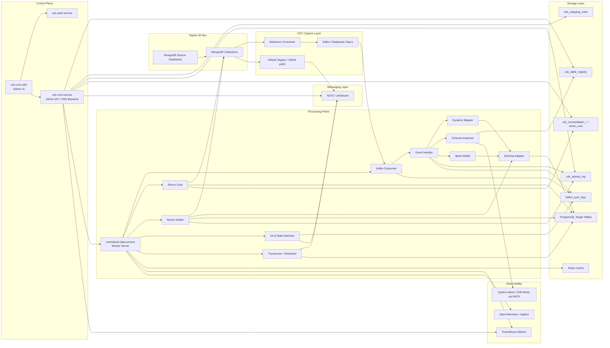
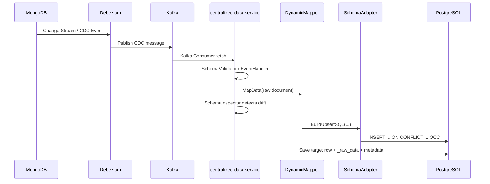
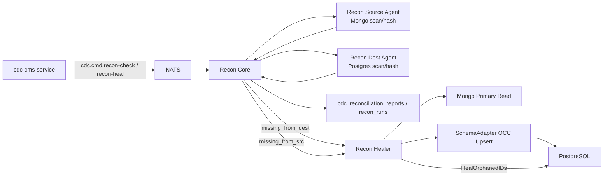
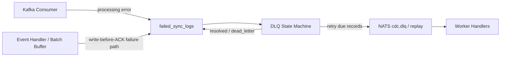
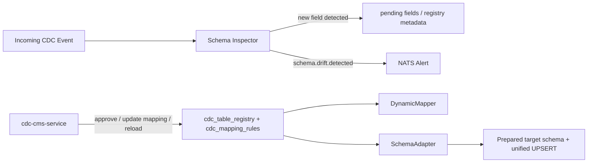
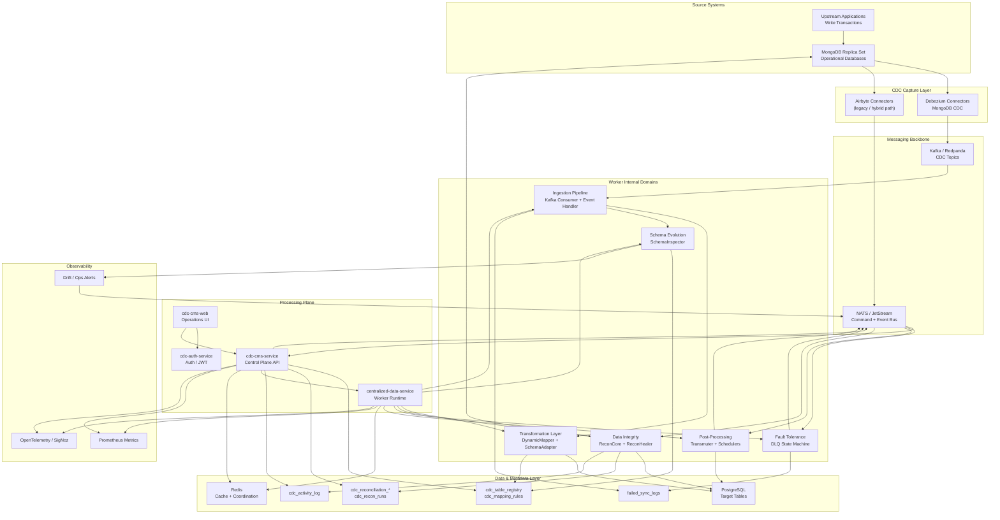
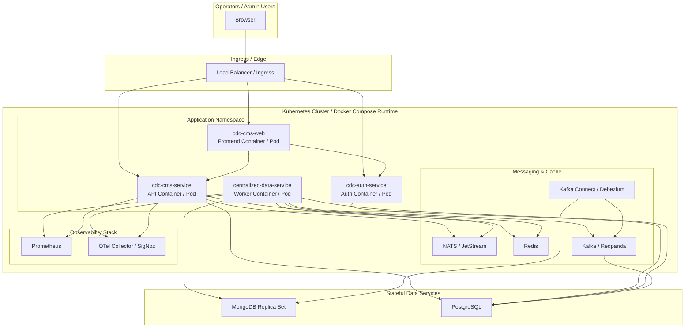
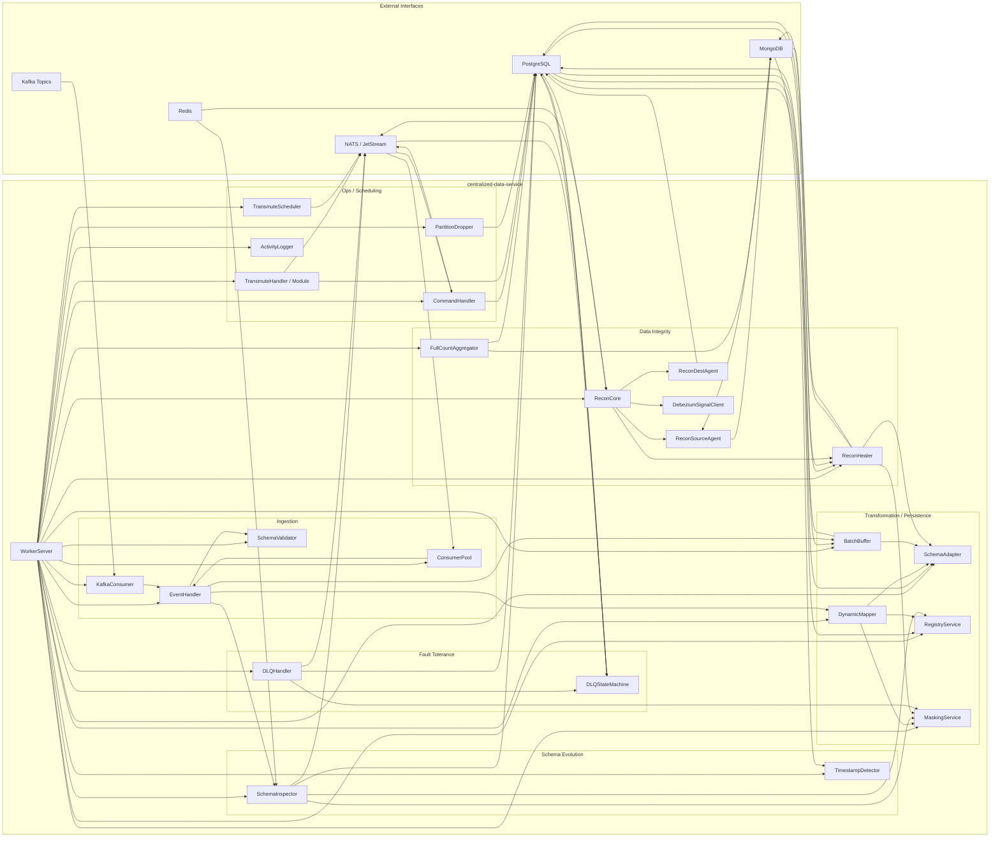
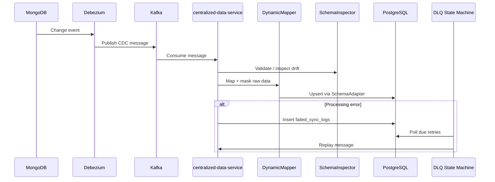

Kế hoạch:
1. Gom toàn bộ thành phần của `cdc-system` theo 4 khối chính: ingest, control plane, processing plane, observability.
2. Vẽ sơ đồ kiến trúc tổng thể theo luồng dữ liệu thật từ MongoDB → Kafka/NATS → Worker → PostgreSQL/CMS.
3. Tách thêm các luồng quan trọng: Reconciliation, DLQ/Retry, Schema Evolution, CMS/Web.
4. Ghi chú trách nhiệm từng service để bạn có thể dùng ngay cho docs/design review.

Dưới đây là sơ đồ System Architecture tổng thể của hệ thống CDC hiện tại.

**System Architecture**

**Cách đọc hệ thống**

- `MongoDB` là source of truth ban đầu; thay đổi dữ liệu được lấy qua `Debezium`.
- `Debezium` đẩy CDC event vào `Kafka`.
- `centralized-data-service` là worker trung tâm, đọc Kafka, map dữ liệu, validate schema, rồi upsert vào `PostgreSQL`.
- `cdc-cms-service` là control plane để quản trị registry, mapping rules, reconciliation, schema drift, schedule, alert.
- `cdc-cms-web` là UI vận hành; `cdc-auth-service` lo xác thực.
- `NATS` là bus lệnh/nội bộ cho command, drift alert, retry, transmute, admin workflows.
- `Redis` dùng cho cache/schema/recon coordination.
- `PostgreSQL` vừa là target warehouse/store, vừa chứa metadata + audit + DLQ state.

**Luồng ingest chính**

**Luồng Data Integrity / Reconciliation**

**Luồng Fault Tolerance / DLQ**

**Luồng Schema Evolution**

**Phân vai 4 service chính**

- `centralized-data-service`
  - worker core
  - kafka consumer
  - event processing
  - schema adapter / dynamic mapper
  - reconciliation
  - dlq retry
  - transmute/scheduler
- `cdc-cms-service`
  - admin API
  - registry/mapping management
  - trigger commands qua NATS
  - health, schedule, reconciliation UI backend
- `cdc-cms-web`
  - dashboard vận hành
  - mapping rules
  - schema drift review
  - data integrity / queue monitoring / schedules
- `cdc-auth-service`
  - auth/JWT/user

**Nếu muốn dùng trong tài liệu chính thức, mình đề xuất chia hệ thống thành 6 layer**
- Source Systems
- CDC Capture
- Messaging Backbone
- Processing & Recovery
- Metadata & Control Plane
- Storage & observability

Kế hoạch:
1. Chuẩn hóa naming và boundary để sơ đồ đủ “production-grade”, không còn kiểu sketch.
2. Vẽ 3 sơ đồ riêng: System Architecture, Deployment Docker/K8s, Component Diagram cho `centralized-data-service`.
3. Tối ưu Mermaid để bạn paste vào docs/md là dùng được ngay.
4. Ghi kèm note ngắn để bạn biết sơ đồ nào dùng cho phần nào trong tài liệu.

Dưới đây là bộ sơ đồ đã “đánh bóng” hơn để paste thẳng vào docs.

**1) Production-Grade System Architecture**

Dùng sơ đồ này cho:
- phần “High-Level Architecture”
- phần overview trong design doc
- onboarding tài liệu cho team mới

**2) Deployment Diagram Docker / K8s**

Nếu muốn ghi chú deployment dưới sơ đồ, bạn có thể thêm:
- `cdc-cms-web`: stateless frontend
- `cdc-cms-service`, `cdc-auth-service`, `centralized-data-service`: scale horizontally
- `PostgreSQL`, `MongoDB`, `Kafka`, `Redis`, `NATS`: stateful services
- `Debezium/Kafka Connect`: bridge CDC từ MongoDB sang Kafka

**3) Component Diagram chi tiết cho `centralized-data-service`**

**4) Một bản sequence ngắn cho docs “critical path”**

**Gợi ý cách đặt vào docs**
- `01-overview.md`: dùng sơ đồ số 1
- `02-deployment.md`: dùng sơ đồ số 2
- `03-worker-components.md`: dùng sơ đồ số 3
- `04-critical-paths.md`: dùng sequence ở cuối
