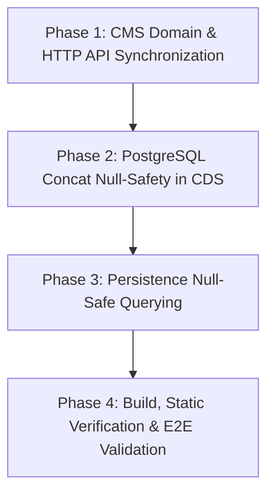

# 02_plan.md — High-Level Roadmap & Milestones

## I. MỤC TIÊU CHIẾN DỊCH
Triển khai giải pháp toàn trình loại bỏ triệt để lỗi chọn nhầm master binding do thiếu `master_schema`, đảm bảo tính đúng đắn dữ liệu 100% khi ghi vào Master DB.

## II. LỘ TRÌNH TRIỂN KHAI (ROADMAP)

### Phase 1: Đồng bộ Tầng CMS API & Domain
- Cập nhật DTO `ScheduleCreateRequest` trong `transmute_schedule_handler.go`.
- Thêm validation cho `master_schema`.
- Truyền `MasterSchema` từ HTTP request vào `CreateTransmuteScheduleCommand`.

### Phase 2: Khắc phục Bẫy Nối chuỗi NULL trong CDS Worker
- Sửa câu lệnh query trong `TransmuteScheduler.tick()`.
- Sửa câu lệnh query trong `MasterBindingRepo.ListMasterTablesByShadowTable`.
- Sửa câu lệnh query trong `MasterBindingRepo.ListMasterTablesByShadowIdentity`.

### Phase 3: Khắc phục Lỗ hổng So sánh NULL trong Persistence
- Cập nhật `Save()` trong `transmute_schedule_repository_gorm.go` với `COALESCE(NULLIF(..., ''), 'public')`.

### Phase 4: Kiểm thử và Xác minh
- Compile sạch cả 2 service: `cdc-cms-service` và `centralized-data-service`.
- Chạy unit tests cho các repository và command liên quan.
- Xác nhận không có hành vi can thiệp sửa đổi data DB trái phép.

## III. SKILLS SỬ DỤNG
- `golang-patterns`, `postgres-patterns`, `clean-code`
