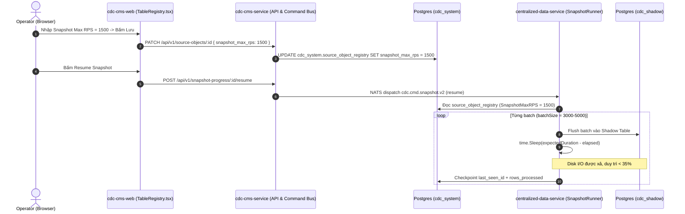

# 03_implementation_technical_design.md — Thiết kế kỹ thuật chi tiết

## 1. Kiến trúc luồng dữ liệu (Data Flow Architecture)

## 2. Chi tiết sửa đổi (Detailed Code Changes)

### 2.1 Backend (`cdc-cms-service`)
- `internal/app/queries/source/source_objects_read_models.go`:
  - `SnapshotMaxRPS *int json:"snapshot_max_rps,omitempty"`
- `internal/infra/persistence/source/source_object_read_repo_gorm.go`:
  - Thêm `so.snapshot_max_rps,` vào câu SQL SELECT trong `ListSourceObjects`.
- `internal/app/commands/source/update_source_object_v2.go`:
  - `SnapshotMaxRPS *int json:"snapshot_max_rps,omitempty"`
  - `Validate()`: Kiểm tra `v == 0` (clear) hoặc `10 <= v <= 100000`.
  - `Handle()`: Map `snapshot_max_rps` vào `updates` map.
- `internal/api/source/source_object_actions_handler.go`:
  - Thêm `SnapshotMaxRPS *int` vào request DTO và gán vào Command.

### 2.2 Frontend (`cdc-cms-web`)
- `src/types/index.ts`:
  - Thêm `snapshot_max_rps?: number | null;` vào `SourceObjectRow`.
- `src/pages/TableRegistry.tsx`:
  - `V2_EXCLUSIVE_FIELDS`: thêm `'snapshot_max_rps'`.
  - `openEdit`: nạp `snapshot_max_rps: record.snapshot_max_rps ?? undefined`.
  - `handleEdit`: xử lý 0 = clear về NULL.
  - Modal Form: thêm InputNumber field cho `snapshot_max_rps`.
