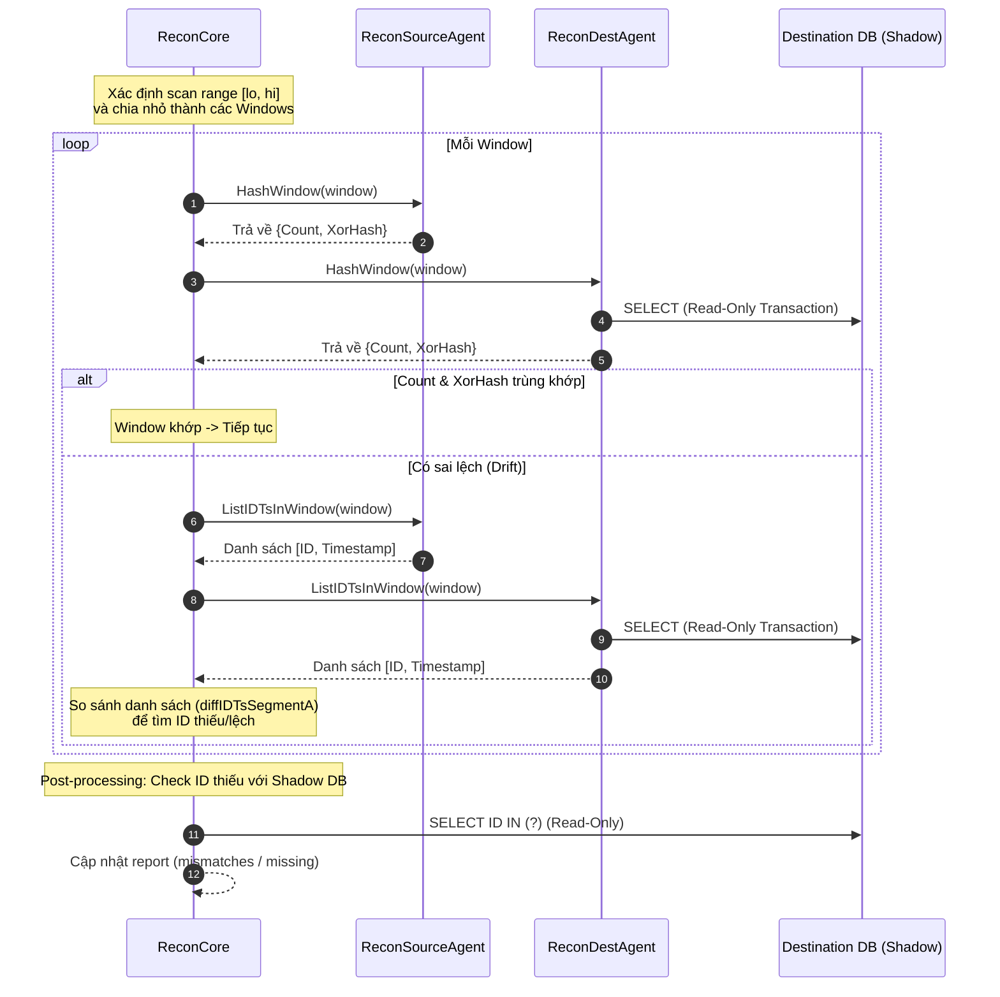

# Phân Tích Kỹ Thuật: Luồng Đối Soát Tier 2 (Window-based XOR-Hash)

Tài liệu này phân tích chi tiết luồng đối soát Tier 2 trong module `centralized-data-service`, xác minh cơ chế so sánh dựa trên XOR-hash và tính chất chỉ đọc (read-only) của luồng.

---

## 1. Tổng Quan Luồng Tier 2 (Window-based XOR-Hash)

Mục tiêu của Tier 2 là phát hiện sai lệch (drift) dữ liệu giữa **Source (MongoDB/PostgreSQL)** và **Destination (Shadow DB PostgreSQL)** trong một khoảng thời gian trượt (time window) cụ thể, thay vì quét toàn bộ bảng (Tier 3) hay chỉ đếm tổng số dòng (Tier 1).

### Sơ Đồ Hoạt Động (Mermaid)



---

## 2. Chi Tiết Logic Thực Thi

### Bước 2.1: Xác định và Chia nhỏ Window
Hàm `RunTier2` (tại [recon_tier_a.go:L846](file:///Users/trainguyen/Documents/work/data-hub/centralized-data-service/internal/service/recon/recon_tier_a.go#L846)) thực hiện:
- Gọi `pickScanRangeWithLag` để lấy khoảng thời gian `[lo, hi]` an toàn (đã trừ đi adaptive lag freeze).
- Chia nhỏ khoảng thời gian này thành các window nhỏ thông qua `buildWindows(lo, hi)`.

### Bước 2.2: Tính XOR-Hash trên từng Window
Với mỗi window, hệ thống gọi đồng thời:
1. `sourceAgent.HashWindow` ([recon_hash.go:L20](file:///Users/trainguyen/Documents/work/data-hub/centralized-data-service/internal/service/recon/recon_hash.go#L20)):
   - **MongoDB source**: Thực hiện query `Find` chỉ project trường `_id` và `timestampField`. Với mỗi document, hàm tính:
     ```go
     xorAcc ^= hashIDPlusTsMs(idStr, ts)
     ```
   - **PostgreSQL source**: Thực hiện `SELECT pk::text AS id, ts FROM table WHERE ts >= lo AND ts < hi`. Với mỗi row, tính XOR tương tự.
2. `destAgent.HashWindow` ([recon_dest_hash.go:L15](file:///Users/trainguyen/Documents/work/data-hub/centralized-data-service/internal/service/recon/recon_dest_hash.go#L15)):
   - Thực hiện `SELECT pk::text AS id, ts FROM table WHERE ts >= lo AND ts < hi`.
   - Tính XOR tương tự: `xorAcc ^= hashIDPlusTsMs(id, ts)`.

> [!NOTE]
> **Tính chất của XOR-hash**: Phép toán XOR (`^`) có tính chất giao hoán (commutative) và kết hợp (associative). Vì vậy, kết quả hash tích lũy cuối cùng của một cửa sổ thời gian không phụ thuộc vào thứ tự đọc dữ liệu từ database. Điều này giúp loại bỏ hoàn toàn việc sử dụng mệnh đề `ORDER BY` trong SQL, giảm tải tối đa cho DB.

### Bước 2.3: Drill-down chi tiết (Khi lệch Hash)
Nếu `srcRes.Count != dstRes.Count` hoặc `srcRes.XorHash != dstRes.XorHash`:
- Gọi `ListIDTsInWindow` ở cả 2 phía để lấy danh sách cụ thể các cặp `(ID, Timestamp)`.
- Chạy hàm `diffIDTsSegmentA` để phân loại:
  - `missingFromDest`: Có ở source, thiếu ở destination.
  - `missingFromSrc` (Orphan): Có ở destination, thiếu ở source.
  - `mismatched`: Trùng ID nhưng khác Timestamp.

### Bước 2.4: Post-processing Cross-Check
Để tránh cảnh báo sai lệch giả do lệch múi giờ ở biên window (window skew):
- Những ID nằm trong danh sách `missingFromDest` sẽ được kiểm tra lại trực tiếp trong Shadow DB:
  ```sql
  SELECT pk::text FROM table WHERE pk IN (?)
  ```
- Nếu ID thực chất có tồn tại trong Shadow DB (nhưng lệch cửa sổ) -> chuyển từ `missingFromDest` sang `mismatchedFromDest`.

---

## 3. Xác Minh Tính Chất Chỉ Đọc (Read-Only)

Chúng tôi đã phân tích toàn bộ mã nguồn của Tier 2 và xác nhận luồng này **Strictly Read-Only (Chỉ đọc, không ghi dữ liệu)** dựa trên các bằng chứng kỹ thuật sau:

### 1. Ở Tầng Database Connection (Destination DB)
Mọi truy vấn đọc từ phía destination agent (`ReconDestAgent`) đều đi qua helper `readOnlyDB(ctx)` ([recon_dest_agent.go:L62](file:///Users/trainguyen/Documents/work/data-hub/centralized-data-service/internal/service/recon/recon_dest_agent.go#L62)):
```go
func (da *ReconDestAgent) readOnlyDB(ctx context.Context) *gorm.DB {
	tx := da.replica.WithContext(ctx).Begin()
	tx.Exec("SET TRANSACTION READ ONLY")
	return tx
}
```
- Lệnh `SET TRANSACTION READ ONLY` buộc PostgreSQL phải chặn mọi lệnh ghi (`INSERT`, `UPDATE`, `DELETE`) phát sinh trong transaction này ở cấp độ cơ sở dữ liệu.
- Mọi hàm gọi `readOnlyDB` luôn sử dụng `defer tx.Rollback()` để đảm bảo transaction luôn được giải phóng và không có thay đổi nào được commit.

### 2. Ở Tầng Logic Core
- Hàm `RunTier2` không có bất kỳ lệnh gọi API `Heal` hay trigger sửa đổi dữ liệu nào.
- Dữ liệu sai lệch chỉ được ghi nhận vào struct `ReconciliationReport` và lưu log/metrics phục vụ giám sát. Luồng Healing (đồng bộ sửa lỗi) là một luồng xử lý riêng biệt được kích hoạt độc lập (qua API hoặc admin command) chứ không chạy tự động bên trong luồng đối soát Tier 2.

### 3. Ở Tầng Source Agent
- Đối với MongoDB: Chỉ sử dụng phương thức `Find` với read preference là `Secondary` ([recon_source_agent.go:L184](file:///Users/trainguyen/Documents/work/data-hub/centralized-data-service/internal/service/recon/recon_source_agent.go#L184)) để giảm tải và đảm bảo an toàn cho MongoDB primary cluster.
- Đối với PostgreSQL Source: Chỉ sử dụng các câu `SELECT` phẳng để stream dữ liệu.

---

## 4. Kết Luận
Cơ chế đối soát Tier 2 hoạt động đúng theo thiết kế **Window-based XOR-Hash**, cho phép so sánh dữ liệu nhanh chóng, tiết kiệm RAM/Băng thông và tuyệt đối an toàn với dữ liệu của cả 2 phía nhờ cơ chế Read-Only ở mức Transaction/Replica DB.
